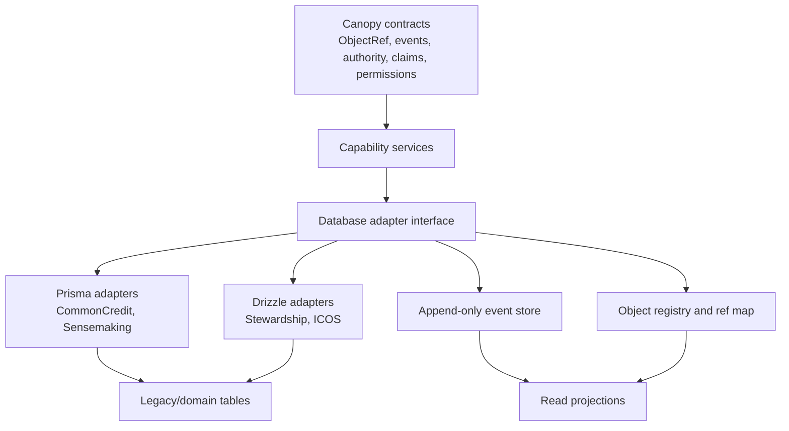

# Canopy Database Adapter Strategy

## Purpose

Canopy needs Prisma projects and Drizzle projects to speak the same kernel contracts without forcing immediate rewrites.

The database adapter layer is the compatibility boundary between existing application schemas and the canonical Canopy contracts. It lets CommonCredit, Sensemaking, Stewardship, and ICOS keep their current persistence models while progressively adopting shared identity, object references, claims/evidence, governance, civic memory, data stewardship, and federation rules.

This strategy treats ORMs as implementation details. Canopy coherence comes from the contract layer, event store, object registry, and migration adapters.

## Source Context

This strategy depends on the contracts and findings from:

- `outputs/canopy_kernel_contract.md`
- `outputs/canopy_ontology_map.md`
- `outputs/canopy_event_taxonomy.md`
- `outputs/canopy_reference_architecture.md`
- `outputs/project_integration_analysis.md`

Relevant implementation patterns:

- CommonCredit uses Prisma and already has shared identity-spec language around `Organization`, `Member`, product activation, ledgers, offers, needs, invoices, disputes, proposals, votes, resources, audit logs, and immutable ledger entries.
- Sensemaking uses Prisma and has issue-centered `Source`, `Claim`, `Theme`, `StakeholderGroup`, and `Contribution` models with the rule that AI-extracted claims are not canonical until accepted by a human.
- Stewardship uses Drizzle and has `communities`, `members`, `resources`, `access_rights`, governance, policies, maintenance, food flows, and a generic `event_log`.
- ICOS uses Drizzle and has stronger kernel-aligned patterns: append-only `timeline_events` enforced through a dedicated database role, revocable `delegations`, finalizable/superseding `decision_records`, resource registry, needs/offers, referenda, quorum state, and export-oriented civic memory.

## Strategy Summary

Canopy should introduce a thin but strict adapter layer around every persistence backend.



The adapter does four things:

1. Maps local ORM rows to canonical Canopy objects.
2. Emits canonical events for consequential changes.
3. Maintains object-reference mappings between local IDs and `ObjectRef`.
4. Builds read projections that let Canopy screens query canonical views without rewriting every legacy table.

## Adapter Principles

### 1. Contracts Above ORMs

Canopy contracts are TypeScript/domain contracts, not Prisma models or Drizzle tables.

Prisma and Drizzle may persist those contracts differently. They must not define competing meanings for identity, authority, object references, evidence, decisions, events, stewardship, or federation.

### 2. Local Tables May Persist, But Must Translate

Existing tables can remain in place:

- `Member` in CommonCredit can continue to exist while translating to `Person` plus `Membership`.
- `Account` in CommonCredit can continue to mean `LedgerAccount`, while kernel `Account` means authentication handle.
- `Community` in Stewardship can continue temporarily while translating to `Organization`, `Commons`, or `Place`.
- `Space` and `Neighborhood` in ICOS can continue while translating to `Organization`, `Commons`, or `Place`.
- Sensemaking `Source` can remain while translating to Canopy `Source` or `Evidence`.

The adapter must make the canonical meaning explicit.

### 3. Writes Use Command Adapters, Not Direct Table Mutation

Any operation that changes rights, obligations, governance state, resource state, ecological state, accounting state, data visibility, or civic memory must go through a Canopy command adapter.

Direct ORM writes are acceptable only for:

- Internal implementation artifacts.
- Non-consequential draft state.
- Read-model cache refreshes.
- Temporary migration backfills.

### 4. Events Are Mandatory For Consequential Changes

Every consequential write must emit a `CanopyEvent` envelope from `outputs/canopy_event_taxonomy.md`.

The local domain row and canonical event should be written in one transaction where the backend supports it. If cross-store writes are unavoidable, use an outbox pattern and treat undispatched events as failed writes until reconciled.

### 5. Authority Is Checked Before Persistence

Adapters must not only save rows. They must enforce the kernel rule that binding decisions, allocations, use rights, delegations, policy versions, membership changes, and resource stewardship changes cite authority.

Rows may store local `createdByMemberId`, `grantedByMemberId`, or `recordedByMemberId`, but the adapter must resolve those into canonical `actorRef` and `authorityRefs`.

### 6. Rewrites Are Progressive

The adapter layer exists to avoid an ORM migration war. The adoption path is:

1. Wrap existing schemas.
2. Add canonical IDs, object refs, and events.
3. Backfill mappings.
4. Build canonical read projections.
5. Move business logic behind Canopy service interfaces.
6. Retire or collapse legacy fields only after projections and tests prove parity.

## Persistence Boundaries

Canopy should keep a clear distinction between canonical stores, domain stores, and projections.

| Boundary | Owns | Examples | Adapter obligation |
| --- | --- | --- | --- |
| Kernel contract | Meaning and invariants | `ObjectRef`, `Person`, `Membership`, `Mandate`, `Claim`, `CanopyEvent` | Define canonical types and validation |
| Local domain store | Workflow-specific state | Prisma `Transaction`, Drizzle `access_rights`, ICOS `referenda` | Persist local behavior without redefining contracts |
| Object registry | Stable canonical refs and mappings | local row to `ObjectRef`, relationship edges, taxonomy mappings | Maintain stable IDs and lookup paths |
| Event store | Civic memory | canonical append-only events, redacted stubs, supersessions | Enforce append-only writes and event envelope validity |
| Read projections | Query-optimized views | object pages, dashboards, search, decision packets, scope views | Rebuildable from canonical events plus local source rows |
| Object/document storage | Files and bundles | evidence files, export bundles, decision packets | Preserve hashes, provenance, visibility, retention |

### What Local ORMs May Own

Local ORM schemas may own:

- Draft workflow state.
- Domain-specific status machines.
- Ledger implementation details.
- Vote and quorum implementation artifacts.
- Maintenance recurrence calculations.
- Food-flow or resource-flow operational rows.
- AI processing state for extraction and synthesis.
- Notification delivery artifacts.
- Search or dashboard caches.

### What Local ORMs May Not Own Alone

Local ORM schemas may not be the only source of truth for:

- Person/account/membership identity.
- Authority, mandates, delegations, guardianship, and revocation.
- Canonical object identity.
- Decision-relevant claims and evidence.
- Binding decisions, agreements, policies, allocations, obligations, and use rights.
- Civic memory events.
- Data stewardship, retention, export, fork, federation, and redaction rules.

Those may have local rows, but the canonical contract and event log must exist.

## Canonical Contracts Vs ORM Models

### Canonical Contracts

Canonical contracts are the public language Canopy modules speak to each other.

Examples:

- `ObjectRef`
- `CanopyEvent`
- `Person`
- `Account`
- `Organization`
- `Membership`
- `RoleAssignment`
- `Mandate`
- `Delegation`
- `Guardian`
- `Claim`
- `Evidence`
- `Issue`
- `Proposal`
- `Decision`
- `Resource`
- `UseRight`
- `Commitment`
- `Allocation`
- `LedgerEntry`

Canonical contracts should live in shared package code and schema validators. They should be serializable, versioned, and independent of any single ORM.

### ORM Models

ORM models are persistence choices.

Examples:

- CommonCredit Prisma `Member` is a local member profile. It maps to canonical `Person` plus `Membership`, and some fields may remain product-specific.
- CommonCredit Prisma `Account` is not a kernel authentication `Account`; it maps to `LedgerAccount`.
- Sensemaking Prisma `Claim` maps closely to canonical `Claim`, but needs generalized `aboutRefs`, claimant refs, evidence links, visibility, data state, and contestability.
- Stewardship Drizzle `access_rights` maps to canonical `UseRight` and `AccessRule`.
- Stewardship Drizzle `policies` and `policy_versions` map to canonical `Policy` and policy-version artifacts tied to `Decision`.
- ICOS Drizzle `timeline_events` maps to canonical civic memory, but its issue-scoped shape must expand to generic `objectRef`, `relatedRefs`, visibility, authority, and capability metadata.
- ICOS Drizzle `delegations` maps strongly to canonical `Delegation` because it structurally supports revocation.

### Adapter Interface

Each project should implement a narrow adapter interface:

```ts
interface CanopyDatabaseAdapter {
  orm: "prisma" | "drizzle" | "sql" | "other";
  capability: CanopyCapability;

  resolveObjectRef(local: LocalObjectPointer): Promise<ObjectRef>;
  resolveLocalObject(ref: ObjectRef): Promise<LocalObjectPointer | null>;

  readCanonicalObject(ref: ObjectRef): Promise<CanonicalObjectSnapshot>;
  writeCommand(command: CanopyCommand): Promise<CanopyCommandResult>;

  appendEvent(event: CanopyEvent): Promise<void>;
  listEvents(query: CanopyEventQuery): Promise<CanopyEvent[]>;

  rebuildProjection(projection: ProjectionName, scope: ProjectionScope): Promise<void>;
  validateMappings(scope: ProjectionScope): Promise<AdapterValidationReport>;
}
```

Adapters should be boring. Domain services make decisions; adapters translate, persist, and enforce database-level guarantees.

## Event-Store Enforcement

The event store is the civic memory boundary. It must be stricter than ordinary domain tables.

### Required Event Store Shape

Every backend must be able to persist the full `CanopyEvent` envelope:

- `id`
- `type`
- `occurredAt`
- `actorRef` or `systemActor`
- `objectRef`
- `relatedRefs`
- `authorityRefs`
- `orgId`
- `placeId`
- `commonsId`
- `livingSystemId`
- `sourceCapability`
- `payload`
- `schemaVersion`
- `visibility`
- `dataState`
- `supersedesEventId`

Legacy event rows may remain, but canonical events should be stored in a shared `canopy_events` table or equivalent event-store schema.

### Append-Only Enforcement

Canopy should adopt the ICOS enforcement pattern:

- Use a dedicated database role for civic memory writes.
- Grant `INSERT` and `SELECT`.
- Revoke `UPDATE` and `DELETE`.
- Make application event writes use that role or an equivalent restricted connection.
- Use corrections, redactions, reversals, and supersessions as new events.

Application conventions are not enough. The database should reject mutation attempts.

### Redaction And Privacy

Append-only does not mean all payloads remain visible forever.

Use this pattern:

- Preserve the event row and envelope.
- Move sensitive payload details into sealed storage when needed.
- Emit a new redaction event such as `evidence.redacted` or a restricted care event.
- Keep a redacted stub for continuity.
- Preserve content hashes where legally and ethically appropriate.
- Inherit visibility from affected objects unless an explicit data stewardship agreement overrides it.

### Legacy Event Upgrade

| Existing event model | Near-term adapter behavior | Target behavior |
| --- | --- | --- |
| CommonCredit audit/domain events | Convert audit actions and ledger changes to canonical `accounting.*`, `allocation.*`, `governance.*`, and `integrity.*` events | Shared event envelope plus immutable accounting events |
| Sensemaking claim/source lifecycle | Emit `evidence.*`, `claim.*`, and `governance.*` events when sources, claims, reviews, and contributions change | Claims/evidence event stream replayable into issue memory |
| Stewardship `event_log` | Add canonical object refs, authority refs, visibility, schema version, and append-only database enforcement | Merge into shared `canopy_events` or a compatible view |
| ICOS `timeline_events` | Generalize beyond issue scope and map to `objectRef` plus `relatedRefs` | Use as the model for append-only enforcement |

## Object-Ref Mapping

Every legacy row that represents a Canopy object needs a stable `ObjectRef`.

```ts
interface ObjectRefMap {
  canonicalId: string;
  canonicalType: CanopyObjectType;
  schemaVersion: number;
  sourceCapability: CanopyCapability;
  sourceOrm: "prisma" | "drizzle" | "sql" | "other";
  sourceTable: string;
  sourceId: string;
  orgId?: string;
  placeId?: string;
  commonsId?: string;
  livingSystemId?: string;
  localType?: string;
  localSubtype?: string;
  createdAt: string;
  supersededByCanonicalId?: string;
}
```

### Mapping Rules

- `canonicalId` is stable and never recycled.
- `sourceTable + sourceId + sourceCapability` must be unique.
- `canonicalType` must be one of the kernel object types or an approved subtype mapped through `CanonicalMapping`.
- Legacy IDs remain valid local identifiers, but cross-module references use `ObjectRef`.
- Mappings are append-friendly: if a mistaken mapping is corrected, preserve the old mapping with a supersession pointer rather than silently overwriting history.
- Object refs should include scope where known: `orgId`, `placeId`, `commonsId`, and `livingSystemId`.

### Priority Mapping Table

| Legacy object | Canonical mapping | Adapter note |
| --- | --- | --- |
| CommonCredit `Organization` | `Organization` | Preserve product config as `Policy` or accounting configuration artifact |
| CommonCredit `Member` | `Person` + `Membership` | Split identity from organizational participation |
| CommonCredit `Account` | `LedgerAccount` | Do not confuse with kernel auth `Account` |
| CommonCredit `LedgerEntry` | `LedgerEntry` | Preserve immutability and reversal model |
| CommonCredit `Offer` | `Offer` / `Capability` | Published offers may imply capabilities |
| CommonCredit `Need` | `Need` / `Request` | Published needs may become concrete requests |
| CommonCredit `Dispute` | `Conflict` | Evidence maps to `Evidence`; decisions map to `Decision` |
| Sensemaking `Issue` | `Issue` | Strong canonical candidate |
| Sensemaking `Source` | `Source` / `Evidence` | Split raw source from evidence links over time |
| Sensemaking `Claim` | `Claim` | Expand to any `aboutRefs`, not only issue refs |
| Sensemaking `Theme` | `Theme` artifact | Do not make a root kernel object |
| Stewardship `Community` | `Organization` / `Commons` / `Place` | Resolve based on governance scope |
| Stewardship `Resource` | `Resource` / `Commons` / `LivingSystem` | Determine whether row is an asset, governed system, or ecological participant |
| Stewardship `AccessRight` | `UseRight` + `AccessRule` | Preserve source policy, role, direct grant, suspension, revocation |
| Stewardship `PolicyVersion` | Policy-version artifact | Must cite decision authority |
| ICOS `Space` | `Organization` / `Commons` | Governance scope determines type |
| ICOS `Neighborhood` | `Place` | Place-scoped participation maps to membership scoped to place |
| ICOS `DecisionRecord` | `Decision` / `DecisionPacket` | Preserve supersession and review date |
| ICOS `Delegation` | `Delegation` | Strong canonical fit; keep revocability structural |
| ICOS `TimelineEvent` | `CanopyEvent` | Generalize issue-scoped civic memory |
| ICOS `NeedOffer` | `Need`, `Request`, or `Offer` | Split by type and status |

## Migration Adapters

Migration adapters should be explicit, repeatable, and reversible at the projection level.

### Phase 0: Inventory And Classification

For each project:

- List tables and determine whether each row type is canonical, subtype, alias, artifact, or retire.
- Identify local ID type: UUID, CUID, ULID/text, provider subject ID, or natural key.
- Identify consequential writes.
- Identify current event/audit/log rows.
- Identify existing immutability constraints.
- Identify PII and restricted data.

### Phase 1: Add Mapping Tables

Add adapter-owned tables without changing legacy behavior:

- `canopy_object_ref_map`
- `canopy_canonical_mappings`
- `canopy_events` or a compatible project-local event table
- `canopy_outbox` if the canonical event store is separate
- `canopy_projection_state`
- `canopy_adapter_audit`

Prisma projects can introduce these as Prisma models. Drizzle projects can introduce them as Drizzle tables. The contract shape must be identical even if generated clients differ.

### Phase 2: Backfill ObjectRefs

Backfill deterministic mappings:

- Organizations, communities, spaces, and neighborhoods first.
- People, accounts, members, and memberships second.
- Issues, resources, policies, decisions, claims, sources, needs, offers, access rights, delegations, ledger accounts, and ledger entries third.
- Event rows last, because event envelopes need resolved object refs.

Backfills should be idempotent. Running the same migration twice should produce the same mappings and no duplicate canonical refs.

### Phase 3: Wrap Consequential Writes

Move consequential writes behind command adapters:

- `createIssue`
- `submitPerspective`
- `createClaim`
- `reviewClaim`
- `createProposal`
- `recordDecision`
- `grantDelegation`
- `revokeDelegation`
- `grantUseRight`
- `postLedgerEntry`
- `reverseLedgerEntry`
- `logContribution`
- `updateResourceCondition`
- `recordIndicator`
- `createExport`

Each command validates authority, writes local state, appends canonical events, and updates projections.

### Phase 4: Dual-Read With Canonical Projections

Build canonical read views while legacy screens still use local tables.

Examples:

- Object page projection.
- Civic memory timeline.
- Decision packet projection.
- Claim/evidence graph.
- Resource and use-right projection.
- Membership and authority projection.
- Ledger/accounting projection.
- Federation export projection.

Compare projection output with legacy UI expectations before switching screens.

### Phase 5: Retire Redundant Local Meaning

Only after command adapters, event replay, and read projections are stable:

- Remove fields that shadow canonical identity.
- Collapse duplicate event tables into views over `canopy_events`.
- Convert JSON evidence blobs into evidence links.
- Replace local status transitions with canonical commands where appropriate.
- Keep domain tables where they still carry real domain behavior.

## Prisma Adapter Guidance

Prisma projects should add contract tables through Prisma models, but avoid making Prisma the definition of Canopy.

Recommended Prisma additions:

- `CanopyObjectRefMap`
- `CanopyEvent`
- `CanopyOutbox`
- `CanopyProjectionState`
- `CanopyAdapterAudit`

Prisma adapter cautions:

- Prisma schema enums should not become the canonical event taxonomy. Validate event names against shared contract code.
- Use transactions for local row plus event writes where both are in the same database.
- Use middleware or service wrappers to prevent direct consequential writes where possible.
- For immutable rows such as CommonCredit ledger entries, continue using reversal rows rather than updates.
- Avoid renaming legacy columns early; use adapter mappings to avoid expensive migrations.

Priority Prisma work:

- CommonCredit: distinguish kernel `Account` from ledger `Account`; map ledger rows to `accounting.*` events; convert disputes, proposals, votes, treasury allocations, and resource bookings to canonical events.
- Sensemaking: expand issue-only claims into object-addressed claims; introduce evidence links; make claim review and source ingestion emit `claim.*` and `evidence.*` events.

## Drizzle Adapter Guidance

Drizzle projects should keep their explicit schema discipline and add contract tables in a shared Drizzle module.

Recommended Drizzle additions:

- `canopyObjectRefMap`
- `canopyEvents`
- `canopyOutbox`
- `canopyProjectionState`
- `canopyAdapterAudit`

Drizzle adapter cautions:

- Keep raw SQL migrations for constraints that Drizzle cannot express cleanly.
- Use database roles for append-only enforcement.
- Keep `onDelete: restrict` on civic-memory-adjacent references.
- Preserve structural safeguards such as ICOS delegations having no `irrevocable` field.
- Avoid circular import workarounds leaking into contract meaning; enforce missing foreign keys in SQL migrations.

Priority Drizzle work:

- Stewardship: upgrade `event_log` into canonical event envelopes; map `access_rights` to `UseRight` and `AccessRule`; convert JSON proposal evidence into evidence refs; require authority refs for decisions and policy versions.
- ICOS: generalize `timeline_events` beyond issue scope; use its database-role append-only pattern as the reference implementation; map `decision_records` to decision packets and `delegations` to canonical delegations.

## Read Projections

Read projections let Canopy query canonical views without forcing all old screens to move at once.

### Projection Principles

- Projections are rebuildable.
- Projections are not authority.
- Projections include source refs and event offsets.
- Projection rebuilds should be scoped by organization, place, commons, living system, or object.
- Projection failures should not mutate event history.

### Required Initial Projections

| Projection | Purpose | Sources |
| --- | --- | --- |
| `object_page_projection` | Hydrate one Canopy object page | object ref map, local rows, relationships, latest canonical events |
| `civic_memory_projection` | Show canonical timeline | `canopy_events`, legacy event rows during migration |
| `authority_projection` | Evaluate roles, mandates, delegations, use rights | memberships, roles, delegations, access rights, policy decisions |
| `claim_evidence_projection` | Traverse claims, counterclaims, evidence, sources | Sensemaking claims/sources, evidence links, governance evidence |
| `decision_packet_projection` | Portable decision record | proposals, perspectives, objections, votes/signals, decisions, policies, events |
| `resource_stewardship_projection` | Resource state and care history | Stewardship/ICOS resources, condition updates, use rights, maintenance, events |
| `accounting_projection` | Ledger and allocation views | ledger accounts, ledger entries, transactions, reversals, allocations |
| `federation_export_projection` | Export/fork bundle | object refs, events, data stewardship rules, content hashes |

### Projection Freshness

Use a simple freshness contract:

- Synchronous update for object-ref mappings and event appends.
- Transactional update for small local read projections when cheap.
- Async rebuild for search, graph, vector, export, and large dashboard projections.
- Projection state records track last event ID, last occurred time, source capability, and rebuild status.

## Testing Strategy

Adapters need contract tests more than ORM-specific snapshot tests.

### 1. Contract Validation Tests

For every adapter:

- Local row maps to a valid `ObjectRef`.
- Canonical object snapshots pass shared schema validation.
- Canonical events pass event-envelope validation.
- Event types belong to the taxonomy.
- Required payload fields exist for the event type.
- Authority refs are required for binding changes.
- Data visibility and data state are present where required.

### 2. Round-Trip Mapping Tests

For each mapped object:

1. Create or load a local row.
2. Resolve `ObjectRef`.
3. Resolve the local row from the `ObjectRef`.
4. Read a canonical snapshot.
5. Assert stable IDs, type, scope, schema version, and source capability.

Run these for Prisma and Drizzle adapters.

### 3. Event Enforcement Tests

Database-level tests must prove:

- Event rows can be inserted.
- Event rows cannot be updated.
- Event rows cannot be deleted.
- Corrections create new events.
- Redactions preserve envelope continuity.
- Ledger reversals create offset events, not edits.
- Decision supersessions create new records and events, not edits to finalized decisions.

These tests should run against a real Postgres database, not only mocked ORM clients.

### 4. Migration Idempotency Tests

Backfill tests should prove:

- Running a migration twice does not duplicate mappings.
- Existing canonical IDs remain stable.
- Partial failures can resume.
- Unknown local subtypes are reported, not silently guessed.
- Retired ontology objects are either mapped as artifacts or excluded with audit records.

### 5. Projection Replay Tests

For each projection:

- Build from scratch.
- Apply incremental events.
- Rebuild again from scratch.
- Assert both projection states match.
- Compare selected legacy queries against canonical projections until migration parity is reached.

### 6. Cross-ORM Compatibility Tests

Use the same contract fixture suite against:

- CommonCredit Prisma adapter.
- Sensemaking Prisma adapter.
- Stewardship Drizzle adapter.
- ICOS Drizzle adapter.

The point is not identical table shapes. The point is identical canonical behavior.

## Risks And Mitigations

| Risk | Why it matters | Mitigation |
| --- | --- | --- |
| ORM models become the contract | Canopy fragments into Prisma Canopy and Drizzle Canopy | Keep contracts in shared schema code; adapters implement contracts |
| `Member`, `Person`, `Account`, and `Membership` are conflated | Authority and identity become unsafe | Split identity explicitly in mappings and projections |
| CommonCredit `Account` conflicts with kernel `Account` | Auth and ledger semantics collide | Rename canonically to `LedgerAccount` in adapters and docs |
| Append-only is only a convention | Civic memory can be rewritten by bugs or privileged app code | Use database roles, revoked update/delete privileges, and event enforcement tests |
| JSON blobs hide evidence or authority | Decision packets cannot be replayed or audited | Convert proposal evidence, policy rationale, and decision support into refs over time |
| Dual writes drift | Local row and canonical event disagree | Use transactions when possible; otherwise use outbox and reconciliation jobs |
| Migration adapters silently guess ontology | Bad mappings become civic memory | Require explicit mapping reports and human review for unknown subtypes |
| Projections become de facto truth | Cached views override event memory | Make projections rebuildable and traceable to event offsets |
| Privacy conflicts with append-only memory | Retention, care, or safety needs can be violated | Use sealed payloads, redacted stubs, data stewardship agreements, and redaction events |
| Legacy reputation/score fields leak into canonical identity | Violates anti-ranking and hidden eligibility constraints | Treat feedback as contextual evidence; prohibit portable person scores |
| Federation exports miss local artifacts | Fork/exit rights become incomplete | Export from object refs plus event history plus data stewardship rules, not only app tables |
| Adapter scope grows into a second framework | Teams avoid adoption | Keep adapters narrow: mapping, persistence, events, projections, validation |

## Recommended First Slice

The first implementation slice should prove that one Prisma project and one Drizzle project can produce identical Canopy behavior.

### Slice A: Sensemaking Claim Adapter

- Map `Issue`, `Source`, and `Claim` to canonical refs.
- Emit `evidence.source.ingested`, `claim.created`, `claim.reviewed`, and `claim.contested`.
- Build `claim_evidence_projection`.
- Enforce that AI-created claims remain non-binding until human review.

### Slice B: Stewardship Resource Adapter

- Map `Community`, `Resource`, `AccessRight`, `Policy`, and `Decision`.
- Emit `stewardship.resource.created`, `stewardship.resource.condition_updated`, `stewardship.use_right.granted`, `governance.decision.recorded`, and `governance.policy.versioned`.
- Build `resource_stewardship_projection` and `authority_projection`.
- Add append-only database enforcement for canonical events.

### Slice C: Shared Object Page

- Show a canonical object page for a Sensemaking issue and a Stewardship resource using the same `ObjectRef` resolver interface.
- Display civic memory from canonical events.
- Display local details through adapter-provided snapshots.
- Demonstrate that the UI does not need to know whether the source table is Prisma or Drizzle.

## Decision

Canopy should not choose Prisma or Drizzle as the ecosystem-wide persistence standard. It should choose canonical contracts, an append-only event store, object-ref mappings, and adapter conformance tests as the standard.

That preserves the useful work already present in CommonCredit, Sensemaking, Stewardship, and ICOS while creating a path toward one coherent Canopy kernel.
