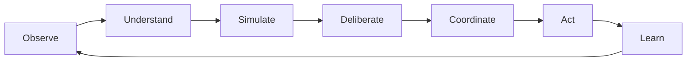

# Canopy Ecosystem Unification Plan

## Position

Canopy is not an MVP, not a bundle of apps, and not a portfolio of related tools. Canopy is the integrated cybernetic commons infrastructure described in the cybernetic plan.

The existing projects can be folded in only if they become coherent organs of Canopy:

- CommonCredit becomes part of Canopy's allocation and accounting system.
- ICOS becomes part of Canopy's constitutional, deliberative, and holonic governance system.
- Sensemaking becomes part of Canopy's claims, evidence, interpretation, and collective intelligence system.
- Stewardship becomes part of Canopy's commons, resources, care, maintenance, policy, and flow system.

They should not feel like separate applications stitched together with navigation. They should feel like different views and capabilities of one living civic/ecological operating system.

## Core Rule

Everything must translate back to the cybernetic loop:



If a module does not participate in this loop, it is not a Canopy module. If it participates but uses a different ontology, identity model, event model, governance model, or visual language, it must be refactored until it does.

## What Must Happen For Coherence

### 1. Establish The Canopy Kernel

The kernel is the non-negotiable shared substrate. It must come before module integration.

Kernel responsibilities:

- Identity
- Accounts
- Persons
- Organizations
- Memberships
- Roles
- Mandates
- Delegations
- Guardians
- Permissions
- Object registry
- Claims
- Evidence
- Counterclaims
- Event log
- Civic memory
- Data stewardship agreements
- Access rules
- Export and federation envelope

Existing source material:

- CommonCredit `shared/IDENTITY_SPEC.md`
- ICOS delegations, decision records, civic memory, export bundles
- Stewardship access-rights and event-log schemas
- Sensemaking claim/source/review schema

Required outcome:

All modules use the same canonical identity, authority, object-reference, claim/evidence, permission, and event structures.

### 2. Create A Shared Canopy Ontology

The existing projects currently use overlapping but different language:

- CommonCredit: member, account, offer, need, transaction, dispute
- ICOS: space, neighborhood, issue, perspective, decision record, delegation
- Sensemaking: issue, source, claim, theme, stakeholder
- Stewardship: community, resource, access right, policy, proposal, decision, maintenance task

Canopy needs one object grammar.

Canonical object groups:

- Actors: `Person`, `Account`, `Organization`, `Membership`, `Role`, `Mandate`, `Delegation`, `Guardian`
- Reality: `Place`, `Commons`, `LivingSystem`, `Resource`, `Stock`, `Flow`
- Epistemics: `Claim`, `Counterclaim`, `Evidence`, `Source`, `Perspective`, `Model`, `Scenario`
- Governance: `Issue`, `Proposal`, `Decision`, `Agreement`, `Policy`, `Appeal`, `Conflict`
- Coordination: `Need`, `Capability`, `Request`, `Offer`, `Commitment`, `Allocation`, `Obligation`, `UseRight`
- Action: `Project`, `Routine`, `Task`, `Contribution`, `MaintenanceCycle`, `RestorationCycle`
- Learning: `Outcome`, `Indicator`, `Threshold`, `Audit`, `Retrospective`, `FeedbackLoop`

Required outcome:

Each old project noun must either map into a Canopy object, become a subtype, or be retired.

### 3. Replace Product Boundaries With Cybernetic Capabilities

The current project boundaries are historically useful but architecturally dangerous. They will make the ecosystem feel disparate if preserved as top-level app boundaries.

Do not expose:

- CommonCredit app
- ICOS app
- Sensemaking app
- Stewardship app

Expose Canopy capabilities:

- Reality Map
- Commons Registry
- Living Systems
- Needs and Capabilities
- Claims and Evidence
- Deliberation
- Agreements and Policies
- Allocation and Accounting
- Flows
- Simulation
- Civic Memory
- Learning and Accountability
- Federation

The code may remain modular internally. The user experience should not reveal project ancestry.

### 4. Build One Canopy Shell

The ecosystem needs a single operating environment.

Shared shell requirements:

- One sign-in
- One organization/place/commons switcher
- One global object search
- One notification/attention system
- One civic memory
- One object page pattern
- One decision packet pattern
- One map/graph/list triad
- One visual language
- One terminology system
- One export/fork path

Every object page should follow the same structure:

- Identity and scope
- Current state
- Relationships
- Claims and evidence
- Indicators and thresholds
- Governance and mandates
- Active issues and proposals
- Agreements, commitments, and obligations
- Events and history
- Outcomes and learning
- Permissions and data stewardship

This is how Canopy avoids feeling like separate applications.

### 5. Create A Shared Event And Memory System

Cybernetic systems depend on memory. Every module must write into the same civic memory pattern.

Use:

- CommonCredit's domain event envelope
- ICOS's append-only civic memory enforcement
- Stewardship's broad event types
- Sensemaking's review/claim states

Canonical event envelope:

```ts
interface CanopyEvent {
  id: string
  type: string
  occurredAt: string
  actorId: string | null
  objectRef: ObjectRef
  orgId: string
  placeId?: string
  commonsId?: string
  livingSystemId?: string
  sourceModule: CanopyCapability
  payload: Record<string, unknown>
  schemaVersion: number
  visibility: DataVisibility
}
```

Required outcome:

A governance decision, credit allocation, resource condition update, food-flow record, claim review, threshold breach, and model audit all become comparable civic-memory events.

### 6. Make Claims And Evidence Universal

Sensemaking cannot be a separate "sensemaking area." Sensemaking must be the epistemic layer across the whole system.

Claims attach to everything:

- A resource condition
- A food shortage
- A credit risk
- A policy effect
- A wetland threshold
- A maintenance failure
- A model assumption
- A stakeholder need

Evidence supports claims. Counterclaims challenge claims. Review processes determine status. Decisions cite claims; they do not bury them.

Required outcome:

Every module asks: what claims are being made here, by whom, with what evidence, confidence, contestability, and visibility?

### 7. Make Governance Universal

Governance cannot live only inside ICOS or Stewardship. Every consequential object needs governance hooks.

Governance attaches to:

- Access rights
- Use rights
- Credit limits
- Resource allocations
- Data disclosures
- Model adoption
- Threshold definitions
- Steward assignments
- Federation agreements
- Taxonomy changes

Required outcome:

Any consequential change can become an issue, proposal, decision, agreement, appeal, or policy revision.

### 8. Make Stewardship The Default Relation

The cybernetic plan says stewardship is more fundamental than ownership. This must shape every module.

Examples:

- CommonCredit should not frame members as customers of a ledger; they are stewards of reciprocal capacity.
- Stewardship should treat resources as commons with obligations, not assets with owners.
- ICOS should treat authority as revocable mandate, not status.
- Sensemaking should treat knowledge as stewarded claims, not content.
- Flow/Synapse should treat food and resources as commitments within ecological limits, not supply-chain inventory alone.

Required outcome:

Every module must answer: who stewards this, what obligations attach to it, what limits govern it, and how is stewardship reviewed?

### 9. Make Living Systems First-Class Everywhere

Ecology cannot be a separate layer consulted occasionally. Living systems must appear inside decisions, allocations, flows, policies, models, and outcomes.

Required integrations:

- Stewardship resources can link to living systems and indicators.
- Food flows carry ecological impact and living-system dependencies.
- CommonCredit transactions or allocations can optionally cite ecological constraints.
- ICOS decisions with ecological scope require ecological claims/evidence/guardian review.
- Sensemaking claims can be made by or on behalf of guardians, ecological proxies, sensors, or scientific institutions.
- Simulation models must declare living-system thresholds and uncertainty.

Required outcome:

No consequential proposal can proceed while pretending nature is external.

### 10. Treat Accounting As Commitments, Not Capital

CommonCredit should be folded in carefully. The mutual-credit ledger is useful, but Canopy's economic layer is broader than credit.

Canopy accounting primitives:

- Request
- Offer
- Commitment
- Contribution
- Allocation
- Use right
- Obligation
- Budget
- Ledger entry
- Reciprocity record
- Maintenance burden

CommonCredit becomes one possible settlement and accounting method inside this broader system.

Required outcome:

The system can track what was promised, by whom, for whom, using what, under which ecological and governance constraints, without making money or credit the primary coordinating principle.

### 11. Preserve Care From Quantification

ICOS/CIP contains a crucial warning: not all care should become data.

Canopy must distinguish:

- Coordinated care that can be represented as a task or commitment
- Credited care that participants consent to record
- Relational care that should remain private or off-ledger
- Anonymous care holds that protect vulnerable people
- Aggregate care-load signals that protect coordinators from burnout

Required outcome:

Canopy makes care visible where visibility helps, and protects it where visibility would damage the relationship.

### 12. Build Federation And Forkability Into The Base

Federation is not Phase 6 glue. It must be designed into Phase 0 and matured over time.

Required base capabilities:

- Export envelope
- Schema versioning
- Object references
- Event replay
- Data stewardship metadata
- Forkable governance profile
- Defederation process
- Import/reconciliation rules

Required outcome:

Every module can leave with its history, and no module traps a community inside Canopy.

## Mapping The Cybernetic Plan To Modules

### Observe

Canopy capabilities:

- Reality Map
- Commons Registry
- Living Systems
- Resource Registry
- Food Flows
- Indicators
- Sources
- Condition Updates

Existing projects:

- Stewardship resource registry, condition updates, food flows
- ICOS local commons resources and Synapse declarations
- Sensemaking sources
- EIL ecological data concepts

### Understand

Canopy capabilities:

- Claims and evidence
- Perspectives
- Themes
- Situation maps
- Causal maps
- Stakeholder groups
- Civic memory digests

Existing projects:

- Sensemaking claims, sources, themes, stakeholders
- ICOS perspectives and CommonGround protocol
- ICOS civic memory and digest concepts

### Simulate

Canopy capabilities:

- Model registry
- Scenario builder
- Assumption registry
- Sensitivity analysis
- Ecological thresholds
- Tradeoff surfaces

Existing projects:

- Cybernetic PRD simulation architecture
- ICOS EIL scenario/API concepts
- CommonCredit scenario wireframes

Gap:

- This is underbuilt in existing repos. It needs a fresh Canopy-native model governance layer.

### Deliberate

Canopy capabilities:

- Issues
- Perspectives
- Deliberation rooms
- Proposals
- Objections
- Amendments
- Consent/voting processes
- Guardian review

Existing projects:

- ICOS CommonGround protocol
- ICOS issues, perspectives, referenda
- Stewardship proposals, deliberation comments, votes
- CommonCredit proposal/vote/dispute concepts

### Coordinate

Canopy capabilities:

- Needs
- Capabilities
- Requests
- Offers
- Commitments
- Allocations
- Use rights
- Delegations
- Steward assignments

Existing projects:

- CommonCredit offers, needs, transactions, credit limits
- Stewardship access rights, assignments, maintenance tasks
- ICOS Synapse declarations and allocation proposals

### Act

Canopy capabilities:

- Projects
- Routines
- Maintenance cycles
- Contributions
- Allocations fulfilled
- Food flows recorded
- Policies enacted

Existing projects:

- Stewardship maintenance tasks, contributions, policies
- ICOS allocation consents, time credits, exchange requests
- CommonCredit transactions and invoices

### Learn

Canopy capabilities:

- Outcomes
- Indicator updates
- Civic memory
- Decision reviews
- Audits
- Retrospectives
- Model reviews
- Policy revisions

Existing projects:

- ICOS civic memory, decision records, digests
- Stewardship event log, policy versions, decision reviews
- Sensemaking review states
- CommonCredit reconciliation and dispute history

## Integration Doctrine

### Doctrine 1: Canopy First, Projects Second

Existing project concepts survive only if they map into Canopy's object grammar and cybernetic loop.

### Doctrine 2: Shared Kernel Before Feature Integration

No module should be integrated by copying UI screens first. First integrate identity, object references, claims, evidence, mandates, events, and permissions.

### Doctrine 3: One Object Can Appear In Many Views

A `Resource` might appear in:

- Commons Registry
- Maintenance
- Food Flow
- Policy
- Deliberation
- Ecological Impact
- Allocation
- Civic Memory

It is still one object, not duplicated records in separate apps.

### Doctrine 4: Every Module Writes To Civic Memory

No important action disappears into a module-specific log.

### Doctrine 5: Every Module Is Governance-Aware

If a module can affect rights, resources, obligations, ecological thresholds, or community memory, it must expose governance hooks.

### Doctrine 6: Every Module Is Ecology-Aware

If a module coordinates material activity, land, food, energy, water, infrastructure, or production, it must be able to attach living-system context.

### Doctrine 7: No Hidden Scores

Canopy may track commitments, contributions, indicators, and outcomes. It must not quietly convert people into scores, rankings, or eligibility profiles.

### Doctrine 8: Local Language, Shared Grammar

The ontology must support local terms and cultural categories without losing interoperability.

## What Needs To Be Built

### Workstream 1: Canopy Kernel Contract

Deliverables:

- Canonical object references
- Identity and membership model
- Role, mandate, delegation, guardian model
- Claim/evidence/counterclaim model
- Event envelope
- Civic memory rules
- Data stewardship agreement model
- Access rule and permission model
- Export/federation envelope

Source material:

- CommonCredit identity spec
- ICOS delegations, decision records, export bundle, timeline events
- Stewardship access rights and event log
- Sensemaking claims and sources

### Workstream 2: Canopy Ontology Map

Deliverables:

- Full noun map from old projects into Canopy objects
- Retire/merge/subtype decisions
- Local taxonomy governance process
- Canonical object page structure

### Workstream 3: Canopy Shell And Interaction Model

Deliverables:

- One navigation model
- One object page layout
- One map/graph/list interaction pattern
- One decision packet pattern
- One attention/notification model
- One search model
- One civic memory view

### Workstream 4: Governance And Memory Backbone

Deliverables:

- Issue lifecycle
- Perspective model
- Proposal lifecycle
- Decision record
- Agreement and policy versioning
- Appeal/conflict pathway
- Civic memory timeline
- Digest/review workflow

Source material:

- ICOS CommonGround
- Stewardship governance
- CommonCredit disputes/proposals

### Workstream 5: Claims And Evidence Backbone

Deliverables:

- Source ingestion
- Claim extraction/review
- Counterclaims
- Evidence links
- Verification states
- Sensitivity states
- AI extraction guardrails

Source material:

- Sensemaking
- ICOS perspectives
- Stewardship proposal evidence

### Workstream 6: Commons, Resources, Flows, And Stewardship

Deliverables:

- Resource registry
- Commons registry
- Living-system links
- Use rights
- Maintenance routines
- Stewardship assignments
- Food/resource flows
- Condition and indicator updates

Source material:

- Stewardship
- ICOS Local Commons
- ICOS Flow Engine

### Workstream 7: Allocation And Accounting

Deliverables:

- Requests
- Offers
- Commitments
- Allocations
- Obligations
- Ledger entries
- Mutual-credit adapter
- Contribution and maintenance burden tracking

Source material:

- CommonCredit
- ICOS Synapse/Kindred
- Stewardship contributions

### Workstream 8: Ecological Intelligence

Deliverables:

- Living-system object pages
- Indicators
- Threshold classes
- Ecological annotations
- Guardian/proxy review
- Impact overlays
- Ecological evidence integration

Source material:

- ICOS EIL
- Stewardship resource indicators
- Cybernetic PRD ecological architecture

### Workstream 9: Simulation And Model Governance

Deliverables:

- Model registry
- Assumption registry
- Dataset registry
- Scenario builder
- Sensitivity tests
- Model audits
- Model disputes

Source material:

- Cybernetic PRD
- ICOS EIL scenario concepts

Gap:

- Needs new Canopy-native design.

## Refactor Strategy

### Do Not

- Do not pick one existing app and rename it Canopy.
- Do not merge all repos into one codebase before the kernel exists.
- Do not expose project names as product areas.
- Do not let mutual credit become the economic center of gravity.
- Do not let governance become only a voting module.
- Do not let AI become the intelligence layer before claims/evidence/model governance exist.

### Do

- Extract contracts first.
- Build the Canopy ontology.
- Build a single shell.
- Migrate existing project concepts into Canopy capabilities.
- Keep modules internally independent but externally coherent.
- Use shared object references and civic memory everywhere.
- Make the cybernetic loop visible in every capability.

## Practical Sequence

This is not an MVP sequence. It is an integration and coherence sequence.

### Step 1: Name And Boundary

Declare Canopy as the parent ecosystem. Existing projects become source modules, not sibling products.

Output:

- Canopy glossary
- Canopy capability map
- Project-to-Canopy mapping table

### Step 2: Kernel Contract

Unify identity, authority, claims, events, permissions, and export.

Output:

- `canopy_kernel_contract.md`
- Type/Zod schemas later
- Event taxonomy
- Object reference format

### Step 3: Object Grammar

Resolve every noun across the projects.

Output:

- `canopy_ontology_map.md`
- Keep/merge/subtype/retire decisions

### Step 4: Unified UX Architecture

Design the Canopy shell and object page system.

Output:

- Information architecture
- Object page template
- Decision packet template
- Civic memory view
- Attention model

### Step 5: Module Translation Specs

For each existing project, write a translation spec:

- CommonCredit -> Canopy Allocation and Accounting
- ICOS -> Canopy Governance, Protocol, Federation, Care, Flow, Ecology
- Sensemaking -> Canopy Claims and Evidence
- Stewardship -> Canopy Commons, Resources, Maintenance, Policies, Food Flows

Output:

- Four translation specs with object mappings and migration notes.

### Step 6: Integrated Reference Architecture

Create the final Canopy architecture.

Output:

- Service map
- Data model map
- Event map
- Governance map
- Ecological map
- Federation map

## Final Recommendation

Move forward with Canopy as the primary plan.

Fold in the existing work, but only through Canopy's kernel, ontology, civic memory, and cybernetic loop. ICOS, Stewardship, Sensemaking, and CommonCredit should disappear as product identities and reappear as Canopy capabilities.

The next concrete deliverable should be:

**Canopy Kernel Contract**

That is the document that will make the ecosystem feel whole. It will define the shared primitives that every module must speak before any implementation is folded in.

