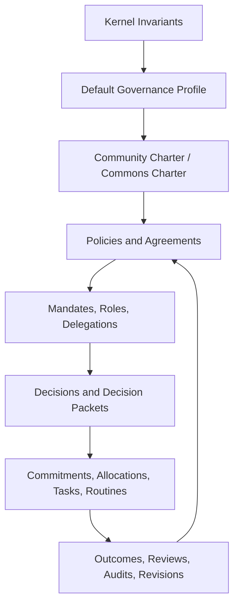

# Canopy Governance Profile

## Purpose

This document defines Canopy's default governance profile.

It translates ICOS/CommonGround constitutional principles into Canopy while distinguishing:

- **Kernel invariants**: non-negotiable system rules required for Canopy coherence and anti-capture.
- **Default constitutional rules**: strong defaults communities may adopt, adapt, or override through explicit governance.
- **Configurable governance procedures**: decision methods, thresholds, timing, roles, and local terminology.

## Governance Stack

## Kernel Invariants

These are required for anything calling itself Canopy.

### 1. Revocability

All delegated authority must be revocable. There is no irrevocable delegation, mandate, role assignment, or guardianship.

Applies to:

- Delegations
- Mandates
- Role assignments
- Guardian appointments
- Federation agreements
- Emergency powers

Required event support:

- `authority.delegation.revoked`
- `authority.mandate.revoked`
- `authority.guardian.challenged`

### 2. Due Process

No person, organization, commons, or guardian may be removed, suspended, excluded, or materially restricted without a visible process, an authority source, and a challenge path, except for narrowly scoped emergency action with review.

Applies to:

- Membership suspension
- Use-right revocation
- Mandate revocation
- Federation/defederation
- Moderation
- Conflict outcomes

### 3. Forkability And Exit

Communities must be able to export their data, governance records, object graph, policies, and civic memory in open formats, subject to data stewardship rules.

Applies to:

- Export envelope
- Federation rules
- Defederation
- Data stewardship agreements

### 4. Civic Memory Integrity

Consequential civic memory is append-only. Corrections and supersessions must be new events.

Applies to:

- Decisions
- Policy versions
- Claims/evidence reviews
- Mandates and delegations
- Allocations and commitments
- Ecological thresholds
- Model audits

### 5. Human Authority Over AI

AI may summarize, classify, extract, compare, recommend, and simulate. AI may not make binding decisions, revoke rights, allocate resources, resolve conflicts, appoint guardians, or suppress participation.

### 6. Claim/Evidence Contestability

Decision-relevant assertions must be represented as claims with evidence, review status, and challenge paths.

### 7. No Hidden Scores

Canopy may track commitments, outcomes, indicators, and contributions. It may not create hidden scores that determine access, authority, eligibility, trust, or worth.

### 8. Data Stewardship Travels

Data stewardship agreements, visibility rules, redactions, and consent constraints must travel with exported or federated data.

### 9. Ecological Visibility

Consequential material activity must expose living-system context when relevant. A proposal affecting land, water, food, energy, infrastructure, waste, habitat, or living systems may not proceed as if nature is external.

### 10. Ownership Is Not Primary

Legal ownership may be represented, but stewardship, use rights, obligations, and governance authority are first-class relations.

## Default Constitutional Principles

These are the recommended default principles for a Canopy instance or federation.

### Commons Protection

No decision should privatize shared infrastructure, restrict legitimate exit rights, erase civic memory, or transfer community-generated knowledge into proprietary control.

Default strength:

- Strong constitutional rule

Possible local variation:

- Communities may define what counts as shared infrastructure.

### Holonic Subsidiarity

Decisions should be made at the smallest scale capable of handling their consequences. Higher-scale coordination is triggered by interdependence, not administrative preference.

Default strength:

- Strong constitutional rule

Possible local variation:

- Communities may define scale thresholds and escalation rules.

### Deliberation Before Binding Decision

Consequential decisions should pass through structured deliberation before becoming binding.

Default strength:

- Strong constitutional rule

Possible local variation:

- Emergency decisions may proceed first and require retrospective review.

### Framework Accountability

The governance framework itself must be governed by active communities, not by administrators, founders, funders, or software maintainers alone.

Default strength:

- Strong constitutional rule

Possible local variation:

- Communities may define the composition of framework councils.

### Power-Aware Legibility

Visibility creates power. Every integration, dashboard, AI summary, data exposure, and metric must be reviewable for who gains power and who becomes vulnerable.

Default strength:

- Strong design constraint

Possible local variation:

- Communities may define review thresholds.

### Refusal As Legitimate

Non-participation is not always apathy. Canopy should support explicit refusal of processes, integrations, data sharing, or governance frameworks as a legitimate political act.

Default strength:

- Strong design constraint

Possible local variation:

- Communities may define refusal procedures.

### Conviviality And Offline Equivalence

Core coordination should have a viable offline or low-tech equivalent where possible. Software should augment community capacity, not replace it.

Default strength:

- Strong design principle

Possible local variation:

- Communities may prioritize digital-first workflows where appropriate.

## Decision Methods

Canopy supports multiple decision methods. The method is chosen by policy, charter, mandate, or proposal type.

| Method | Best for | Required protections |
| --- | --- | --- |
| Consent | Commons rules, stewardship changes, high-trust groups | Objections visible; block criteria defined |
| Consensus | Small groups, values-heavy decisions | Time limits and facilitation support |
| Simple majority | Low-stakes operational matters | Quorum and minority report |
| Supermajority | Constitutional or high-impact matters | Threshold declared before vote |
| Sortition | Citizen panels, review bodies | Eligibility and transparency rules |
| Delegated council | Cross-scale coordination | Revocable mandates |
| Facilitator determination | Operational matters within mandate | Mandate scope and appeal path |
| Emergency authority | Time-critical risks | Sunset, event log, retrospective review |
| Guardian delay/review | Living-system impact | Basis and challenge path |

## CommonGround Protocol As Default Deliberation Cycle

Default cycle:

### Attention

An issue enters shared awareness.

Required objects:

- Issue
- Scope
- Affected objects
- Awareness state

Failure modes:

- Attention flooding
- Attention capture
- Scope avoidance

### Perspecting

Participants contribute situated perspectives.

Required objects:

- Perspective
- AffectedGroup
- Stand-aside signal
- Missing voice flag

Failure modes:

- Perspectival monoculture
- Silenced perspectives
- Epistemic dominance

### Integration

Perspectives encounter each other and produce shared understanding.

Required artifacts:

- Situation map
- Convergence/divergence summary
- Decision-readiness assessment

Failure modes:

- Parallel monologue
- False convergence
- Integration fatigue

### Decision

The group resolves a proposal through the applicable decision method.

Required objects:

- Proposal
- Decision
- Authority refs
- Unresolved objections
- Review date

Failure modes:

- Decision without understanding
- Perpetual deliberation
- Quorum gaming

### Memory

Decision and context become civic memory.

Required objects:

- DecisionPacket
- CivicMemoryEvent
- PolicyVersion or Agreement where applicable
- Review trigger

Failure modes:

- Memory loss
- Memory ossification
- Memory inaccessibility

## Governance Object Requirements

### Issue

Must include:

- Title
- Scope
- Affected objects
- Created by
- Claims
- Perspectives
- Status
- Governance path
- Civic memory events

### Proposal

Must include:

- Problem statement
- Proposed change
- Affected objects
- Authority source
- Claims and evidence
- Decision method
- Ecological hooks where relevant
- Data stewardship implications
- Review/sunset where relevant

### Decision

Must include:

- What was decided
- How it was decided
- Why
- Authority source
- Participation/quorum state where applicable
- Unresolved objections
- Alternatives considered
- Created policies/agreements/commitments
- Review date
- Civic memory events

### Appeal

Must include:

- Target object
- Grounds
- Opened by
- Applicable process
- Remedy sought
- Status
- Outcome

### Conflict

Must classify:

- Factual dispute
- Value conflict
- Procedural objection
- Harm report
- Jurisdictional disagreement
- Resource/use-right conflict
- Data stewardship conflict
- Model/assumption dispute

## Guardian Review

Guardian review is required when:

- A proposal affects a represented living system and policy requires review.
- A threshold breach creates a governance trigger.
- A model or scenario uses assumptions about a represented living system.
- A data disclosure affects sensitive ecological knowledge.

Guardian review may produce:

- Claim
- Evidence
- Perspective
- Objection
- Delay request
- Alternative proposal
- Threshold recommendation

Guardian review may not:

- Become unchallengeable veto unless a binding policy explicitly grants that power.
- Replace wider affected-party deliberation.

## Emergency Governance

Emergency authority exists for time-sensitive harm prevention.

Emergency action must include:

- Emergency scope
- Acting authority
- Reason
- Actions taken
- Duration
- Sunset
- Retrospective review date
- Appeal path after action

Emergency authority must not:

- Become permanent by default.
- Bypass civic memory.
- Become a general-purpose admin override.

## Platform Self-Governance

The Canopy platform itself must be governable.

Governed platform changes:

- Kernel schema changes
- Canonical ontology changes
- Event taxonomy changes
- Data retention defaults
- AI model changes
- Federation protocol changes
- Moderation defaults
- Export format changes
- Capability activation/deactivation
- Integration approval

Required process:

- Proposal
- Impact assessment
- Claim/evidence packet
- Community review
- Decision
- Versioned change log
- Migration path
- Rollback or fork path where feasible

## Anti-Capture Defaults

Canopy's default governance profile should include anti-capture rules derived from ICOS.

### Financial Capture

- Funding sources visible.
- No funding agreement may override governance.
- Speculative tokenization prohibited by default.

### Founder/Admin Capture

- No permanent founder authority.
- Admin actions must be evented.
- Schema/default changes require governance.

### Data Capture

- Community data held in trust.
- No cross-community aggregation without consent.
- Export/fork rights tested.

### Technical Capture

- Open formats required.
- Critical path must have open-source or self-hostable path where possible.
- No proprietary lock-in for civic memory.

### Narrative Capture

- Communities control use of their stories.
- Public case studies require consent or co-authorship.

## Governance Health Indicators

Governance health indicators are vital signs, not optimization targets.

Suggested indicators:

- Participation breadth
- Scope challenge frequency
- Perspectival diversity
- Cross-perspective engagement
- Open issue load
- Decision review completion
- Appeal resolution time
- Guardian review completion
- Policy review overdue count
- Concentration of authority
- Delegation revocation rate
- Civic memory digest freshness

Rules:

- Health indicators must not become member scores.
- Indicators should trigger reflection, not automatic sanctions.

## Default Amendment Process

Kernel invariants:

- Require Canopy-wide amendment process.
- Require compatibility review.
- Require migration and fork path.

Default governance profile:

- May be adapted by a community through its charter process.
- Adaptations must be recorded.
- Adaptations must not violate kernel invariants.

Local policy:

- Amended by applicable local governance rules.
- Must preserve decision packet and civic memory.

## Governance Compliance Checklist

A Canopy capability is governance-compliant if:

- Consequential changes cite authority.
- Decisions include rationale and unresolved objections.
- Appeals exist for restrictions/removals.
- Delegations are revocable.
- Civic memory is append-only.
- Claims and evidence are distinguishable.
- Guardian review is available where applicable.
- Emergency powers sunset.
- Platform-level changes are governable.
- Export/fork remains possible.

