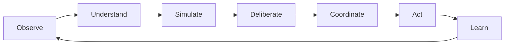
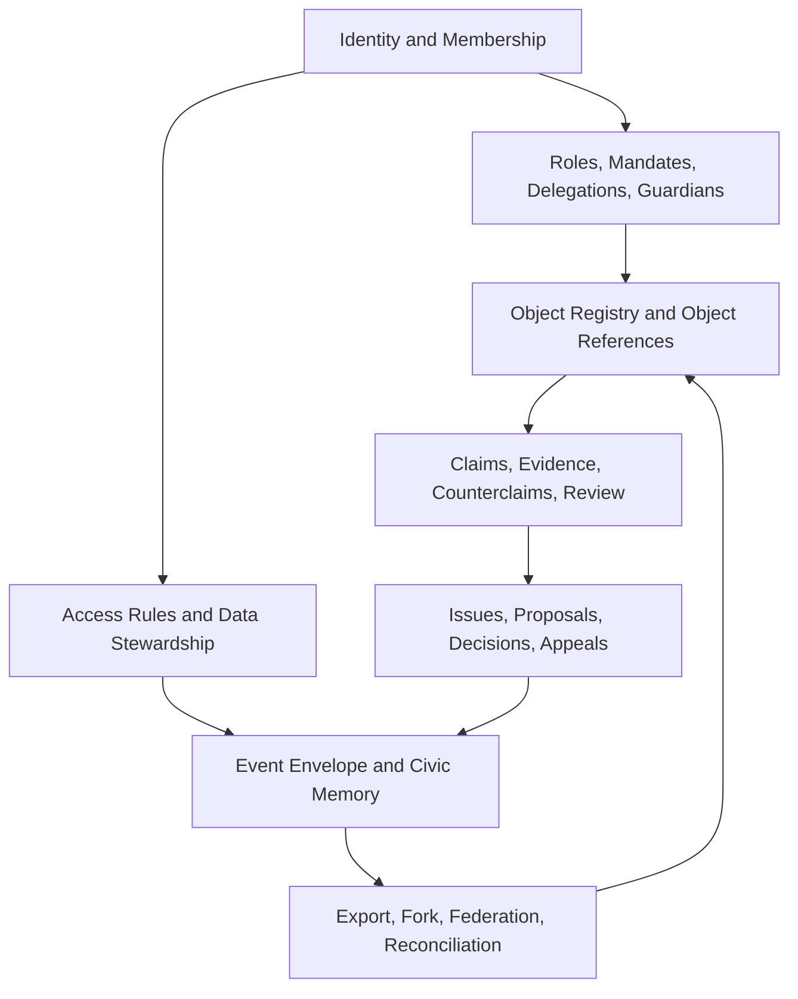

# Canopy Kernel Contract

## 1. Purpose

The Canopy Kernel is the shared substrate that makes the ecosystem feel like one cybernetic commons infrastructure rather than a set of separate applications.

It defines the primitives every Canopy capability must use:

- Identity
- Authority
- Object references
- Claims and evidence
- Permissions
- Data stewardship
- Events
- Civic memory
- Governance hooks
- Federation and export

Modules may own domain behavior. They may not invent incompatible identity, authority, object, claim, permission, event, memory, or export models.

## 2. Status

Version: 0.1  
Status: Draft contract  
Scope: Architecture and data contract, not implementation code  
Parent plan: Canopy cybernetic commons infrastructure

## 3. Design Principle

The kernel exists to preserve coherence across the cybernetic loop:



Every module must declare how its objects, events, and workflows participate in this loop.

## 4. Kernel Invariants

These are non-negotiable unless the kernel contract itself is amended through Canopy governance.

1. No module may hard-delete governed civic memory.
2. No module may create binding decisions without an authority source.
3. No module may treat AI output as final authority.
4. No module may create hidden eligibility scores for people.
5. No module may bypass claim/evidence structures for decision-relevant assertions.
6. No module may create local identity fields that shadow canonical identity fields.
7. No module may create irreversible delegations.
8. No module may block export, fork, or legitimate exit.
9. No module may make ecological consequences invisible when material resources, land, energy, food, water, infrastructure, or living systems are affected.
10. No module may treat ownership as the only valid relation to a resource.

## 5. Kernel Layer Map



## 6. Canonical Object Reference

All modules must address objects through a common reference format.

```ts
type CanopyObjectType =
  | "person"
  | "account"
  | "organization"
  | "membership"
  | "role"
  | "mandate"
  | "delegation"
  | "guardian"
  | "place"
  | "commons"
  | "living_system"
  | "resource"
  | "stock"
  | "flow"
  | "claim"
  | "counterclaim"
  | "evidence"
  | "source"
  | "perspective"
  | "model"
  | "scenario"
  | "issue"
  | "proposal"
  | "decision"
  | "agreement"
  | "policy"
  | "appeal"
  | "conflict"
  | "need"
  | "capability"
  | "request"
  | "offer"
  | "commitment"
  | "allocation"
  | "obligation"
  | "use_right"
  | "project"
  | "routine"
  | "task"
  | "contribution"
  | "outcome"
  | "indicator"
  | "threshold"
  | "audit"
  | "retrospective";

interface ObjectRef {
  id: string;
  type: CanopyObjectType;
  orgId?: string;
  placeId?: string;
  commonsId?: string;
  livingSystemId?: string;
  module?: CanopyCapability;
  schemaVersion: number;
}
```

Rules:

- `id` is stable and never recycled.
- `type` must be one of the canonical types or an approved local subtype mapped to a canonical type.
- `schemaVersion` is required for federation and replay.
- Domain modules may add domain IDs, but must expose a canonical `ObjectRef`.

## 7. Identity Contract

### 7.1 Person

A `Person` is a human being. A person may have multiple accounts, memberships, roles, mandates, delegations, or guardianships.

```ts
interface Person {
  id: string;
  displayName: string;
  preferredName?: string;
  bio?: string;
  timezone?: string;
  createdAt: string;
  status: "active" | "restricted" | "departed" | "archived";
}
```

Rules:

- A person is not the same thing as an account.
- A person is not the same thing as a membership.
- Sensitive identity details must be held through data stewardship rules.

### 7.2 Account

An `Account` is an authentication-facing identity handle.

```ts
interface Account {
  id: string;
  personId: string;
  provider: "clerk" | "nextauth" | "magic_link" | "did" | "other";
  providerSubjectId: string;
  email?: string;
  createdAt: string;
  disabledAt?: string;
}
```

Rules:

- Canopy must support provider adapters. The kernel must not depend on Clerk, NextAuth, or any single provider as ontology.
- A person may have multiple accounts.
- An account cannot hold authority directly; authority flows through membership, role, mandate, or delegation.

### 7.3 Organization

An `Organization` is a formal or informal collective actor.

```ts
interface Organization {
  id: string;
  slug: string;
  name: string;
  type:
    | "cooperative"
    | "land_trust"
    | "housing_coop"
    | "intentional_community"
    | "mutual_aid"
    | "nonprofit"
    | "institution"
    | "network"
    | "public_agency"
    | "indigenous_governance_body"
    | "producer"
    | "other";
  status: "active" | "restricted" | "archived";
  activatedCapabilities: CanopyCapability[];
  createdAt: string;
  archivedAt?: string;
}
```

Rules:

- `Organization` replaces product-specific `Community`, `Space`, or `Network` where those refer to a governing collective.
- Product activation becomes capability activation.
- Organizations can participate as actors, stewards, guardians, producers, institutions, or federation members.

### 7.4 Membership

A `Membership` is a person's relation to an organization.

```ts
interface Membership {
  id: string;
  personId: string;
  orgId: string;
  status: "invited" | "provisional" | "active" | "suspended" | "departed";
  joinedAt?: string;
  departedAt?: string;
  visibility: "public" | "org" | "role_restricted" | "private";
}
```

Rules:

- A person can have memberships in multiple organizations.
- Permissions should evaluate membership status and authority, not just account presence.

## 8. Authority Contract

### 8.1 Role

A `Role` is a named bundle of possible responsibilities and permissions.

```ts
interface Role {
  id: string;
  orgId: string;
  name: string;
  description?: string;
  permissions: PermissionAtom[];
  governanceBodyId?: string;
  createdAt: string;
}
```

### 8.2 Role Assignment

```ts
interface RoleAssignment {
  id: string;
  orgId: string;
  personId: string;
  roleId: string;
  assignmentType: "direct" | "elected" | "rotating" | "skill_based" | "emergency";
  startsAt?: string;
  endsAt?: string;
  reviewAt?: string;
  grantedByObjectRef?: ObjectRef;
  revokedAt?: string;
  revocationReason?: string;
}
```

### 8.3 Mandate

A `Mandate` is bounded authority to decide, act, represent, steward, or review.

```ts
interface Mandate {
  id: string;
  holderRef: ObjectRef;
  grantedByRef: ObjectRef;
  scope: MandateScope;
  capabilities: MandateCapability[];
  startsAt: string;
  expiresAt?: string;
  reviewAt?: string;
  revocationProcessRef?: ObjectRef;
  accountabilityProcessRef?: ObjectRef;
  conflictOfInterestPolicyRef?: ObjectRef;
  status: "active" | "expired" | "revoked" | "suspended";
}
```

Rules:

- Every consequential decision must cite a mandate, policy, agreement, role assignment, or emergency authority.
- Emergency mandates must have sunset and review.
- Mandates must be inspectable by affected participants unless protected by a data stewardship rule.

### 8.4 Delegation

A `Delegation` grants a capability from one actor to another.

```ts
interface Delegation {
  id: string;
  delegatorRef: ObjectRef;
  delegateRef: ObjectRef;
  capability: MandateCapability;
  scope: MandateScope;
  grantedByDecisionRef?: ObjectRef;
  grantedAt: string;
  expiresAt?: string;
  revokedAt?: string;
  revokedByRef?: ObjectRef;
}
```

Rules:

- There is no irrevocable delegation.
- Delegation may be space-wide, object-specific, issue-specific, or emergency-scoped.
- Delegation is authority, not status.

### 8.5 Guardian

A `Guardian` represents a living system, future generation, vulnerable interest, or non-participating affected party.

```ts
interface Guardian {
  id: string;
  holderRef: ObjectRef;
  representedRef: ObjectRef;
  basis:
    | "legal"
    | "customary"
    | "scientific"
    | "community_delegated"
    | "indigenous_governance"
    | "institutional"
    | "sensor_protocol"
    | "other";
  evidenceStandard?: string;
  challengePathRef?: ObjectRef;
  startsAt: string;
  reviewAt?: string;
  endsAt?: string;
}
```

Rules:

- Guardians do not become sovereign over living systems.
- Guardianship is representational authority with contestability.
- Guardian review is required when a proposal affects the represented object and the applicable policy says review is required.

## 9. Permission Contract

### 9.1 Permission Atom

```ts
type PermissionVerb =
  | "view"
  | "create"
  | "edit"
  | "archive"
  | "verify"
  | "challenge"
  | "decide"
  | "delegate"
  | "grant_use"
  | "revoke_use"
  | "allocate"
  | "export"
  | "federate"
  | "moderate"
  | "emergency_act";

interface PermissionAtom {
  verb: PermissionVerb;
  objectType: CanopyObjectType | "*";
  scope?: MandateScope;
}
```

### 9.2 Access Rule

```ts
interface AccessRule {
  id: string;
  objectRef: ObjectRef;
  actorRef?: ObjectRef;
  roleRef?: ObjectRef;
  mandateRef?: ObjectRef;
  permission: PermissionAtom;
  conditions: AccessCondition[];
  sourceRef: ObjectRef;
  startsAt: string;
  endsAt?: string;
  revokedAt?: string;
}
```

### 9.3 Permission Evaluation

All modules must evaluate permissions through a common shape:

```ts
interface PermissionCheckRequest {
  actorRef: ObjectRef;
  permission: PermissionAtom;
  targetRef: ObjectRef;
  context?: {
    purpose?: string;
    emergency?: boolean;
    actingMandateRef?: ObjectRef;
  };
}

interface PermissionCheckResult {
  allowed: boolean;
  sourceRefs: ObjectRef[];
  reason?: string;
  requiredAppealPathRef?: ObjectRef;
}
```

Rules:

- Client-side permission checks are advisory only.
- Server-side mutation handlers must enforce permission checks.
- Permission denial must be explainable unless doing so would reveal protected information.

## 10. Data Stewardship Contract

### 10.1 Data Visibility

```ts
type DataVisibility =
  | "public"
  | "federation"
  | "organization"
  | "commons"
  | "role_restricted"
  | "guardian_restricted"
  | "private"
  | "embargoed"
  | "sealed";
```

### 10.2 Data State

```ts
type DataState =
  | "unverified"
  | "locally_verified"
  | "expert_reviewed"
  | "institutionally_certified"
  | "contested"
  | "outdated"
  | "sensitive"
  | "archived"
  | "machine_inferred"
  | "sensor_derived"
  | "testimony_derived"
  | "model_derived";
```

### 10.3 Data Stewardship Agreement

```ts
interface DataStewardshipAgreement {
  id: string;
  governedRef: ObjectRef;
  stewardRefs: ObjectRef[];
  visibility: DataVisibility;
  allowedUses: string[];
  prohibitedUses: string[];
  consentRequired: boolean;
  disclosureRules: DisclosureRule[];
  retentionRule?: RetentionRule;
  exportRule?: ExportRule;
  federationRule?: FederationRule;
  reviewAt?: string;
}
```

Rules:

- Data stewardship agreements travel with exported data.
- Sensitive ecological data may be hidden to protect living systems.
- Vulnerable-community data may be restricted without erasing accountability.
- Crisis sharing requires authority, scope, duration, and post-crisis review.

## 11. Claims And Evidence Contract

### 11.1 Claim

A `Claim` is a contestable assertion about an object, condition, need, capability, cause, impact, model, or outcome.

```ts
interface Claim {
  id: string;
  orgId?: string;
  claimantRef: ObjectRef;
  aboutRefs: ObjectRef[];
  claimType:
    | "fact"
    | "causal"
    | "value"
    | "assumption"
    | "preference"
    | "forecast"
    | "risk"
    | "need"
    | "capability"
    | "impact";
  text: string;
  structuredValue?: Record<string, unknown>;
  confidence?: number;
  dataState: DataState;
  visibility: DataVisibility;
  reviewStatus: "pending" | "accepted" | "rejected" | "contested" | "superseded";
  createdAt: string;
  reviewAt?: string;
}
```

Rules:

- Decision-relevant assertions must be claims.
- AI-generated assertions must be marked `machine_inferred` or otherwise identified.
- A claim can be accepted for a purpose without becoming universal truth.

### 11.2 Counterclaim

```ts
interface Counterclaim {
  id: string;
  targetClaimRef: ObjectRef;
  claimantRef: ObjectRef;
  text: string;
  evidenceRefs: ObjectRef[];
  reviewStatus: "pending" | "accepted" | "rejected" | "preserved";
  createdAt: string;
}
```

### 11.3 Evidence

```ts
interface Evidence {
  id: string;
  submittedByRef: ObjectRef;
  evidenceType:
    | "testimony"
    | "measurement"
    | "sensor_reading"
    | "local_knowledge"
    | "scientific_study"
    | "institutional_record"
    | "media_artifact"
    | "model_output"
    | "ai_interpretation"
    | "legal_document"
    | "financial_record"
    | "field_note";
  title: string;
  summary?: string;
  sourceUri?: string;
  storageRef?: string;
  quote?: string;
  dataState: DataState;
  visibility: DataVisibility;
  createdAt: string;
}
```

### 11.4 Evidence Link

```ts
interface EvidenceLink {
  id: string;
  claimRef: ObjectRef;
  evidenceRef: ObjectRef;
  relation: "supports" | "challenges" | "contextualizes" | "qualifies" | "supersedes";
  note?: string;
  createdAt: string;
}
```

Rules:

- Evidence supports or challenges claims through links.
- Sources, claims, evidence, and decisions must remain distinguishable.
- Evidence type must be explicit.

## 12. Governance Hook Contract

Every consequential object must be able to expose governance hooks.

```ts
interface GovernanceHooks {
  issueRefs: ObjectRef[];
  proposalRefs: ObjectRef[];
  decisionRefs: ObjectRef[];
  agreementRefs: ObjectRef[];
  policyRefs: ObjectRef[];
  appealRefs: ObjectRef[];
  conflictRefs: ObjectRef[];
}
```

Required governance hooks:

- `UseRight` changes
- `AccessRule` changes
- `Mandate` grants and revocations
- `Delegation` grants and revocations
- Credit limit or accounting rule changes
- Data disclosure changes
- Model adoption or retirement
- Threshold changes
- Steward assignment changes
- Federation and defederation decisions
- Taxonomy changes

## 13. Civic Memory And Event Contract

### 13.1 Canopy Event

```ts
interface CanopyEvent {
  id: string;
  type: string;
  occurredAt: string;
  actorRef?: ObjectRef;
  objectRef: ObjectRef;
  orgId?: string;
  placeId?: string;
  commonsId?: string;
  livingSystemId?: string;
  sourceCapability: CanopyCapability;
  payload: Record<string, unknown>;
  schemaVersion: number;
  visibility: DataVisibility;
  dataState?: DataState;
}
```

### 13.2 Event Type Namespaces

Event types must be namespaced:

- `identity.*`
- `authority.*`
- `object.*`
- `claim.*`
- `evidence.*`
- `governance.*`
- `stewardship.*`
- `ecology.*`
- `allocation.*`
- `accounting.*`
- `flow.*`
- `model.*`
- `federation.*`
- `system.*`

Examples:

- `claim.reviewed`
- `resource.condition_updated`
- `living_system.threshold_breached`
- `governance.decision.recorded`
- `authority.delegation.revoked`
- `allocation.commitment.created`
- `flow.food.recorded`
- `model.audit.completed`
- `federation.export.created`

### 13.3 Civic Memory Rules

- Civic memory is append-only.
- Corrections must be new events, not edits.
- Supersession must be explicit.
- Exported memory must include schema versions.
- Private or sealed events may export as redacted stubs when necessary.
- A module-specific log is not sufficient for consequential events.

Implementation target:

- Adopt ICOS-style database-level append-only enforcement where possible.
- At minimum, application code must not update or delete civic memory rows.

## 14. Cybernetic Loop Participation Contract

Each capability must declare which cybernetic phases it participates in.

```ts
type CyberneticPhase =
  | "observe"
  | "understand"
  | "simulate"
  | "deliberate"
  | "coordinate"
  | "act"
  | "learn";

interface CapabilityManifest {
  capability: CanopyCapability;
  phases: CyberneticPhase[];
  ownedObjectTypes: CanopyObjectType[];
  consumedObjectTypes: CanopyObjectType[];
  emittedEventTypes: string[];
  governanceHooks: string[];
  ecologicalHooks: string[];
  exportSupport: boolean;
}
```

Rules:

- A capability that emits no events is not integrated.
- A capability with no governance hooks cannot make consequential changes.
- A material coordination capability with no ecological hooks is incomplete.

## 15. Capability Registry

Initial Canopy capabilities:

```ts
type CanopyCapability =
  | "kernel"
  | "reality_map"
  | "commons_registry"
  | "living_systems"
  | "claims_evidence"
  | "deliberation"
  | "agreements_policies"
  | "allocation_accounting"
  | "flows"
  | "simulation_models"
  | "civic_memory"
  | "learning_accountability"
  | "federation"
  | "care_coordination";
```

Historical project mappings:

| Existing project | Canopy capability mapping |
| --- | --- |
| CommonCredit | `allocation_accounting`, parts of `flows`, parts of `deliberation` |
| ICOS | `deliberation`, `federation`, `civic_memory`, `living_systems`, `flows`, `care_coordination` |
| Sensemaking | `claims_evidence`, parts of `deliberation`, parts of `learning_accountability` |
| Stewardship | `commons_registry`, `agreements_policies`, `flows`, `learning_accountability`, parts of `living_systems` |

## 16. Module Obligations

Every Canopy module must:

1. Use canonical object references.
2. Use kernel identity and membership.
3. Declare a capability manifest.
4. Emit consequential events into civic memory.
5. Expose governance hooks for consequential changes.
6. Represent decision-relevant assertions as claims.
7. Link claims to evidence.
8. Respect data stewardship agreements.
9. Support export/fork semantics.
10. Avoid hidden scores and non-contestable automated decisions.

## 17. Existing Project Translation Rules

### 17.1 CommonCredit

Translate:

- `Member` -> `Membership` plus product-specific accounting profile
- `Account` -> `LedgerAccount`, not identity account
- `Offer` -> `Offer` / `Capability`
- `Need` -> `Need` / `Request`
- `Transaction` -> `CommitmentFulfillment` plus `LedgerEntry`
- `LedgerEntry` -> `LedgerEntry`
- `Invoice` -> `PaymentRequest` or `SettlementRequest`
- `CreditLimitRequest` -> governed accounting `UseRight`
- `Dispute` -> `Conflict`
- `Proposal` -> `Proposal`

Kernel requirements:

- Ledger rows must be append-only.
- Mutual credit is one accounting method, not the central economic ontology.
- No reputation metric may become a generalized social score.

### 17.2 ICOS

Translate:

- `Space` -> `Organization`, `Commons`, or `Place`, depending on context
- `Neighborhood` -> `Place` subtype
- `Issue` -> `Issue`
- `Perspective` -> `Perspective`
- `DecisionRecord` -> canonical `Decision`
- `Delegation` -> `Delegation`
- `TimelineEvent` -> `CanopyEvent`
- `SurplusShortageDeclaration` -> `Request` / `Offer` / `Claim`
- `AllocationProposal` -> `Allocation`
- `Producer` -> `Organization` subtype or domain actor profile
- `CreditTransaction` -> domain-specific `LedgerEntry`

Kernel requirements:

- Preserve revocable delegations.
- Preserve append-only civic memory.
- Preserve forkability, exit, and data export principles.
- Treat constitutional principles as Canopy defaults unless explicitly adopted as kernel invariants.

### 17.3 Sensemaking

Translate:

- `Issue` -> `Issue`
- `Source` -> `Evidence` or `Source`
- `Claim` -> `Claim`
- `Theme` -> `Theme` as sensemaking artifact, not kernel primitive
- `StakeholderGroup` -> `AffectedGroup` or `PerspectiveGroup`
- `Contribution` -> `Perspective`, `EvidenceLink`, or `Contribution`, depending on target

Kernel requirements:

- Claims must attach to any object, not only issues.
- Counterclaims must be first-class.
- Human review remains required before claims become decision-ready.
- AI extraction must mark outputs as machine-inferred.

### 17.4 Stewardship

Translate:

- `Community` -> `Organization`
- `Resource` -> `Resource`
- `AccessRight` -> `UseRight` plus `AccessRule`
- `MaintenanceTask` -> `Task` and possibly `Routine`
- `Contribution` -> `Contribution`
- `Policy` -> `Policy`
- `PolicyVersion` -> `PolicyVersion`
- `Proposal` -> `Proposal`
- `Decision` -> `Decision`
- `EventLogEntry` -> `CanopyEvent`
- `FoodFlow` -> `Flow`
- `FoodPolicyIntervention` -> `Policy` / `Agreement` / `Allocation`

Kernel requirements:

- Rights engine must use canonical permission check shape.
- Resource events must emit to civic memory.
- Maintenance and care work must not become productivity ranking.
- Food flows must be able to link to ecological indicators and living systems.

## 18. Federation And Export Contract

### 18.1 Export Envelope

```ts
interface CanopyExportEnvelope {
  id: string;
  exportedAt: string;
  exportedByRef: ObjectRef;
  scopeRef: ObjectRef;
  format: "json" | "jsonl" | "csv_bundle";
  schemaVersion: number;
  includes: CanopyObjectType[];
  dataStewardshipAgreements: DataStewardshipAgreement[];
  contentHash: string;
  redactionSummary?: string;
}
```

Rules:

- Export must include enough metadata for import, audit, and reconciliation.
- Redactions must be declared.
- Data stewardship rules must travel with exported data.
- Forkability must be tested, not merely promised.

### 18.2 Federation Rule

```ts
interface FederationRule {
  id: string;
  localScopeRef: ObjectRef;
  remoteScopeRef: ObjectRef;
  allowedObjectTypes: CanopyObjectType[];
  allowedEventTypes: string[];
  syncMode: "manual" | "scheduled" | "near_real_time";
  conflictPolicy: "preserve_both" | "local_wins" | "remote_wins" | "governance_required";
  reviewAt?: string;
}
```

Rules:

- Federation is a governed relationship.
- Defederation must preserve local records.
- Cross-scale coordination must not erase local autonomy.

## 19. Ecological Hook Contract

Material modules must expose ecological hooks.

```ts
interface EcologicalHooks {
  affectedLivingSystemRefs: ObjectRef[];
  indicatorRefs: ObjectRef[];
  thresholdRefs: ObjectRef[];
  guardianReviewRequired: boolean;
  ecologicalClaimRefs: ObjectRef[];
  impactModelRefs: ObjectRef[];
}
```

Required for:

- Resource extraction
- Land use
- Food flows
- Energy flows
- Water systems
- Infrastructure
- Procurement
- Transportation
- Waste
- Restoration

Threshold classes:

- `advisory`: visible in deliberation
- `governance_trigger`: creates issue/review/escalation
- `binding`: hard constraint because a legitimate agreement made it binding

## 20. Model Governance Contract

Models must be governed objects.

```ts
interface Model {
  id: string;
  name: string;
  purpose: string;
  stewardRefs: ObjectRef[];
  datasetRefs: ObjectRef[];
  assumptionRefs: ObjectRef[];
  knownFailureModes: string[];
  validationStatus: "untested" | "locally_validated" | "expert_reviewed" | "contested" | "retired";
  reviewAt?: string;
}
```

Rules:

- Every scenario must cite a model or method.
- Model outputs are evidence, not decisions.
- Affected communities and guardians can contest assumptions.
- Model confidence has history, not a static label.

## 21. Decision Packet Contract

A decision packet is the portable record of how a consequential choice was made.

```ts
interface DecisionPacket {
  issueRef: ObjectRef;
  proposalRef: ObjectRef;
  decisionRef: ObjectRef;
  authorityRefs: ObjectRef[];
  affectedObjectRefs: ObjectRef[];
  claimRefs: ObjectRef[];
  evidenceRefs: ObjectRef[];
  perspectiveRefs: ObjectRef[];
  scenarioRefs: ObjectRef[];
  ecologicalHooks?: EcologicalHooks;
  unresolvedObjections: string;
  outcome: "passed" | "rejected" | "deferred" | "superseded";
  reviewAt?: string;
  eventRefs: ObjectRef[];
}
```

Rules:

- Decisions must preserve rationale and unresolved objections.
- Decision packets must cite authority.
- Decision packets must be exportable.
- Decision packets must be visible according to data stewardship rules.

## 22. Open Design Questions

1. Should Canopy use UUIDs everywhere, ULIDs everywhere, or tolerate both behind canonical `ObjectRef`?
2. Should `Person` be global to a federation or local to an organization until explicitly linked?
3. Which ICOS constitutional principles become kernel invariants versus default governance profile rules?
4. Should `Place` and `Commons` be separate root objects in all cases, or can a place sometimes be a commons?
5. What is the minimum viable append-only enforcement pattern across Drizzle, Prisma, and any future persistence layer?
6. How should sensitive living-system data export as redacted stubs without enabling harm?
7. What are the first canonical event types required for the integrated system?
8. How should local taxonomy terms map to canonical object types without semantic assimilation?

## 23. Immediate Next Deliverables

1. Canopy Ontology Map: every noun in CommonCredit, ICOS, Sensemaking, and Stewardship mapped to canonical object, subtype, or retired term.
2. Canopy Event Taxonomy: first stable list of event namespaces and event payloads.
3. Canopy Object Page Template: one UI pattern that can render any canonical object.
4. Canopy Module Manifests: one manifest for each folded module.
5. Canopy Governance Profile: default constitutional profile derived from ICOS, with explicit kernel invariants.

## 24. Summary

The Canopy Kernel Contract is the coherence layer. It prevents the ecosystem from becoming a set of adjacent apps by requiring every capability to speak the same language of identity, authority, claims, evidence, permissions, events, civic memory, data stewardship, and federation.

The existing projects should not be merged by UI proximity. They should be folded in by contract.

