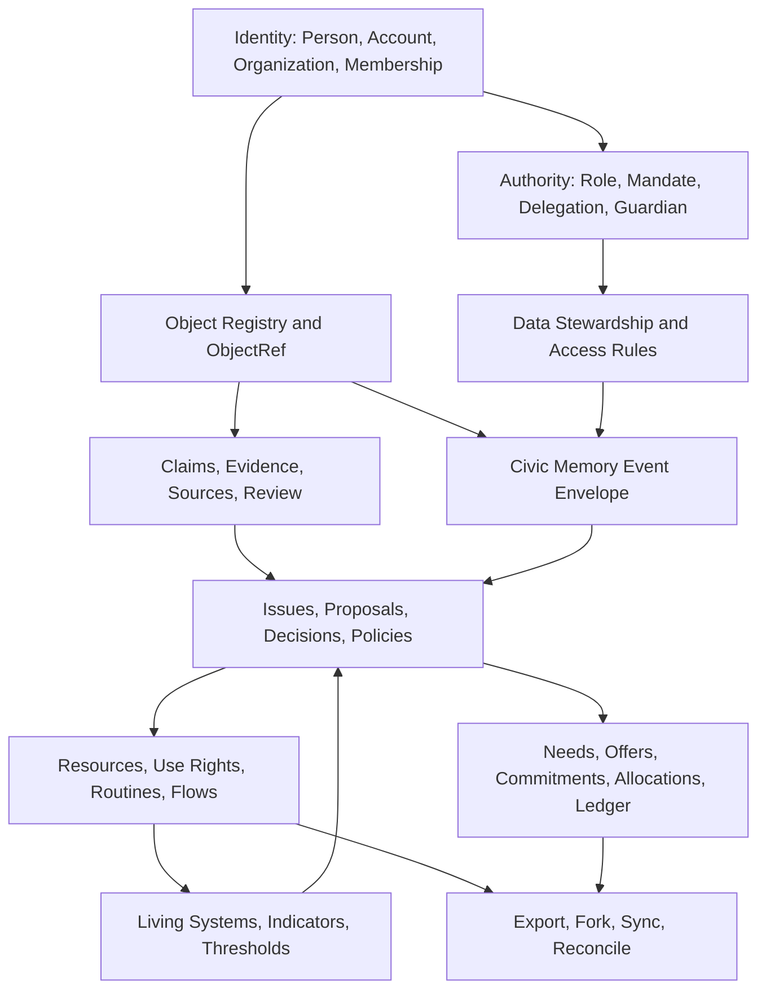

# Canopy Migration / Fold-In Plan

## Purpose

This is a coherence-preserving fold-in plan for CommonCredit, ICOS, Sensemaking, and Stewardship.

It is not an MVP plan. It does not ask the four projects to become one product quickly. It phases their adaptation into Canopy by extracting shared primitives first, wrapping existing domain capabilities second, projecting their objects and events into the Canopy kernel third, and only later translating selected implementation code into native Canopy services.

The core migration rule is:

> Preserve working domain knowledge, but do not preserve project boundaries as user-facing architecture.

CommonCredit, ICOS, Sensemaking, and Stewardship should remain useful source bodies during migration. They should not survive as separate top-level apps inside Canopy.

## Migration Thesis

Canopy coherence depends on five substrates being stabilized before deep feature porting:

1. Kernel identity and authority
2. Canonical object references and ontology mappings
3. Claims, evidence, counterclaims, and review
4. Append-only civic memory events
5. Governance, data stewardship, export, and federation envelopes

The migration should therefore proceed through four modes:

| Mode | Meaning | When to use |
| --- | --- | --- |
| Extract | Lift concepts, schemas, invariants, and protocols into the Canopy kernel | For shared identity, events, claims, delegation, decisions, rights, ledgers |
| Wrap | Keep an existing module intact behind adapters that emit Canopy objects/events | For useful but not-yet-native domain workflows |
| Project | Expose legacy objects through canonical `ObjectRef`, event, and relationship views | For read models, search, object pages, civic memory, decision packets |
| Translate | Rebuild selected workflows as native Canopy services once the kernel is stable | For long-lived capability modules |

Do not translate first. Translation before extraction will reproduce four ontologies inside one codebase.

## Target Disposition By Project

| Project | Canopy destination | Disposition | First value to extract | First thing to wrap | Leave alone until later |
| --- | --- | --- | --- | --- | --- |
| CommonCredit | Allocation and Accounting; Coordination | Extract ledger and exchange invariants; wrap mutual-credit workflows; translate accounting service later | Ledger discipline, offer/need vocabulary, domain event envelope, dispute ladder | Ledger postings, offers, needs, invoices, credit-limit requests, disputes | Full network UI, tax exports, Stripe/member dues, reputation scoring |
| ICOS | Governance Spine; Civic Memory; Federation; Living Systems; Flow | Extract constitutional protocol and append-only memory; use as governance reference; translate CommonGround selectively | Delegations, decision records, attention-perspecting-integration-decision-memory protocol, export bundles, append-only enforcement | Issues, perspectives, delegations, decisions, referenda, Synapse declarations, allocation proposals | Full ICOS site/docs, municipal-scale MCS, AI governance features before claim/model audit is stable |
| Sensemaking | Claims and Evidence; Issue interpretation | Extract schema and review lifecycle; project claims across all objects; translate ingestion after data rules mature | Claim/source/review lifecycle, claim types, stakeholder affectedness, human acceptance rule | Source ingestion, issue-centered claim review, AI extraction as non-authoritative artifact | App shell, ungoverned AI synthesis, any automatic canonicalization |
| Stewardship | Commons and Resources; Use Rights; Policies; Maintenance; Food Flows | Use as strongest first domain substrate; extract resource/rights/policy/event concepts; wrap resource governance | Resource registry, `can()` rights shape, use/access rights, maintenance cycles, policy versioning, food flows | Resource pages, use-right checks, condition updates, maintenance tasks, policy decisions, food-flow records | SaaS-style metrics, contribution dashboards that imply ranking, tenant terminology as ontology |

## Non-Negotiable Migration Constraints

1. No migrated object may bypass canonical `ObjectRef`.
2. No migrated workflow may create binding decisions without `authorityRefs`.
3. No migrated domain assertion that affects decisions may remain outside claims/evidence.
4. No project-specific event log may be the only durable memory for consequential events.
5. No project-specific `Member`, `Community`, `Space`, or `Account` may shadow kernel identity.
6. No delegation, right, mandate, or credit capacity may be irreversible.
7. No contribution, reputation, or care signal may become a hidden eligibility score.
8. No ecological consequence may be invisible when resources, places, living systems, food, water, land, energy, waste, or infrastructure are affected.
9. No old product name should become a primary navigation boundary in the Canopy shell.
10. No AI output may be migrated as authority; it can only become evidence, interpretation, extraction, or proposal material subject to review.

## Extraction Priorities

### 1. Kernel Identity And Authority

Extract first because every later mapping depends on stable actors and authority.

Source material:

- CommonCredit shared identity concepts
- ICOS memberships, delegations, and constitutional authority
- Stewardship roles, role assignments, governance bodies, and access rights
- Sensemaking members and org roles

Canonical targets:

- `Person`
- `Account`
- `Organization`
- `Membership`
- `Role`
- `RoleAssignment`
- `Mandate`
- `Delegation`
- `Guardian`

Key adaptations:

- Split `Member` into `Person + Membership + RoleAssignment`.
- Split auth-facing `Account` from CommonCredit ledger `LedgerAccount`.
- Map Stewardship `Community` to `Organization` for tenant/governing collective, and to `Commons` only when it describes a governed shared resource system.
- Map ICOS `Space` case-by-case to `Organization`, `Commons`, or governance scope.
- Preserve ICOS revocability as a kernel invariant for all delegations.
- Treat ecological proxy/guardian roles from ICOS/EIL as `Guardian` plus challenge path, not as unchallengeable representation.

### 2. Object Registry And Ontology Projection

Extract second because wrappers need a canonical projection layer before they can safely coexist.

Create a canonical registry that can store or resolve:

- Stable `ObjectRef`
- Canonical object type
- Legacy project source
- Legacy table/object id
- Scope refs: `orgId`, `placeId`, `commonsId`, `livingSystemId`
- Schema version
- Visibility and data stewardship defaults
- Local term mappings

Minimum mapping gates:

- Every wrapped legacy row that appears in search, object pages, decisions, claims, ledgers, rights, flows, or events must have an `ObjectRef`.
- Every local noun must be `KEEP`, `MERGE`, `SUBTYPE`, `ALIAS`, `ARTIFACT`, or `RETIRE`.
- Every canonical object page must be able to ask: claims, evidence, governance hooks, events, permissions, relationships, outcomes.

### 3. Claims And Evidence

Extract before governance translation because proposals and decisions must cite contestable knowledge.

Source material:

- Sensemaking `Issue`, `Source`, `Claim`, `Theme`, `StakeholderGroup`, `Contribution`
- ICOS `Perspective`
- Stewardship resource documents and proposal evidence
- CommonCredit dispute evidence and contextual feedback

Canonical targets:

- `Claim`
- `Counterclaim`
- `Evidence`
- `Source`
- `Perspective`
- `Issue`
- `AffectedGroup`
- `EvidenceLink`
- `ReviewStatus`

Key adaptations:

- Claims can be about any `ObjectRef`, not only an issue.
- Claimants can be people, organizations, guardians, institutions, sensors, importers, or AI assistants.
- Evidence must link to claims through explicit relationships, not only direct source fields.
- AI extraction creates draft claims/evidence with review state; it does not create canonical truth.
- Resource condition updates, ecological indicator readings, flow records, accounting disputes, and policy impact statements must become claim/evidence aware.

### 4. Civic Memory And Event Envelope

Extract before high-volume migration because replay, export, audit, and learning depend on event comparability.

Source material:

- CommonCredit domain event envelope
- ICOS append-only timeline enforcement and export bundles
- Stewardship broad event log
- Sensemaking claim/review transitions

Canonical target:

```ts
interface CanopyEvent {
  id: string;
  type: CanopyEventType;
  occurredAt: string;
  actorRef?: ObjectRef;
  systemActor?: "scheduler" | "sensor" | "ai_assistant" | "importer" | "federation_peer";
  objectRef: ObjectRef;
  relatedRefs?: ObjectRef[];
  authorityRefs?: ObjectRef[];
  orgId?: string;
  placeId?: string;
  commonsId?: string;
  livingSystemId?: string;
  sourceCapability: CanopyCapability;
  payload: Record<string, unknown>;
  schemaVersion: number;
  visibility: DataVisibility;
  dataState?: DataState;
  supersedesEventId?: string;
}
```

First stable event families:

- `identity.*`
- `authority.*`
- `object.*`
- `claim.*`
- `evidence.*`
- `governance.*`
- `stewardship.*`
- `coordination.*`
- `allocation.*`
- `accounting.*`
- `flow.*`
- `ecology.*`
- `federation.*`

Implementation guidance:

- Adopt ICOS-style append-only enforcement for civic memory.
- Use corrective/superseding events instead of mutation for memory-level records.
- Allow private/sealed events to emit redacted stubs where needed.
- Make imported legacy events explicit with `systemActor: "importer"` and source metadata.

### 5. Governance Spine

Extract before policy, rights, allocation, and ledger translation because those workflows need legitimate authority.

Source material:

- ICOS CommonGround protocol and decision records
- Stewardship governance proposals, comments, votes, decision rules, policy versions
- CommonCredit proposals, votes, treasury allocation, disputes
- Sensemaking issue and perspective workflows

Canonical targets:

- `Issue`
- `Perspective`
- `Proposal`
- `Decision`
- `DecisionPacket`
- `Agreement`
- `Policy`
- `Appeal`
- `Conflict`

Key adaptations:

- ICOS constitutional principles become default templates and kernel invariants where they protect exit, revocability, memory, non-capture, due process, and forkability.
- Stewardship policy versions become native `PolicyVersion` artifacts under `Policy`.
- CommonCredit votes and treasury allocations become decision-process artifacts, not separate governance ontology.
- Every decision packet must carry authority, claims/evidence, perspectives, unresolved objections, outcome, review date, supersession path, and exportability.

## What To Wrap First

Wrapping allows useful workflows to keep running while Canopy contracts harden.

### Stewardship Wrapper

Wrap first because it is the most concrete domain substrate and exercises resources, rights, policies, maintenance, events, and food flows.

Wrapper responsibilities:

- Project `Community`, `Resource`, `AccessRight`, `Policy`, `Proposal`, `Decision`, `MaintenanceTask`, `Contribution`, and food-flow records to canonical objects.
- Emit canonical events for resource creation, condition updates, use-right changes, policy versioning, task completion, contribution logging, and flow records.
- Route all permission checks through a kernel-shaped `can(actorRef, action, objectRef, context)` adapter.
- Link documents and condition updates to claims/evidence.

Do not translate yet:

- Full Stewardship UI
- Onboarding checklists
- Metrics dashboards
- Contribution leaderboard-like views

### Sensemaking Wrapper

Wrap second because it supplies the epistemic layer all other modules need.

Wrapper responsibilities:

- Project `Issue`, `Source`, `Claim`, `StakeholderGroup`, and `Contribution` into Canopy object refs.
- Emit `claim.created`, `claim.reviewed`, `claim.contested`, `evidence.source.ingested`, `evidence.created`, and `evidence.linked_to_claim`.
- Allow claims about Stewardship resources, ICOS decisions, CommonCredit credit limits, flows, indicators, and policies.
- Mark AI-generated extractions as draft or pending review.

Do not translate yet:

- AI synthesis workflows that cannot explain source, confidence, limitations, and review status
- Theme clusters as root objects
- Any workflow that makes claims canonical without human or mandated review

### ICOS Wrapper

Wrap third, while extracting governance primitives earlier.

Wrapper responsibilities:

- Project `Space`, `Neighborhood`, `Issue`, `Perspective`, `Delegation`, `DecisionRecord`, `TimelineEvent`, `Referendum`, export bundles, and Synapse allocation objects.
- Emit governance, authority, civic-memory, allocation, flow, and federation events.
- Use ICOS decision records as the first `DecisionPacket` model.
- Use ICOS append-only enforcement as the reference memory implementation.

Do not translate yet:

- Municipal-scale governance workflows
- Full ICOS site and docs
- AI deliberation support before claims/evidence/model audit rules are stable

### CommonCredit Wrapper

Wrap fourth, after authority, governance, and event contracts can protect accounting consequences.

Wrapper responsibilities:

- Project `Offer`, `Need`, `Invoice`, `Transaction`, `LedgerEntry`, `CreditLimitRequest`, `Dispute`, `Treasury`, `Project`, and `CommonsResource`.
- Emit coordination, allocation, accounting, governance, and conflict events.
- Keep double-entry ledger rules intact.
- Treat credit limit changes as governed `UseRight` changes over mutual-credit capacity.
- Treat disputes as `Conflict` with linked claims/evidence and decision records.

Do not translate yet:

- Tax/accounting exports
- Stripe/member dues
- Full mutual-credit network UI
- Portable reputation scoring

## What To Leave Alone

Some material should be preserved as source context but not folded in early.

Leave alone until kernel stability:

- Product-specific shells, navigation, onboarding, and marketing pages
- ORM and auth-provider migrations that do not change ontology
- Styling systems and component libraries
- Full AI extraction, synthesis, or recommendation loops
- Municipal-scale governance implementations
- External payment integrations
- Tax and compliance export surfaces
- Reputation scores, contribution rankings, generalized trust scores
- Care coordination details unless data stewardship and sealed-event rules are ready

Leave alone permanently or retire as root concepts:

- Hidden eligibility scoring
- Irreversible delegation
- Ownership-only resource models
- Product slugs as primary capability identity
- Unreviewed AI conclusions
- Theme clusters as root kernel objects
- Auth tokens, sessions, verification tokens, and rate-limit buckets as ontology objects

## Object Mapping Dependencies

The following dependencies should govern migration order.



Concrete dependency rules:

- `UseRight` cannot migrate before `Person`, `Organization`, `Membership`, `Mandate`, and `ObjectRef`.
- `CreditLimitRequest` cannot migrate before `UseRight`, `Decision`, and `accounting.limit.changed`.
- `ResourceConditionUpdate` cannot migrate before `Claim`, `Evidence`, `Indicator`, and `stewardship.resource.condition_updated`.
- `DecisionRecord` cannot migrate before `authorityRefs`, `Proposal`, `EvidenceLink`, and civic memory.
- `LedgerEntry` cannot migrate before identity actor refs, ledger account mapping, event append-only rules, and reversal semantics.
- `SurplusShortageDeclaration` cannot migrate before `Offer`, `Request`, `Claim`, and flow/resource refs.
- `PolicyVersion` cannot migrate before `Decision`, `Policy`, and event supersession.
- `ExportEnvelope` cannot migrate before object refs, schema versions, visibility, and data stewardship agreements.

## Event Mapping Dependencies

Event projection should be introduced in layers. Each layer should include validation fixtures before the next layer is allowed to emit production events.

### Layer A: Identity And Authority

Required events:

- `identity.organization.created`
- `identity.membership.activated`
- `authority.role.assigned`
- `authority.mandate.granted`
- `authority.delegation.granted`
- `authority.delegation.revoked`

Used by:

- All rights, decisions, proposals, allocations, ledger entries, and stewardship assignments

### Layer B: Objects And Evidence

Required events:

- `object.created`
- `object.relationship.linked`
- `object.taxonomy.mapped`
- `claim.created`
- `claim.reviewed`
- `claim.contested`
- `evidence.source.ingested`
- `evidence.created`
- `evidence.linked_to_claim`

Used by:

- Resource condition updates
- Decision packets
- Disputes/conflicts
- Ecological indicators
- Model assumptions
- Policy impact claims

### Layer C: Governance And Memory

Required events:

- `governance.issue.created`
- `governance.perspective.submitted`
- `governance.proposal.created`
- `governance.proposal.opened`
- `governance.decision.recorded`
- `governance.policy.versioned`
- `governance.appeal.opened`
- `governance.conflict.opened`
- `governance.conflict.resolved`

Used by:

- Policy changes
- Use-right grants
- Credit limits
- Resource allocations
- Stewardship assignments
- Conflict and dispute resolution

### Layer D: Domain Capability Events

Required events:

- `stewardship.resource.created`
- `stewardship.resource.condition_updated`
- `stewardship.use_right.granted`
- `stewardship.routine.created`
- `stewardship.task.completed`
- `coordination.need.created`
- `coordination.offer.created`
- `coordination.commitment.created`
- `allocation.created`
- `accounting.ledger_account.created`
- `accounting.ledger_entry.posted`
- `accounting.ledger_entry.reversed`
- `flow.recorded`
- `flow.food.recorded`
- `ecology.indicator.recorded`
- `ecology.threshold.breached`

Used by:

- Learning loops
- Reality map
- Commons registry
- Allocation/accounting reports
- Flow analysis
- Ecological governance triggers

### Layer E: Federation And Learning

Required events:

- `federation.export.created`
- `federation.import.received`
- `federation.conflict.detected`
- `federation.reconciliation.recorded`
- `model.audit.completed`
- `integrity.audit.completed`

Used by:

- Forking
- Cross-instance sync
- External accountability
- Model governance
- Long-term memory and retrospectives

## Per-Project Detailed Plan

### CommonCredit

Disposition:

CommonCredit becomes the source body for Canopy's Allocation and Accounting capability, plus part of Coordination. It should not come forward as a standalone mutual-credit app. Its ledger rigor and cooperative exchange vocabulary are valuable; its app boundaries and scoring-adjacent reputation surfaces are risky.

Extract first:

- Double-entry ledger invariants
- Offset/reversal model instead of deletion
- `Offer` and `Need` vocabulary
- Domain event envelope
- Credit limit governance
- Dispute ladder
- Treasury allocation patterns
- "Institution, not app" design principle

Wrap:

- `Offer` as `Offer` and sometimes `Capability`
- `Need` as `Need` and sometimes `Request`
- `Invoice` as `SettlementRequest` / `Request`
- `CreditLimitRequest` as `UseRightChangeRequest`
- `Transaction` as settlement/fulfillment artifact
- `LedgerEntry` as canonical accounting primitive
- `Dispute` as `Conflict`
- `TreasuryAllocation` as `Allocation`
- `ProjectTask` as `Task`

Leave alone:

- Stripe/member dues
- Tax exports
- Full mutual-credit network UI
- Generalized reputation
- Portable endorsement scores

Translate later:

- Native ledger service
- Mutual-credit accounting policy configuration
- Settlement request workflows
- Dispute/conflict resolution workflows
- Accounting reports as learning artifacts

Primary risks:

- Confusing identity `Account` with ledger `LedgerAccount`
- Letting credit limits bypass governance
- Importing reputation as hidden eligibility
- Treating accounting events as mutable operational logs rather than civic memory
- Overfitting Canopy allocation to mutual credit alone

### ICOS

Disposition:

ICOS becomes the constitutional, governance, civic-memory, federation, and protocol reference for Canopy. CommonGround should inform the governance spine. EIL and Synapse should inform Living Systems, Flow, and allocation consent, but not before the kernel can represent claims, guardians, thresholds, and authority.

Extract first:

- Revocable delegation schema
- Decision record structure
- Attention -> perspecting -> integration -> decision -> memory protocol
- Append-only civic memory enforcement
- Export bundle and content hash model
- Forkability and anti-capture principles
- Holonic governance model
- Guardian/proxy ecological representation
- Synapse surplus/shortage and consented allocation concepts

Wrap:

- `Issue` as `Issue`
- `Perspective` as `Perspective`
- `Delegation` as `Delegation`
- `DecisionRecord` as `Decision` / `DecisionPacket`
- `TimelineEvent` as `CivicMemoryEvent`
- `Space` as `Organization`, `Commons`, or governance scope
- `Neighborhood` as `Place`
- `Referendum` as decision-process subtype
- `SurplusShortageDeclaration` as `Offer` / `Request` plus `Claim`
- `AllocationProposal` as `Proposal` plus candidate `Allocation`

Leave alone:

- Full ICOS site/docs
- Municipal-scale MCS
- AI deliberation layer until model audit and claim review are ready
- Constitutional language that should remain a template rather than hard-coded universal law

Translate later:

- Native governance service
- Decision packet service
- Delegation service
- Export/federation service
- Ecological guardian review workflows
- Flow allocation consent workflows

Primary risks:

- Hard-coding one constitutional culture into a plural system
- Treating perspectives as comments rather than first-class deliberative inputs
- Translating referenda before richer consent, objection, and review patterns
- Using ecological data only as decoration instead of governance-triggering context
- Losing append-only memory guarantees during migration

### Sensemaking

Disposition:

Sensemaking becomes the epistemic layer for all Canopy capabilities. It should not be a separate "sensemaking area." Its schemas should be generalized so claims and evidence attach to resources, flows, credit decisions, policies, ecological thresholds, model outputs, and conflicts.

Extract first:

- Claim lifecycle: pending, accepted, rejected, contested, superseded
- Claim types: fact, causal, value, assumption, preference
- Source ingestion structure
- Human acceptance rule
- Stakeholder power/affectedness model
- Contribution model as input to perspective/evidence

Wrap:

- `Issue` as `Issue`
- `Source` as `Source` and extracted `Evidence`
- `Claim` as `Claim`
- `StakeholderGroup` as `AffectedGroup`
- `Theme` as artifact
- `Contribution` as `Perspective`, `EvidenceLink`, or `Contribution` depending on target

Leave alone:

- Boilerplate app shell
- Ungoverned AI extraction
- Theme clusters as root objects
- Automatic synthesis that hides disagreement

Translate later:

- Evidence ingestion service
- Claim review service
- Counterclaim and contestability workflows
- AI-assisted extraction with provenance, confidence, limitation, and review requirements
- Cross-object issue interpretation

Primary risks:

- Letting claims stay issue-bound instead of object-universal
- Treating source credibility as a simplistic score
- Collapsing disagreement into synthesis too early
- Exposing sensitive evidence without data stewardship
- Allowing AI to create final authority

### Stewardship

Disposition:

Stewardship is the best first practical domain wrapper because it exercises resources, rights, maintenance, policy, governance, event logs, and food flows. It should become the Commons and Stewardship capability, not a SaaS tenant app.

Extract first:

- Resource registry
- Resource condition updates
- Access/use rights schema
- `can()` rights engine shape
- Policy and policy-version model
- Maintenance task and recurrence model
- Stewardship assignments
- Food-flow chain
- RLS-oriented community context rule

Wrap:

- `Community` as `Organization` or `Commons`
- `Resource` as `Resource`
- `AccessRight` as `UseRight` plus `AccessRule`
- `ResourceConditionUpdate` as `Claim`, `IndicatorReading`, and `stewardship.resource.condition_updated`
- `ResourceDocument` as `Evidence` / `Source`
- `Policy` and `PolicyVersion` as canonical policy artifacts
- `MaintenanceTask` as `Task` under `Routine` or `Project`
- `StewardshipAssignment` as `Mandate` plus `RoleAssignment`
- Food-flow rows as `Flow`

Leave alone:

- MVP success metrics
- SaaS-style active-org targets
- Contribution dashboards that rank people
- Tenant-specific naming as ontology

Translate later:

- Native resource service
- Native use-right and access-rule service
- Maintenance/routine service
- Policy versioning service
- Food-flow service
- Commons registry views

Primary risks:

- Conflating `Community`, `Organization`, `Commons`, and `Place`
- Treating access rights as simple permissions instead of governed use relationships
- Reducing care and maintenance to project management
- Losing policy-decision linkage
- Importing contribution visibility in ways that become ranking

## Practical Sequence

### Phase 0: Freeze The Contract Surface

Goal:

Establish migration contracts without moving substantial product code.

Actions:

1. Ratify the kernel object types, event envelope, and first stable event set.
2. Create migration tables for legacy source refs and canonical `ObjectRef`s.
3. Define local term mappings for all four projects.
4. Define data stewardship defaults for imported objects and events.
5. Define authority requirements for decisions, rights, allocations, credit limits, policy changes, and exports.

Exit criteria:

- Every source project has a mapping inventory.
- Every canonical object type has owner/service intent.
- Every event namespace has validation rules.
- Migration can reject unmapped identity, authority, object, and event records.

### Phase 1: Identity, Authority, And Scope Projection

Goal:

Make actors, memberships, roles, delegations, mandates, places, organizations, and commons comparable across projects.

Actions:

1. Import/project organizations, communities, spaces, and networks.
2. Split people, accounts, memberships, and role assignments.
3. Project ICOS delegations into canonical delegation records.
4. Project Stewardship roles/access actors into mandates and role assignments.
5. Resolve CommonCredit ledger accounts separately from auth accounts.
6. Establish scope refs for org/place/commons/living system where known.

Exit criteria:

- No wrapped workflow depends on project-local member identity alone.
- Delegations are revocable and scoped.
- Authority-bearing events can include `authorityRefs`.

### Phase 2: Object Registry And Read Projection

Goal:

Allow the Canopy shell and object pages to see legacy objects through canonical references.

Actions:

1. Register resources, issues, claims, sources, proposals, decisions, offers, needs, ledger accounts, flows, policies, tasks, and projects.
2. Create relationship projections between objects.
3. Build read-only object pages from projected data.
4. Add canonical search over projected objects.
5. Mark artifacts versus root objects clearly.

Exit criteria:

- A resource page can show claims, evidence, rights, policies, events, tasks, and flows.
- An issue page can show claims, perspectives, proposals, decisions, and outcomes.
- A ledger/accounting object can show authority, entries, reversals, disputes, and related commitments.

### Phase 3: Claims And Evidence Backbone

Goal:

Make decision-relevant assertions visible, reviewable, contestable, and linkable.

Actions:

1. Generalize Sensemaking claims to attach to any `ObjectRef`.
2. Convert Stewardship proposal evidence JSON and resource documents into evidence links.
3. Convert CommonCredit dispute evidence into claims/evidence.
4. Convert ecological condition and flow assertions into claims/evidence where appropriate.
5. Add counterclaim support before AI synthesis.
6. Add review states and data visibility to every migrated claim/evidence object.

Exit criteria:

- Decisions cite reviewed claims/evidence.
- Resource condition updates include claim/evidence provenance.
- Disputes and conflicts preserve contested claims.
- AI-generated claims remain reviewable artifacts.

### Phase 4: Civic Memory Event Projection

Goal:

Create one append-only history for consequential cross-module changes.

Actions:

1. Implement canonical event validation.
2. Project legacy events from Stewardship, ICOS, CommonCredit, and Sensemaking into `CanopyEvent`.
3. Add event emission adapters to wrappers.
4. Add redacted stub events for private/sealed records.
5. Add supersession/correction behavior.
6. Create decision packet and civic memory read models.

Exit criteria:

- Consequential changes emit canonical events.
- Civic memory can be replayed by object, scope, actor, capability, and event namespace.
- Corrections do not mutate prior memory.
- Export envelopes can include event hashes.

### Phase 5: Governance Spine Activation

Goal:

Make proposals, decisions, policies, rights, allocations, and disputes flow through one governance grammar.

Actions:

1. Wrap ICOS issues, perspectives, delegations, and decision records.
2. Wrap Stewardship proposals, policies, and decision records.
3. Wrap CommonCredit proposals, disputes, credit-limit requests, and treasury allocations.
4. Define decision packet requirements by decision type.
5. Connect policies and use rights to their authorizing decisions.
6. Add appeal and conflict pathways for migrated decisions.

Exit criteria:

- Binding changes carry authority refs.
- Policy versions are linked to decisions.
- Use-right grants and credit-limit changes are governed.
- Decisions preserve unresolved objections and review dates.

### Phase 6: First Domain Capability Wrapper - Commons And Stewardship

Goal:

Use Stewardship as the first concrete Canopy capability while keeping old code behind adapters.

Actions:

1. Wrap resource registry.
2. Wrap use-right checks through kernel permission evaluation.
3. Wrap maintenance routines and tasks.
4. Wrap resource condition updates as claims, indicators, and events.
5. Wrap food flows as canonical `Flow` events.
6. Render through Canopy object pages rather than Stewardship app boundaries.

Exit criteria:

- A commons/resource workflow can run end-to-end through Canopy shell, object graph, claims/evidence, governance, and memory.
- Legacy Stewardship tables can still serve domain behavior.
- No user-facing surface requires understanding "Stewardship" as a separate product.

### Phase 7: Allocation And Accounting Wrapper

Goal:

Bring CommonCredit value into Canopy after governance and memory can support economic consequences.

Actions:

1. Wrap ledger accounts and ledger entries.
2. Preserve double-entry and reversal invariants.
3. Wrap offers, needs, requests, commitments, and invoices.
4. Route credit-limit changes through use-right/governance workflows.
5. Wrap disputes as conflicts with claims/evidence and decisions.
6. Connect treasury allocations to policies, decisions, obligations, and accounting events.

Exit criteria:

- Ledger changes emit canonical accounting events.
- Credit capacity changes have authority and review paths.
- Offer/need matching can create commitments.
- Disputes enter the governance/conflict system.

### Phase 8: Living Systems, Flows, And Ecological Thresholds

Goal:

Fold in ICOS/EIL and Stewardship food-flow knowledge as ecological/cybernetic infrastructure.

Actions:

1. Register living systems and ecological scopes.
2. Add guardians and challenge paths.
3. Convert indicators and thresholds into governed objects.
4. Project food/material/waste/energy flows.
5. Define advisory, governance-triggering, and binding thresholds.
6. Connect threshold breaches to issues, claims, guardian reviews, and proposals.

Exit criteria:

- Ecological consequences appear in relevant resource, policy, allocation, and flow workflows.
- Threshold breaches can trigger governance.
- Guardian review is contestable and auditable.

### Phase 9: Native Translation

Goal:

Translate only the workflows that have proven stable under wrappers.

Candidate native services:

- Identity and authority service
- Object graph service
- Claims and evidence service
- Governance and decision packet service
- Civic memory service
- Commons/resource service
- Use-right/access-rule service
- Allocation/accounting service
- Flow service
- Federation/export service

Translation criteria:

- The wrapper has stable mapping coverage.
- The event projection has been validated.
- The workflow depends on Canopy-native objects more than legacy tables.
- The old implementation blocks coherence, auditability, or federation.
- Tests exist for object mapping, event emission, authority checks, and data visibility.

## Risk Register

| Risk | Where it appears | Why it matters | Mitigation |
| --- | --- | --- | --- |
| Ontology drift | All projects | Four object worlds survive under Canopy labels | Require object registry and mapping disposition before wrappers go live |
| Identity shadowing | CommonCredit, Stewardship, Sensemaking, ICOS | `Member`, `Account`, `Community`, and `Space` conflict with kernel authority | Split Person/Account/Membership/Role/Mandate and reject local authority-only references |
| Event fragmentation | All projects | Civic memory cannot replay or compare changes | Canonical event envelope, append-only store, adapter tests |
| Governance bypass | CommonCredit, Stewardship | Credit limits, policies, rights, and allocations become admin actions | Require `authorityRefs` and decision packets for binding changes |
| Epistemic flattening | Sensemaking, ICOS | Claims become comments or AI summaries erase disagreement | First-class claim/counterclaim/evidence/perspective with review state |
| Reputation leakage | CommonCredit, Stewardship | Feedback and contributions become hidden ranking | Retire root reputation, preserve contextual evidence only, prohibit eligibility scores |
| Ecological invisibility | Stewardship, ICOS/EIL, flows | Resource decisions ignore living-system consequences | Require ecological refs/claims/events for material flows and affected living systems |
| Premature translation | All projects | Teams rewrite features before contracts stabilize | Extract/wrap/project before native rebuilds |
| Data exposure | Sensemaking, care, governance, exports | Sensitive evidence or care records leak through unified search/memory | Data stewardship agreements, visibility inheritance, redacted stubs |
| ORM/auth distraction | All projects | Technical migration consumes coherence work | Use adapters first; choose storage/provider implementation after contracts stabilize |
| Constitutional overreach | ICOS | One governance culture becomes universal law | Keep plural templates; hard-code only anti-capture, revocability, exit, due process, memory invariants |
| Ledger inconsistency | CommonCredit | Accounting loses trust if imported loosely | Preserve double-entry, append-only ledger entries, reversal-by-offset |

## Verification Checklist

Before any source workflow is considered folded into Canopy, verify:

- It declares its canonical capability destination.
- All user-visible objects have `ObjectRef`s.
- Local nouns have ontology dispositions.
- Authority-bearing actions require `authorityRefs`.
- Decision-relevant assertions use claims/evidence.
- Consequential changes emit canonical events.
- Permissions are evaluated through kernel-shaped access rules.
- Data visibility and retention are explicit.
- Export/fork implications are known.
- Object pages can show relationships, claims, governance, memory, and outcomes.
- The workflow participates in the cybernetic loop: Observe, Understand, Simulate, Deliberate, Coordinate, Act, Learn.

## Recommended First Thin Slice

The first coherence test should not be "launch Canopy." It should be a narrow cross-substrate slice:

1. Import one organization/community.
2. Register one place or commons.
3. Register one resource.
4. Add one resource condition claim with evidence.
5. Open one issue about that resource.
6. Submit one perspective.
7. Create one proposal.
8. Record one decision with authority refs.
9. Version one policy or grant one use right.
10. Create one maintenance routine or task.
11. Log one contribution or completion.
12. Emit all canonical events.
13. Render the civic memory and decision packet.
14. Export the object/event bundle.

This slice exercises Stewardship, Sensemaking, ICOS, and the kernel without pretending the whole ecosystem is migrated.

## End State

The successful fold-in is not a monorepo with four legacy apps.

The successful fold-in is:

- One Canopy shell
- One identity and authority model
- One object graph
- One claims/evidence layer
- One governance spine
- One append-only civic memory
- One data stewardship and export model
- Multiple domain capabilities that can evolve independently without breaking coherence

CommonCredit, ICOS, Sensemaking, and Stewardship remain visible in the ancestry of the system, but not as seams the user has to understand.
