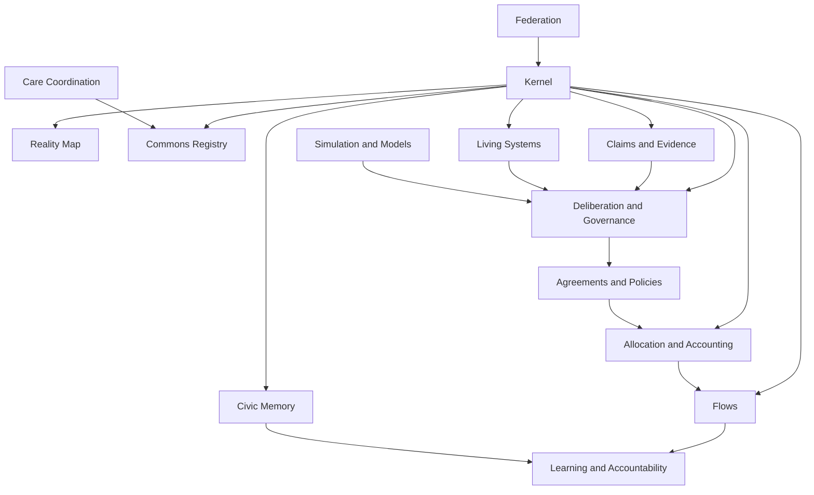

# Canopy Module Manifests

## Purpose

Every Canopy capability must publish a manifest. The manifest declares what the capability owns, consumes, emits, governs, and contributes to the cybernetic loop.

This prevents old project boundaries from reappearing as hidden app silos.

## Manifest Schema

```ts
interface CapabilityManifest {
  capability: CanopyCapability;
  purpose: string;
  historicalSources: string[];
  cyberneticPhases: CyberneticPhase[];
  ownedObjectTypes: CanopyObjectType[];
  consumedObjectTypes: CanopyObjectType[];
  emittedEventTypes: string[];
  governanceHooks: string[];
  ecologicalHooks: string[];
  dataStewardshipRequirements: string[];
  mustNotDo: string[];
}
```

## Capability Map



## 1. Kernel

Purpose:

Provide shared identity, authority, object references, permissions, claims/evidence contract, event envelope, data stewardship, and federation primitives.

Historical sources:

- CommonCredit `shared/IDENTITY_SPEC.md`
- ICOS delegations, decision records, timeline events, export bundle
- Stewardship access rights and event log
- Sensemaking claims/sources

Cybernetic phases:

- All phases

Owns:

- Person
- Account
- Organization
- Membership
- Role
- RoleAssignment
- Mandate
- Delegation
- Guardian
- ObjectRef
- DataStewardshipAgreement
- AccessRule
- CivicMemoryEvent
- ExportEnvelope
- FederationRule

Consumes:

- None; kernel is foundational.

Emits:

- `identity.*`
- `authority.*`
- `object.*`
- `federation.*`
- `system.*`

Governance hooks:

- Kernel amendment
- Schema version change
- Federation/defederation
- Data stewardship defaults

Ecological hooks:

- Living-system references available in ObjectRef

Must not:

- Depend on a specific auth provider as ontology.
- Encode old product names as top-level user concepts.
- Allow irrevocable delegations.

## 2. Reality Map

Purpose:

Make places, commons, resources, living systems, flows, and relationships visible across scales.

Historical sources:

- Stewardship Resource Registry
- ICOS Local Commons resources/neighborhoods
- Canopy PRD Reality Registry

Cybernetic phases:

- Observe
- Understand
- Learn

Owns:

- Place
- ObjectRelationship
- MapLayer
- SpatialAnnotation

Consumes:

- Resource
- Commons
- LivingSystem
- Flow
- Indicator
- Claim

Emits:

- `object.created`
- `object.relationship.linked`
- `object.relationship.unlinked`
- `evidence.created`

Governance hooks:

- Object verification
- Boundary dispute
- Sensitive-data challenge

Ecological hooks:

- Living-system overlays
- Watershed/bioregion/place links

Must not:

- Become a surveillance map.
- Treat administrative boundaries as the only real boundaries.

## 3. Commons Registry

Purpose:

Represent shared resource systems, stewardship roles, use rights, rules, routines, and obligations.

Historical sources:

- Stewardship PRD and schemas
- ICOS Local Commons
- CommonCredit CommonsResource

Cybernetic phases:

- Observe
- Coordinate
- Act
- Learn

Owns:

- Commons
- Resource
- UseRight
- Routine
- Task
- StewardshipAssignment alias

Consumes:

- Policy
- Mandate
- RoleAssignment
- Claim
- Evidence
- Indicator

Emits:

- `stewardship.resource.created`
- `stewardship.resource.condition_updated`
- `stewardship.use_right.granted`
- `stewardship.use_right.revoked`
- `stewardship.routine.created`
- `stewardship.task.created`
- `stewardship.task.completed`

Governance hooks:

- Use-right grant/revocation
- Steward assignment
- Maintenance escalation
- Commons charter amendment

Ecological hooks:

- Resource-living-system links
- Restoration routines
- Indicator and threshold links

Must not:

- Present resources as merely owned assets.
- Hide maintenance and care labor.

## 4. Living Systems

Purpose:

Treat rivers, forests, aquifers, habitats, species, soils, airsheds, and bioregions as first-class participants with indicators, thresholds, needs, guardians, and evidence.

Historical sources:

- Canopy PRD ecological architecture
- ICOS EIL
- Stewardship indicators

Cybernetic phases:

- Observe
- Understand
- Simulate
- Deliberate
- Learn

Owns:

- LivingSystem
- Indicator
- Threshold
- EcologicalAnnotation
- GuardianReview

Consumes:

- Guardian
- Claim
- Evidence
- Model
- Flow
- Proposal

Emits:

- `ecology.living_system.created`
- `ecology.indicator.recorded`
- `ecology.threshold.created`
- `ecology.threshold.breached`
- `ecology.guardian.review_requested`
- `ecology.guardian.review_completed`
- `ecology.annotation.added`

Governance hooks:

- Guardian appointment/challenge
- Threshold adoption
- Ecological review
- Territorial consent

Ecological hooks:

- This is the source module.

Must not:

- Reduce ecosystems to metrics only.
- Claim to represent indigenous or traditional ecological knowledge without explicit governance and consent.

## 5. Claims And Evidence

Purpose:

Provide the universal epistemic layer for claims, sources, evidence, counterclaims, review states, and AI-assisted extraction.

Historical sources:

- Sensemaking schema
- ICOS perspectives/situation maps
- Stewardship evidence items

Cybernetic phases:

- Observe
- Understand
- Deliberate
- Learn

Owns:

- Claim
- Counterclaim
- Evidence
- Source
- EvidenceLink
- Theme artifact

Consumes:

- Any ObjectRef
- Perspective
- ModelOutput

Emits:

- `claim.created`
- `claim.reviewed`
- `claim.contested`
- `claim.superseded`
- `evidence.source.ingested`
- `evidence.created`
- `evidence.linked_to_claim`
- `evidence.redacted`

Governance hooks:

- Claim challenge
- Evidence review
- Source redaction
- AI extraction review

Ecological hooks:

- Ecological claims and evidence
- Guardian-submitted claims

Must not:

- Store decision-relevant assertions as unreviewed facts.
- Let AI extraction bypass human review.

## 6. Deliberation And Governance

Purpose:

Move from issue to perspective to integration to proposal to decision to memory.

Historical sources:

- ICOS CommonGround
- Stewardship governance schemas
- CommonCredit proposals/disputes

Cybernetic phases:

- Understand
- Deliberate
- Coordinate
- Learn

Owns:

- Issue
- Perspective
- Proposal
- Decision
- Appeal
- Conflict
- Vote artifact
- QuorumState artifact

Consumes:

- Claim
- Evidence
- GuardianReview
- Scenario
- Mandate
- Policy

Emits:

- `governance.issue.created`
- `governance.perspective.submitted`
- `governance.proposal.created`
- `governance.proposal.opened`
- `governance.objection.raised`
- `governance.decision.recorded`
- `governance.appeal.opened`
- `governance.conflict.opened`
- `governance.conflict.resolved`

Governance hooks:

- This is the source module.

Ecological hooks:

- Guardian review required for ecological proposals
- Threshold breach issue creation

Must not:

- Replace deliberation with voting.
- Hide unresolved objections.

## 7. Agreements And Policies

Purpose:

Represent standing rules, agreements, charters, policy versions, review dates, and constitutional profiles.

Historical sources:

- Stewardship policies/policy versions
- ICOS Commons Charter and constitutional docs
- CommonCredit rule changes

Cybernetic phases:

- Deliberate
- Coordinate
- Act
- Learn

Owns:

- Agreement
- Policy
- PolicyVersion
- CharterSection
- GovernanceRule

Consumes:

- Decision
- Proposal
- Mandate
- Claim
- Evidence

Emits:

- `governance.policy.created`
- `governance.policy.versioned`
- `object.relationship.linked`
- `governance.decision.recorded`

Governance hooks:

- Policy amendment
- Constitutional review
- Review/sunset

Ecological hooks:

- Ecological policy type
- Binding threshold policy links

Must not:

- Make policy text untraceable from decisions.

## 8. Allocation And Accounting

Purpose:

Track requests, offers, commitments, allocations, obligations, budgets, ledgers, and settlement methods without making money the primary coordination logic.

Historical sources:

- CommonCredit
- ICOS Synapse/Kindred
- Stewardship contributions/procurement needs

Cybernetic phases:

- Coordinate
- Act
- Learn

Owns:

- Need
- Capability
- Request
- Offer
- Commitment
- Allocation
- Obligation
- LedgerAccount
- LedgerEntry
- Budget
- Treasury

Consumes:

- Policy
- Agreement
- UseRight
- Flow
- Claim
- Evidence

Emits:

- `coordination.need.created`
- `coordination.capability.created`
- `coordination.request.created`
- `coordination.offer.created`
- `coordination.commitment.created`
- `coordination.commitment.fulfilled`
- `allocation.created`
- `allocation.obligation.created`
- `accounting.ledger_account.created`
- `accounting.ledger_entry.posted`
- `accounting.ledger_entry.reversed`

Governance hooks:

- Allocation approval
- Credit/accounting rule changes
- Budget decisions
- Obligation dispute

Ecological hooks:

- Ecological constraints on allocation
- Resource-use and flow links

Must not:

- Turn mutual credit into the whole economic ontology.
- Create social credit or hidden eligibility scores.

## 9. Flows

Purpose:

Represent movement of resources, food, energy, care, labor, waste, knowledge, and materials through time.

Historical sources:

- Stewardship FoodFlow
- ICOS Flow Engine/Synapse
- Canopy PRD stock/flow architecture

Cybernetic phases:

- Observe
- Understand
- Coordinate
- Act
- Learn

Owns:

- Flow
- Stock
- FlowIntervention
- FlowRoute artifact

Consumes:

- Resource
- LivingSystem
- Indicator
- Commitment
- Allocation
- Policy

Emits:

- `flow.recorded`
- `flow.food.recorded`
- `flow.waste.recorded`
- `flow.transport.recorded`
- `flow.intervention.created`

Governance hooks:

- Flow intervention
- Procurement policy
- Allocation routing

Ecological hooks:

- Living-system impacts
- Emissions/resource-use claims
- Waste and loss indicators

Must not:

- Become a marketplace or price-discovery engine by default.

## 10. Simulation And Models

Purpose:

Support scenario analysis, model governance, assumptions, sensitivity tests, and tradeoff surfaces.

Historical sources:

- Canopy PRD simulation architecture
- ICOS EIL scenario concepts

Cybernetic phases:

- Understand
- Simulate
- Deliberate
- Learn

Owns:

- Model
- Assumption
- Scenario
- ModelOutput artifact
- ModelAudit
- ModelDispute

Consumes:

- Claim
- Evidence
- Indicator
- Threshold
- Flow
- Proposal

Emits:

- `model.created`
- `model.assumption.added`
- `model.scenario.created`
- `model.output.generated`
- `model.audit.completed`
- `model.dispute.opened`
- `model.retired`

Governance hooks:

- Model adoption
- Model audit
- Assumption dispute
- Model retirement

Ecological hooks:

- Thresholds and living-system indicators
- Ecological impact scenarios

Must not:

- Present scenarios as decisions.
- Hide assumptions.

## 11. Civic Memory

Purpose:

Provide append-only shared memory across all capabilities.

Historical sources:

- ICOS timeline events
- Stewardship event log
- CommonCredit domain event envelope

Cybernetic phases:

- All phases, especially Learn

Owns:

- CivicMemoryEvent
- Digest
- DecisionPacket artifact
- AuditTrail artifact

Consumes:

- All emitted events

Emits:

- `system.memory.digest_created`
- `system.memory.redaction_stub_created`
- `federation.export.created`

Governance hooks:

- Redaction review
- Memory correction
- Export/fork

Ecological hooks:

- Living-system memory timelines

Must not:

- Permit destructive edits to civic memory.

## 12. Learning And Accountability

Purpose:

Close the loop through outcomes, audits, retrospectives, reviews, model evaluation, and policy revision.

Historical sources:

- Stewardship review dates/policy versions
- ICOS digests/civic memory
- CommonCredit reconciliation/disputes

Cybernetic phases:

- Learn
- Observe

Owns:

- Outcome
- Audit
- Retrospective
- Review
- FeedbackLoop artifact

Consumes:

- Decision
- Policy
- Commitment
- Indicator
- Model
- CivicMemoryEvent

Emits:

- `learning.outcome.recorded`
- `learning.retrospective.completed`
- `integrity.audit.completed`
- `model.audit.completed`
- `governance.policy.versioned`

Governance hooks:

- Review trigger
- Audit initiation
- Corrective proposal

Ecological hooks:

- Indicator changes
- Restoration outcomes

Must not:

- Reduce learning to engagement metrics.

## 13. Federation

Purpose:

Support export, forkability, sync, reconciliation, and defederation without central command.

Historical sources:

- ICOS forkability/export principles
- CommonCredit domain event envelope
- Canopy kernel contract

Cybernetic phases:

- Coordinate
- Learn
- Observe

Owns:

- ExportEnvelope
- FederationRule
- ImportEnvelope
- ReconciliationRecord

Consumes:

- ObjectRef
- CivicMemoryEvent
- DataStewardshipAgreement

Emits:

- `federation.export.created`
- `federation.import.received`
- `federation.sync.completed`
- `federation.conflict.detected`
- `federation.reconciliation.recorded`
- `federation.defederation.initiated`
- `federation.defederation.completed`

Governance hooks:

- Federation agreement
- Defederation
- Reconciliation

Ecological hooks:

- Cross-boundary living-system coordination

Must not:

- Make federation equivalent to centralization.

## 14. Care Coordination

Purpose:

Coordinate care carefully without turning intimate care into a ledger or score.

Historical sources:

- ICOS CIP
- ICOS Kindred boundary
- Stewardship care contribution warnings

Cybernetic phases:

- Observe
- Coordinate
- Act
- Learn

Owns:

- CareHold
- SupportCircle
- RepairThread
- CareLoadSignal

Consumes:

- Person
- Membership
- Conflict
- Contribution
- DataStewardshipAgreement

Emits:

- `care.hold.created`
- `care.support_circle.created`
- `care.support_circle.closed`
- `care.repair_thread.opened`
- `care.repair_thread.closed`
- `care.load_signal.updated`

Governance hooks:

- Escalation to conflict/governance only when needed
- Care data stewardship review

Ecological hooks:

- Usually none, except disaster/climate care contexts

Must not:

- Log intimate care acts by default.
- Rank caregivers or care receivers.
- Make care debt visible.

## Manifest Validation Checklist

A module is Canopy-compliant if:

- It declares owned and consumed canonical objects.
- It emits canonical events for consequential changes.
- It exposes governance hooks.
- It exposes ecological hooks where material/ecological impact exists.
- It uses kernel identity and authority.
- It writes to civic memory.
- It respects data stewardship.
- It avoids hidden scores.
- It participates in at least one cybernetic phase.

