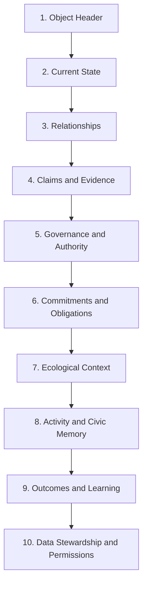

# Canopy Object Page Template

## Purpose

Canopy must not feel like separate applications joined by navigation. The object page is the primary unifying interface pattern.

Every canonical object should render through the same underlying structure, with object-specific panels appearing only where relevant. A `Resource`, `Claim`, `LivingSystem`, `Policy`, `Commitment`, `Model`, and `Flow` should feel like different beings in the same ecosystem, not screens from different products.

## Core Principle

An object page answers:

- What is this?
- Where does it belong?
- Who stewards it?
- What is known or claimed about it?
- What evidence supports that?
- What authority governs it?
- What is happening now?
- What commitments, obligations, risks, or thresholds attach to it?
- What has changed?
- What should happen next?

## Universal Page Anatomy



## 1. Object Header

Required elements:

- Object name/title
- Object type and local term
- Canonical type
- Scope chips: organization, place, commons, living system
- Status
- Steward/guardian/owner-of-record distinction where applicable
- Last verified or updated date
- Visibility state
- Primary actions

Header rule:

The header must not collapse stewardship into ownership. If legal ownership exists, it appears under legacy/legal context, not as the primary relation.

## 2. Current State

Purpose:

Show the present condition of the object without requiring the user to read history first.

Common fields:

- Lifecycle status
- Data state
- Verification state
- Active risk or alert state
- Active governance state
- Open commitments or tasks
- Active thresholds
- Current indicators

Examples:

- Resource: condition, access availability, open maintenance tasks.
- Claim: review status, confidence, contested state.
- LivingSystem: current health indicators, threshold breaches.
- Commitment: promised, in progress, fulfilled, blocked.
- Policy: active, under review, superseded, sunset date.

## 3. Relationships

Purpose:

Show how the object sits in the wider Canopy graph.

Common relationship types:

- Contains / contained by
- Stewarded by
- Represented by
- Governed by
- Affects / affected by
- Uses / used by
- Supports / challenges
- Fulfills / fulfilled by
- Allocates / allocated to
- Supersedes / superseded by
- Federates with

Views:

- Compact list
- Graph view
- Map view when spatial
- Timeline view when historical

Rule:

Relationship labels must use canonical verbs, with local terms shown as secondary language.

## 4. Claims And Evidence

Purpose:

Every decision-relevant object must expose the claims being made about it.

Required panels:

- Active claims
- Contested claims
- Accepted claims
- Outdated or superseded claims
- Evidence sources
- Counterclaims
- Review status
- Evidence type distribution

Required actions:

- Add claim
- Add evidence
- Challenge claim
- Request review
- Mark outdated

Object-specific examples:

- Resource: "Workshop roof is degraded."
- Flow: "Transport emissions estimate is based on van route average."
- LivingSystem: "Aquifer recharge is below seasonal threshold."
- Model: "Assumption X overweights household behavior."
- Policy: "This policy reduced repair backlog by 20%."

Rule:

The page must distinguish claim, evidence, perspective, model output, and decision.

## 5. Governance And Authority

Purpose:

Show who can legitimately act, decide, represent, challenge, or review.

Required panels:

- Applicable policies
- Mandates
- Delegations
- Role assignments
- Guardian relationships
- Decision rules
- Open issues
- Active proposals
- Appeals and conflicts
- Review dates

Required actions:

- Open issue
- Create proposal
- Request guardian review
- File appeal
- Challenge authority
- View decision packet

Rule:

Consequential actions must show their authority source before execution.

## 6. Commitments And Obligations

Purpose:

Show what has been promised, owed, allocated, blocked, fulfilled, or unresolved.

Required panels:

- Commitments
- Obligations
- Allocations
- Requests
- Offers
- Use rights
- Ledger/accounting links where applicable
- Blockers

Object-specific examples:

- Resource: maintenance obligations, use rights, repair fund allocations.
- Need: requests, matched offers, commitments.
- Organization: obligations across policies, agreements, and allocations.
- Flow: commitments that generated the flow.

Rule:

Accounting is presented as commitment memory, not as the primary meaning of social value.

## 7. Ecological Context

Purpose:

Nature is not an externality. Objects with material, spatial, energetic, food, water, infrastructure, land, or ecological implications must expose living-system context.

Required where applicable:

- Affected living systems
- Indicators
- Thresholds
- Guardian review status
- Ecological claims
- Ecological evidence
- Model/scenario links
- Restoration obligations
- Uncertainty and data gaps

Threshold classes:

- Advisory
- Governance trigger
- Binding

Rule:

If ecological context is not applicable, the page should say why, not silently omit it.

## 8. Activity And Civic Memory

Purpose:

Show what changed, who changed it, when, under what authority, and with what consequences.

Required panels:

- Canonical event timeline
- Decision records
- Supersession history
- Import/export/federation events
- Redacted event stubs where appropriate
- Audit trail

Filters:

- Governance
- Claims/evidence
- Stewardship
- Allocation/accounting
- Ecology
- Federation
- Integrity

Rule:

Module-specific logs should not appear as separate histories. They should be translated into civic memory events.

## 9. Outcomes And Learning

Purpose:

Close the cybernetic loop.

Required panels:

- Outcomes
- Indicator changes
- Retrospectives
- Reviews
- Audits
- Model performance notes
- Policy effects
- Lessons learned
- Open learning questions

Object-specific examples:

- Proposal: what happened after decision?
- Policy: did it produce intended effects?
- Resource: did condition improve after maintenance?
- Commitment: was the need actually met?
- Model: did forecast match observed outcome?

Rule:

Canopy object pages must not end at action. They must support learning.

## 10. Data Stewardship And Permissions

Purpose:

Make visibility, privacy, access, export, and federation explicit.

Required panels:

- Visibility level
- Data stewardship agreement
- Access rules
- Consent records
- Sensitive-data flags
- Export permissions
- Federation rules
- Retention rules
- Redaction policy

Required actions:

- Request access
- Challenge visibility
- Export object
- View redaction summary
- Review data stewardship agreement

Rule:

Transparency must not become surveillance. Privacy must not become unaccountable opacity.

## Universal Action Zones

Every object page has three action zones.

### Observe Actions

- Add observation
- Upload source
- Record condition
- Record indicator
- Record flow

### Governance Actions

- Open issue
- Create proposal
- Add perspective
- Request review
- File appeal

### Coordination Actions

- Create request
- Make offer
- Create commitment
- Assign task
- Log contribution
- Create allocation

Actions appear only when permission checks allow them.

## Object-Type Variants

### Resource Page

Primary emphasis:

- Condition
- Stewardship
- Use rights
- Maintenance routines
- Policies
- Documents/evidence
- Ecological context
- Civic memory

Inherited sources:

- Stewardship resource schema
- ICOS Local Commons resource
- CommonCredit CommonsResource

### LivingSystem Page

Primary emphasis:

- Health indicators
- Thresholds
- Guardians
- Ecological claims
- Affected proposals
- Restoration obligations
- Data uncertainty

Inherited sources:

- Cybernetic PRD
- ICOS EIL
- Stewardship resource indicators

### Claim Page

Primary emphasis:

- Claim text
- Claimant
- About objects
- Evidence links
- Counterclaims
- Review status
- Decision usage

Inherited sources:

- Sensemaking Claim
- ICOS perspective/evidence patterns

### Issue Page

Primary emphasis:

- Scope
- Attention state
- Claims
- Perspectives
- Proposals
- Decision readiness
- Civic memory

Inherited sources:

- ICOS Issue
- Sensemaking Issue
- Stewardship Proposal context

### Proposal Page

Primary emphasis:

- Proposed change
- Authority source
- Affected objects
- Claims/evidence
- Perspectives
- Guardian review
- Scenarios
- Decision method
- Objections/amendments

Inherited sources:

- ICOS CommonGround
- Stewardship proposals
- CommonCredit proposals

### Decision Page

Primary emphasis:

- What was decided
- How it was decided
- Why
- Authority
- Unresolved objections
- Review date
- Supersession
- Created agreements/policies/commitments

Inherited sources:

- ICOS DecisionRecord
- Stewardship Decision
- CommonCredit RuleChange

### Commitment Page

Primary emphasis:

- Parties
- What was promised
- What need/request/allocation it fulfills
- Constraints
- Obligations
- Fulfillment state
- Outcomes

Inherited sources:

- CommonCredit transactions/offers/needs
- ICOS allocation proposals
- Stewardship maintenance tasks

### Flow Page

Primary emphasis:

- Source
- Destination
- Resource
- Quantity
- Timing
- Loss/waste
- ecological impact
- commitments and policies

Inherited sources:

- Stewardship FoodFlow
- ICOS Flow Engine/Synapse

### Model Page

Primary emphasis:

- Purpose
- Steward
- Assumptions
- Datasets
- Validation
- Known failure modes
- Scenarios produced
- Audits and disputes

Inherited sources:

- Cybernetic PRD simulation architecture
- ICOS EIL scenario concepts

## Layout Contract

Recommended page regions:

```text
+----------------------------------------------------+
| Header: title, type, scope, status, primary actions |
+---------------+------------------------------------+
| Left rail     | Main workspace                     |
| Relationships | Current state / selected tab       |
| Scope         |                                    |
| Stewardship   |                                    |
+---------------+------------------------------------+
| Bottom / side panels: memory, claims, permissions   |
+----------------------------------------------------+
```

Primary tabs:

- Overview
- Claims
- Governance
- Commitments
- Ecology
- Memory
- Permissions

Tabs may be hidden only when truly irrelevant, not because a module failed to implement them.

## Empty-State Rules

Canopy empty states should not advertise features. They should invite the next legitimate action.

Examples:

- No claims: "No claims have been recorded for this object."
- No evidence: "No evidence has been linked to these claims."
- No guardian: "No guardian has been appointed for this living system."
- No policy: "No governing policy is linked yet."
- No outcome: "No outcome has been recorded yet."

## Coherence Checklist

An object page is Canopy-compliant if:

- It uses canonical object type and local term.
- It shows scope and stewardship.
- It exposes claims and evidence.
- It exposes governance hooks.
- It writes consequential actions to civic memory.
- It respects data stewardship.
- It can show ecological context where relevant.
- It supports learning/outcomes.
- It does not reveal old project boundaries.
