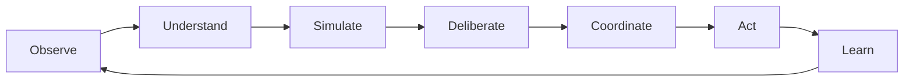
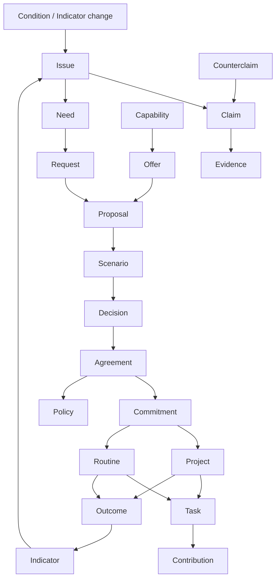

# Canopy Ontology Map

## Purpose

This document maps nouns and schema objects from CommonCredit, ICOS, Sensemaking, and Stewardship into the canonical Canopy ontology.

The purpose is coherence. Canopy should not inherit four separate object worlds. Every old project object must become one of:

- **KEEP**: canonical Canopy object as-is or nearly as-is.
- **MERGE**: fold into a canonical object with another project's equivalent.
- **SUBTYPE**: preserve as a domain-specific subtype of a canonical object.
- **ALIAS**: preserve as local language mapped to a canonical object.
- **ARTIFACT**: preserve as a record, view, packet, report, or implementation artifact, not a root object.
- **RETIRE**: do not carry forward as a Canopy concept.

## Ontology Principle

Canopy's ontology is not organized around apps. It is organized around the cybernetic loop:

Objects should help communities perceive reality, interpret claims, deliberate legitimately, coordinate commitments, act within ecological limits, and learn from outcomes.

## Canonical Object Families

### Actors And Authority

| Canonical object | Definition | Notes |
| --- | --- | --- |
| Person | Human participant | Separate from account and membership |
| Account | Authentication handle | Provider adapter, not source of authority |
| Organization | Formal or informal collective actor | Co-op, land trust, institution, network, producer |
| Membership | Person's relation to an organization | Replaces product-specific member records where possible |
| Role | Named responsibility/permission bundle | Not itself a mandate |
| RoleAssignment | Person or organization holding a role | Termed, revocable |
| Mandate | Bounded authority to decide, act, represent, steward, or review | Core authority object |
| Delegation | Transfer of capability from one actor to another | Always revocable |
| Guardian | Representative for living system or vulnerable interest | Contestable representation |
| Credential | Attested qualification or proof | Training, expertise, eligibility |

### Reality And Commons

| Canonical object | Definition | Notes |
| --- | --- | --- |
| Place | Geographic, administrative, lived, or ecological location | Neighborhood, watershed, municipality, bioregion |
| Commons | Shared resource system governed by a community | Boundaries, participants, rules |
| LivingSystem | River, forest, aquifer, habitat, species, soil system, airshed | First-class ecological participant |
| Resource | Material, energetic, spatial, infrastructural, informational, cultural capacity | Not necessarily owned |
| Stock | Quantity or condition at a point in time | Reserve, inventory, capacity, depletion |
| Flow | Movement over time | Material, care, labor, money, food, waste, energy |
| Indicator | Signal about state, trend, health, risk, or value | Updates from outcomes or observations |
| Threshold | Limit, trigger, boundary, or target | Advisory, governance trigger, binding |

### Epistemics And Sensemaking

| Canonical object | Definition | Notes |
| --- | --- | --- |
| Claim | Contestable assertion | Decision-relevant statements live here |
| Counterclaim | Claim challenging another claim | Preserves disagreement |
| Evidence | Artifact or observation supporting/challenging claims | Type and provenance required |
| Source | Origin artifact for evidence | File, URL, transcript, dataset, interview |
| Perspective | Situated account of how someone sees an issue | First-class deliberative input |
| Theme | Sensemaking cluster | ARTIFACT, not root kernel object |
| Model | Governable causal/computational representation | Used for scenarios |
| Assumption | Model or scenario premise | Contestable |
| Scenario | Possible future under assumptions | Evidence, not decision |
| StakeholderGroup | Affected group or voice category | SUBTYPE/Alias under AffectedGroup |
| AffectedGroup | Group affected by issue/proposal/decision | Includes missing voices |

### Governance And Memory

| Canonical object | Definition | Notes |
| --- | --- | --- |
| Issue | Condition requiring attention, interpretation, or action | Gateway into governance |
| Proposal | Suggested action, policy, allocation, rule, or investigation | Must cite claims/evidence |
| Decision | Legitimate resolution of proposal or issue | Durable record |
| DecisionPacket | Portable record of authority, evidence, perspectives, outcome | ARTIFACT |
| Agreement | Ratified commitment among parties | Creates obligations |
| Policy | Standing rule or norm | Versioned |
| PolicyVersion | Snapshot of policy text | ARTIFACT under Policy |
| Appeal | Request to review decision/process/outcome | Formal challenge |
| Conflict | Dispute, grievance, deadlock, harm report | Routes to process |
| Vote | Individual decision signal | ARTIFACT under decision process |
| QuorumState | Participation/legitimacy tracker | ARTIFACT |
| Referendum | Decision process subtype | SUBTYPE of Proposal/DecisionProcess |
| CivicMemoryEvent | Append-only event | Kernel event record |
| Digest | Summary of memory/precedent | ARTIFACT |

### Coordination, Allocation, And Accounting

| Canonical object | Definition | Notes |
| --- | --- | --- |
| Need | Human, community, institutional, or ecological requirement | May create request |
| Capability | Ability to meet needs or act | Person/org/resource capacity |
| Request | Concrete ask derived from need | May become commitment |
| Offer | Concrete available capacity | May become commitment |
| Commitment | Promise to provide, do, maintain, fund, or refrain | Core coordination object |
| Allocation | Authorized assignment of resource/capacity/budget/use right | Requires authority |
| Obligation | Duty created by agreement, role, mandate, use right, or policy | Tracks what remains owed |
| UseRight | Governed access/withdrawal/stewardship right | Replaces ownership-centric framing |
| LedgerAccount | Accounting account | Domain object, not identity account |
| LedgerEntry | Append-only accounting line | Mutual credit, time credit, budget, etc. |
| Transaction | Fulfillment/settlement event | ARTIFACT under commitment/accounting |
| Invoice | Settlement request | SUBTYPE of Request |
| Budget | Resource allocation envelope | Can be policy/agreement-backed |
| Treasury | Shared fund/account | SUBTYPE of Resource/LedgerAccount |

### Action, Care, And Stewardship

| Canonical object | Definition | Notes |
| --- | --- | --- |
| Project | Coordinated bounded activity | Episodic action |
| Routine | Recurring practice, care, maintenance, restoration | Ongoing action |
| Task | Unit of work | Under project or routine |
| MaintenanceCycle | Recurring care/maintenance schedule | SUBTYPE of Routine |
| RestorationCycle | Recurring ecological repair/regeneration | SUBTYPE of Routine |
| Contribution | Logged labor/care/knowledge/material/funds | Must avoid ranking |
| StewardshipAssignment | Mandate/role assignment scoped to resource/commons/living system | MERGE into Mandate + RoleAssignment, preserve alias |
| CareHold | Protected awareness that care is needed | From CIP; privacy-first |
| SupportCircle | Private group coordinating relational care | Domain object under care coordination |
| RepairThread | Confidential relational repair process | SUBTYPE of Conflict/RestorativeProcess |

### Data, Federation, And Integrity

| Canonical object | Definition | Notes |
| --- | --- | --- |
| DataStewardshipAgreement | Rules governing data access/use/export/federation | Kernel object |
| AccessRule | Rule determining who can view/edit/challenge/export | Kernel object |
| FederationRule | Governed sync relationship | Kernel/federation object |
| ExportEnvelope | Portable export metadata and hash | ARTIFACT |
| Taxonomy | Vocabulary structure | Governance-aware |
| LocalTerm | Community-specific term | Mapped to canonical object |
| CanonicalMapping | Mapping local term to canonical type | Prevents assimilation |
| RateLimitBucket | Abuse prevention artifact | ARTIFACT |
| Notification | Attention artifact | ARTIFACT |
| NotificationPreference | User setting | ARTIFACT |
| Audit | Review of process/model/data/governance | Learning/accountability |
| Retrospective | Structured learning after action | Learning/accountability |

## Canonical Relationship Grammar

## CommonCredit Mapping

| Existing noun | Disposition | Canopy canonical mapping | Notes |
| --- | --- | --- | --- |
| Organization | MERGE | Organization | Use kernel Organization; preserve CommonCredit config separately |
| CreditNetworkConfig | SUBTYPE | Policy / AccountingConfiguration | Domain configuration for mutual-credit method |
| Member | MERGE | Membership + Person | Product-specific credit profile becomes AccountingProfile |
| MembershipApplication | SUBTYPE | Request / MembershipRequest | Intake workflow artifact |
| Account | SUBTYPE | LedgerAccount | Not identity Account |
| Transaction | ARTIFACT | CommitmentFulfillment / LedgerTransaction | Settlement record, not root coordination object |
| LedgerEntry | KEEP | LedgerEntry | Append-only accounting primitive |
| Offer | KEEP | Offer | May also imply Capability |
| Need | KEEP | Need / Request | Published need may become Request |
| Invoice | SUBTYPE | SettlementRequest / Request | Legacy-compatible payment request |
| ReputationEvent | RETIRE as root | Evidence / Feedback artifact | Avoid generalized score; preserve only contextual post-commitment feedback |
| Endorsement | SUBTYPE | Evidence / Credential / Testimony | Must not become portable status score |
| CreditLimitRequest | SUBTYPE | UseRightChangeRequest | Governed access to debit/credit capacity |
| Dispute | MERGE | Conflict | Domain subtype: accounting/exchange conflict |
| DisputeEvidence | MERGE | Evidence | Linked to Conflict/Claim |
| DisputeDecision | SUBTYPE | Decision | Conflict decision record |
| Proposal | MERGE | Proposal | Use Canopy governance |
| Vote | ARTIFACT | Vote | Decision-process signal |
| RuleChange | SUBTYPE | PolicyVersion / PolicyChange | Outcome of Decision |
| Treasury | SUBTYPE | Resource + LedgerAccount | Shared fund/account |
| TreasuryAllocation | SUBTYPE | Allocation | Budget/fund allocation |
| Project | KEEP | Project | Commons/economic project |
| ProjectTask | MERGE | Task | Under Project |
| CommonsResource | MERGE | Resource / Commons | Determine per instance: shared item = Resource; governed system = Commons |
| BookingRecord | SUBTYPE | UseRightEvent / Reservation | Domain artifact under UseRight |
| MaintenanceLog | MERGE | Contribution / Outcome / MaintenanceEvent | Use Stewardship maintenance ontology |
| Statement | ARTIFACT | AccountingReport | Report, not root object |
| TaxSummary | ARTIFACT | AccountingReport / LegacyComplianceArtifact | Legacy interface |
| NetworkReport | ARTIFACT | IndicatorReport / AccountingReport | Learning artifact |
| AuditLog | MERGE | CivicMemoryEvent / Audit | Use Canopy event model |
| Notification | ARTIFACT | Notification | Shared attention system |
| VerificationToken | RETIRE as ontology | Auth artifact | Implementation only |

## ICOS Mapping

| Existing noun | Disposition | Canopy canonical mapping | Notes |
| --- | --- | --- | --- |
| Space | MERGE | Organization / Commons | Depends on scope; often a governance space for an organization/commons |
| Member | MERGE | Membership + Person | Use kernel identity |
| Membership | KEEP | Membership | Align fields with kernel |
| Neighborhood | SUBTYPE | Place | Place subtype; may contain commons |
| NeighborhoodMembership | SUBTYPE | Membership scoped to Place | Preserve as place membership/participation |
| Invitation | ARTIFACT | MembershipInvitation | Workflow artifact |
| MagicLinkToken | RETIRE as ontology | Account/Auth artifact | Implementation only |
| Session | RETIRE as ontology | Account/Auth artifact | Implementation only |
| Issue | KEEP | Issue | Strong canonical candidate |
| IssueView | ARTIFACT | AttentionEvent / AwarenessSignal | Civic-memory or analytics artifact |
| Perspective | KEEP | Perspective | First-class deliberative object |
| DecisionRecord | MERGE | Decision / DecisionPacket | Strong durable decision shape |
| Delegation | KEEP | Delegation | Strong canonical candidate |
| TimelineEvent | MERGE | CivicMemoryEvent | Adopt append-only enforcement |
| Referendum | SUBTYPE | DecisionProcess / Proposal | Voting process subtype |
| ReferendumVote | ARTIFACT | Vote | Decision-process signal |
| ReferendumSupporter | ARTIFACT | ProposalSupportSignal | Attention/decision-process artifact |
| QuorumState | ARTIFACT | QuorumState | Process legitimacy artifact |
| OfficialSummary | ARTIFACT | Digest / Summary | Memory/sensemaking artifact |
| DigestDelivery | ARTIFACT | Notification / DeliveryRecord | Implementation artifact |
| CommonsCharterSection | SUBTYPE | Policy / CharterSection | Charter is constitutional policy |
| StewardshipEntry | MERGE | Contribution / StewardshipEvent | Context-specific stewardship record |
| Resource | MERGE | Resource | Local Commons resource |
| NeedOffer | SPLIT | Need / Request / Offer | Type field determines mapping |
| ExchangeRequest | SUBTYPE | Request / Commitment | Mutual-aid exchange request |
| CreditTransaction | MERGE | LedgerEntry | Time-credit ledger entry |
| Producer | SUBTYPE | Organization | Producer actor profile |
| SurplusShortageDeclaration | SPLIT | Offer / Request / Claim | Surplus = Offer; shortage = Request; declaration includes Claim |
| AllocationProposal | MERGE | Allocation / Proposal | Proposed allocation requiring consent |
| AllocationConsent | ARTIFACT | ConsentSignal / DecisionProcessEvent | Consent record for allocation |
| RateLimitBucket | ARTIFACT | IntegrityControl | Abuse prevention |

## Sensemaking Mapping

| Existing noun | Disposition | Canopy canonical mapping | Notes |
| --- | --- | --- | --- |
| Organization | MERGE | Organization | Use kernel Organization |
| Member | MERGE | Membership + Person | Sensemaking roles become RoleAssignments |
| OrgRole | MERGE | Role | Facilitator, Evidence Steward, Decision Steward, Participant |
| Issue | KEEP | Issue | Central sensemaking issue |
| Source | KEEP | Source / Evidence | Source is origin; extracted item becomes Evidence |
| Claim | KEEP | Claim | Strong canonical candidate with extensions |
| Theme | ARTIFACT | Theme | Sensemaking cluster, not root object |
| StakeholderGroup | SUBTYPE | AffectedGroup | Include power/affectedness fields |
| Contribution | SPLIT | Perspective / EvidenceLink / Contribution | Depends on target/type |
| SourceType | VALUE | EvidenceType / SourceType | Controlled vocabulary |
| ReviewStatus | VALUE | ReviewStatus | Use kernel review state |
| ClaimType | VALUE | ClaimType | Extend with risk, impact, need, capability |
| ThemeSignal | VALUE | SignalStrength | Artifact value |
| PowerLevel | VALUE | Affectedness/Power rating | Keep carefully, avoid reductive scoring |

## Stewardship Mapping

| Existing noun | Disposition | Canopy canonical mapping | Notes |
| --- | --- | --- | --- |
| Community | ALIAS | Organization / Commons | Use Organization for tenant; Commons for governed resource system |
| Member | MERGE | Membership + Person | Use kernel identity |
| GovernanceBody | SUBTYPE | Organization / Role / Mandate holder | Council/circle/working group |
| GovernanceBodyMember | ARTIFACT | RoleAssignment / Membership | Membership in governance body |
| Role | KEEP | Role | Align with kernel |
| RoleAssignment | KEEP | RoleAssignment | Align with kernel |
| OnboardingChecklist | ARTIFACT | MembershipProcess / Checklist | Workflow artifact |
| OnboardingChecklistItem | ARTIFACT | ChecklistItem | Workflow artifact |
| MemberOnboardingProgress | ARTIFACT | ProcessProgress | Workflow state |
| Resource | KEEP | Resource | Strong canonical candidate |
| ResourceConditionUpdate | SUBTYPE | Claim / IndicatorReading / CivicMemoryEvent | Condition change should be claim/event |
| ResourceDocument | MERGE | Evidence / Source | Document as evidence/source |
| ResourcePolicyLink | ARTIFACT | ObjectRelationship | Link table only |
| AccessRight | MERGE | UseRight + AccessRule | Split right from access condition |
| AccessCondition | VALUE | AccessCondition | Permission condition |
| StewardshipAssignment | MERGE | Mandate + RoleAssignment | Preserve alias in UI if useful |
| MaintenanceTask | MERGE | Task | Under Routine, Project, or MaintenanceCycle |
| Contribution | KEEP | Contribution | Anti-ranking constraints apply |
| Policy | KEEP | Policy | Strong canonical candidate |
| PolicyVersion | ARTIFACT | PolicyVersion | Version record under Policy |
| DecisionRule | SUBTYPE | GovernanceRule / DecisionMethodConfig | Policy/process configuration |
| Proposal | KEEP | Proposal | Align with Canopy governance |
| EvidenceItem | MERGE | EvidenceLink | Replace loose JSON with claims/evidence |
| DeliberationComment | SUBTYPE | Perspective / DeliberationContribution | Formal objections become Perspective/Conflict hooks |
| Vote | ARTIFACT | Vote | Decision-process signal |
| Decision | KEEP | Decision | Merge shape with ICOS DecisionRecord |
| Notification | ARTIFACT | Notification | Shared attention system |
| NotificationPreference | ARTIFACT | NotificationPreference | User settings |
| EventLogEntry | MERGE | CivicMemoryEvent | Use Canopy event envelope |
| FoodItem | SUBTYPE | Resource / Stock | Food as resource type; item classification |
| FoodActor | SUBTYPE | Organization / Person / ProducerProfile | Actor in food system |
| ProcurementNeed | SUBTYPE | Need / Request | Institutional need |
| ProcurementNeedItem | ARTIFACT | RequestLineItem | Line item under Request |
| ProductionCapacity | SUBTYPE | Capability / Offer | Producer capacity |
| ProductionCapacityItem | ARTIFACT | OfferLineItem | Line item under Offer |
| FoodFlow | KEEP | Flow | Strong pilot object |
| FoodPolicyIntervention | SUBTYPE | Policy / Agreement / Allocation | Depends on intervention type |

## ICOS Document-Only Concepts Mapping

| Concept | Disposition | Canopy canonical mapping | Notes |
| --- | --- | --- | --- |
| Local Commons | SUBTYPE | Commons / Place capability profile | Local coordination context |
| CommonGround | SUBTYPE | Governance protocol/profile | Not user-facing module name |
| MCS | SUBTYPE | Civic governance profile | Later scale profile |
| EIL | SUBTYPE | LivingSystems + EcologicalIntelligence capability | Ecological impact/data service |
| CIP | SUBTYPE | CareCoordination capability | Protect non-quantified care |
| Flow Engine | SUBTYPE | Flows + Allocation capability | Synapse/Equip/Kindred live here |
| Synapse | SUBTYPE | Allocation/Flow planning profile | Participatory matching/planning |
| Equip | SUBTYPE | SharedAssetLifecycle profile | Resource + UseRight + Maintenance |
| Kindred | SUBTYPE | GiftLedger profile | LedgerEntry with anti-ranking constraints |
| SupportCircle | KEEP | SupportCircle | Care coordination object |
| CareHold | KEEP | CareHold | Privacy-first care awareness |
| RepairThread | SUBTYPE | Conflict / RestorativeProcess | Confidential relational repair |
| EcologicalProxy | MERGE | Guardian | Proxy/guardian representation |
| TerritoryGuardian | MERGE | Guardian | Guardian scoped to Place/LivingSystem |
| AnnotationLayer | SUBTYPE | Evidence / Claim / Perspective layer | Local/ecological context attached to data |
| SituationMap | ARTIFACT | SensemakingArtifact | Can cite claims/perspectives |
| ProtocolHealthMetric | SUBTYPE | Indicator | Governance/sensemaking health |
| Attention | PHASE | Observe/Understand process | Not root object |
| Perspecting | PHASE | Deliberative process | Not root object |
| Integration | PHASE | Sensemaking process | Not root object |
| Memory | PHASE | Learn/CivicMemory process | Not root object |

## Value Object And Enum Consolidation

### Status Values

Many projects define parallel statuses. Canopy should not force one universal status enum. Instead, use status families:

| Status family | Applies to | Examples |
| --- | --- | --- |
| LifecycleStatus | Objects with lifecycle | draft, active, archived, retired |
| ReviewStatus | Claims/evidence/review | pending, accepted, rejected, contested, superseded |
| GovernanceStatus | Proposals/decisions | draft, open, deliberating, voting, decided, archived |
| FulfillmentStatus | Commitments/tasks | open, in_progress, fulfilled, blocked, cancelled |
| DataState | Knowledge quality | unverified, locally_verified, contested, outdated, sensitive |
| MembershipStatus | Membership relation | invited, provisional, active, suspended, departed |

### Object Type Values

Keep local vocabularies as local terms, but map them to canonical types.

Examples:

- Stewardship `resource_type=forest_stand` maps to `Resource` with ecological link to `LivingSystem`.
- ICOS `neighborhood` maps to `Place`.
- CommonCredit `account` maps to `LedgerAccount`, not identity `Account`.
- Sensemaking `theme` maps to `Theme` artifact under `claims_evidence`.

## Root Object Decisions

### Promote To Canonical Root

These are strong root objects and should be part of Canopy's kernel or core domain:

- Person
- Account
- Organization
- Membership
- Role
- RoleAssignment
- Mandate
- Delegation
- Guardian
- Place
- Commons
- LivingSystem
- Resource
- Flow
- Claim
- Counterclaim
- Evidence
- Source
- Perspective
- Issue
- Proposal
- Decision
- Agreement
- Policy
- Need
- Capability
- Request
- Offer
- Commitment
- Allocation
- Obligation
- UseRight
- Project
- Routine
- Task
- Contribution
- Outcome
- Indicator
- Threshold
- CivicMemoryEvent
- DataStewardshipAgreement
- AccessRule
- Model
- Scenario

### Keep As Domain Objects, Not Kernel Roots

- LedgerAccount
- LedgerEntry
- Treasury
- Budget
- FoodItem
- FoodActor
- ProducerProfile
- ProcurementNeedItem
- ProductionCapacityItem
- SupportCircle
- CareHold
- RepairThread
- QuorumState
- Digest
- Notification
- Taxonomy
- LocalTerm
- ExportEnvelope

### Retire As Product Ontology

Do not carry these forward as user-facing ontology:

- Product-specific `CommonCredit`, `ICOS`, `Sensemaking`, `Stewardship` as top-level app areas
- `VerificationToken`
- Auth `Session` as a civic object
- `RateLimitBucket` as a civic object
- Generalized `ReputationScore`
- Portable member ranking
- Engagement metrics as success objects

## Potential Naming Conflicts

| Term | Conflict | Canopy resolution |
| --- | --- | --- |
| Account | Auth identity vs ledger account | `Account` for auth; `LedgerAccount` for accounting |
| Member | Person vs membership relation | Use `Person` + `Membership` |
| Community | Organization vs commons vs place | Avoid as root; use local alias |
| Space | Governance container vs place | Map to Organization/Commons/Place by context |
| Resource | Asset vs ecological resource vs capacity | Keep broad, always attach stewardship and use-right context |
| Decision | Vote outcome vs durable record | Use `Decision`; `Vote` is process signal |
| Evidence | Loose proposal attachment vs claim support | Evidence must link to Claim |
| Contribution | Labor log vs deliberation contribution | Use `Contribution` for work/care; `Perspective` or `EvidenceLink` for deliberation |
| Credit | Money-like unit vs trust/status | Mutual-credit accounting only; never social credit |
| Guardian | Ecological proxy vs administrative steward | Guardian represents vulnerable/living interest; Steward maintains/custodies |

## Required Schema Translation Rules

1. Any table with `community_id`, `space_id`, or `neighborhood_id` must expose canonical scope through `orgId`, `placeId`, `commonsId`, or `livingSystemId`.
2. Any user/member table must resolve to `Person`, `Account`, and `Membership`.
3. Any proposal evidence JSON must migrate to `Claim`, `Evidence`, and `EvidenceLink`.
4. Any vote or consent row remains a process artifact, not the decision itself.
5. Any ledger transaction must be append-only and linked to a `Commitment`, `Allocation`, or `Obligation` where possible.
6. Any access or booking concept must map to `UseRight` and `AccessRule`.
7. Any condition update must become a `Claim`, `IndicatorReading`, or `CivicMemoryEvent`.
8. Any module event log must emit or translate to `CivicMemoryEvent`.
9. Any ecological constraint must link to `LivingSystem`, `Indicator`, and `Threshold`.
10. Any AI output must be a `Claim`, `Evidence`, `Theme`, `Summary`, `ModelOutput`, or `Scenario`, never a decision.

## Project-To-Canopy Traceability Matrix

| Canopy family | CommonCredit | ICOS | Sensemaking | Stewardship |
| --- | --- | --- | --- | --- |
| Actors and Authority | Member, Organization | Member, Membership, Delegation | Member, OrgRole | Member, Role, RoleAssignment, GovernanceBody |
| Reality and Commons | CommonsResource | Neighborhood, Resource, Producer | StakeholderGroup partly | Resource, FoodItem, FoodActor |
| Epistemics and Sensemaking | DisputeEvidence, NetworkReport | Perspective, OfficialSummary, SituationMap concept | Source, Claim, Theme | ResourceDocument, EvidenceItem |
| Governance and Memory | Proposal, Vote, RuleChange, DisputeDecision | Issue, Referendum, DecisionRecord, TimelineEvent | Issue, Contribution partly | Proposal, Decision, Policy, EventLogEntry |
| Coordination and Accounting | Offer, Need, Transaction, LedgerEntry, TreasuryAllocation | NeedOffer, ExchangeRequest, AllocationProposal, CreditTransaction | Contribution partly | AccessRight, ProcurementNeed, ProductionCapacity, FoodPolicyIntervention |
| Action and Stewardship | Project, ProjectTask, MaintenanceLog | StewardshipEntry, AllocationConsent | Contribution partly | MaintenanceTask, Contribution, StewardshipAssignment |
| Ecology and Flows | CommonsResource partly | EIL concepts, SurplusShortageDeclaration | Claims about ecological issues | FoodFlow, ResourceIndicator concept |
| Data and Federation | Identity spec, domain event envelope | Export bundle, forkability, federation concepts | ReviewStatus, source processing | API contracts, RLS pattern, EventLogEntry |

## Canopy Object Page Implications

Because one object can appear in many capabilities, every canonical root object should support:

- Object identity
- Scope
- Stewardship
- Authority
- Claims and evidence
- Relationships
- Governance hooks
- Data stewardship
- Civic memory events
- Outcomes and indicators where applicable
- Export/federation metadata

Example: a `Resource` object may appear in:

- Reality Map
- Commons Registry
- Maintenance
- Food Flows
- Policy
- Deliberation
- Allocation
- Ecological Impact
- Civic Memory

It remains one resource.

## Unresolved Ontology Questions

1. Should `Commons` always be distinct from `Organization`, or can a commons be an organization in small cases?
2. Should `LivingSystem` be separate from `Place` when the object is a watershed, forest, or habitat with geographic boundaries?
3. Should `Agreement` and `Commitment` be distinct in all cases, or can small commitments exist without formal agreements?
4. Should `Need` include ecological needs directly, or should living-system needs be represented as claims made by guardians?
5. Should `StewardshipAssignment` remain a user-facing term even if technically represented as Mandate + RoleAssignment?
6. How much of ICOS's constitutional vocabulary should be canonical versus a default governance profile?
7. Can `Contribution` represent care without violating CIP's privacy constraints, or should care contribution be a separate restricted subtype?
8. Should food-system objects become generalized flow objects immediately, or remain a food-resilience profile first?

## Immediate Next Step

The next artifact should be the **Canopy Event Taxonomy**.

Reason:

The ontology map tells us what objects exist. The event taxonomy tells us how Canopy remembers change across those objects. Without event taxonomy, the modules can still drift into separate histories.
