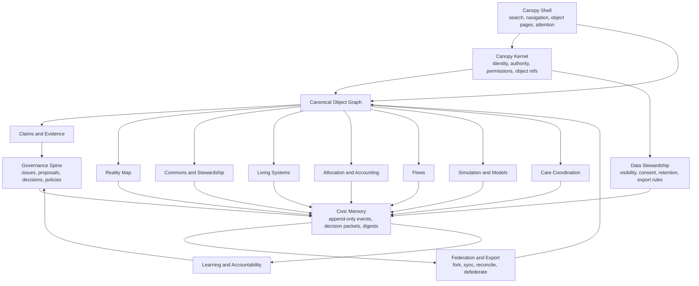
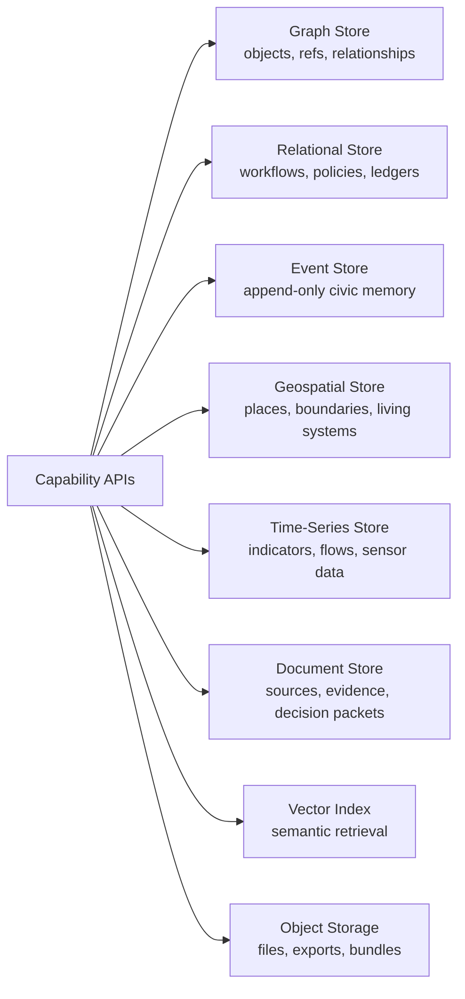
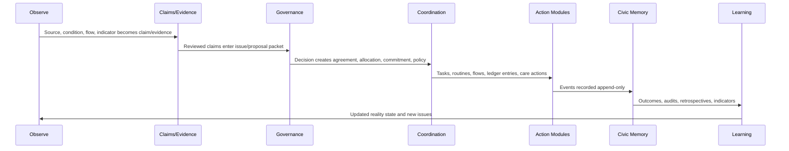
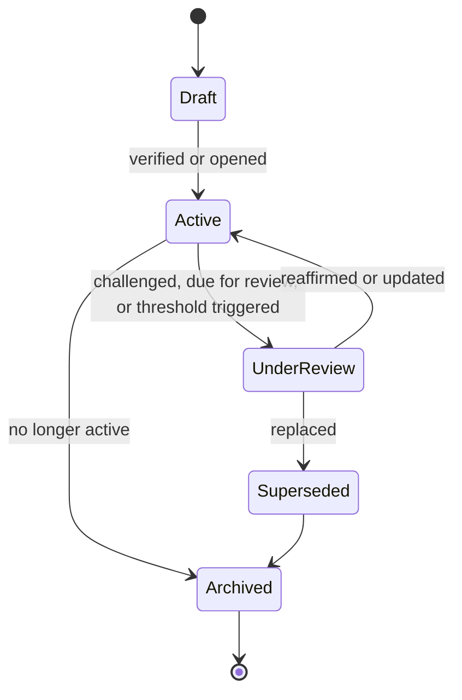
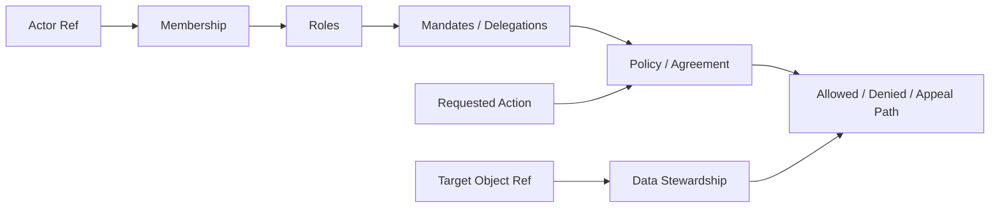
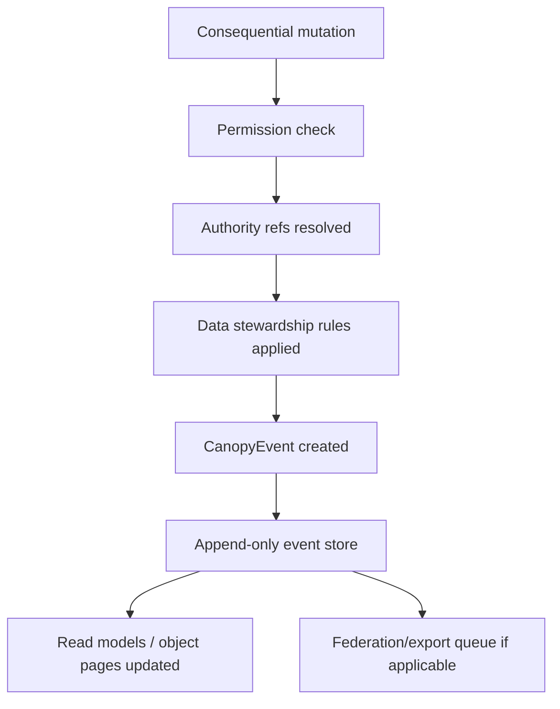

# Canopy Reference Architecture

## Purpose

This document defines the integrated Canopy architecture: the shared kernel, canonical object graph, civic memory, governance spine, module capabilities, data stores, and federation layer.

Canopy is not four applications joined by navigation. It is one cybernetic commons infrastructure with modular capabilities.

## Architectural Thesis

Canopy coherence comes from five shared substrates:

1. Kernel identity and authority
2. Canonical object graph
3. Claims/evidence layer
4. Append-only civic memory
5. Governance and federation protocols

Every module must use these substrates.

## Whole-System Map



## Logical Layers

### Layer 1: Canopy Shell

User-facing operating environment.

Responsibilities:

- One sign-in
- One object search
- One scope switcher
- One attention/notification system
- One object page template
- One decision packet view
- One civic memory view
- One map/graph/list triad

Does not:

- Expose old product names as top-level app boundaries.
- Own domain data.

### Layer 2: Kernel

Shared substrate.

Responsibilities:

- Person, Account, Organization, Membership
- Role, RoleAssignment, Mandate, Delegation, Guardian
- ObjectRef
- Permission evaluation
- AccessRule
- DataStewardshipAgreement
- Event envelope
- Export envelope
- Federation rule

### Layer 3: Canonical Object Graph

Graph of Canopy objects and relationships.

Responsibilities:

- Object registry
- Object relationship types
- Canonical/local taxonomy mapping
- Graph traversal
- Scope relationships
- Object page hydration

### Layer 4: Epistemic Layer

Claims, evidence, counterclaims, sources, perspectives, and review.

Responsibilities:

- Claims about any object
- Evidence links
- Counterclaims
- Source ingestion
- AI-assisted extraction as reviewable artifact
- Data state and confidence

### Layer 5: Governance Spine

Legitimate collective decision-making.

Responsibilities:

- Issues
- Perspectives
- Proposals
- Objections
- Amendments
- Decisions
- Agreements
- Policies
- Appeals
- Conflicts
- Guardian review

### Layer 6: Capability Modules

Domain behavior.

Capabilities:

- Reality Map
- Commons and Stewardship
- Living Systems
- Allocation and Accounting
- Flows
- Simulation and Models
- Care Coordination
- Learning and Accountability

### Layer 7: Civic Memory

Append-only system memory.

Responsibilities:

- Canonical events
- Decision packets
- Policy versions
- Supersessions
- Redacted stubs
- Digests
- Audits
- Replay and export

### Layer 8: Federation

Cross-instance and cross-scale coordination.

Responsibilities:

- Export
- Import
- Sync
- Reconciliation
- Forking
- Defederation
- Schema versioning
- Data stewardship preservation

## Data Store Architecture

Canopy should be polyglot at the storage layer but unified at the contract layer.



Recommended responsibilities:

| Store | Owns |
| --- | --- |
| Graph | Object refs, relationships, scope graph, taxonomy mappings |
| Relational | Workflows, ledger rows, policies, decisions, assignments |
| Event | Civic memory events, replay, supersession |
| Geospatial | Places, boundaries, watersheds, habitats |
| Time-series | Indicators, sensor readings, flow measurements |
| Document | Evidence, sources, charters, decision packets |
| Vector | Search and retrieval over evidence/memory |
| Object storage | Files, exports, compressed bundles |

## Service Architecture

```mermaid
flowchart TB
    Gateway["API Gateway / Server Actions"]
    Auth["Auth Adapter"]
    Identity["Identity Service"]
    Authority["Authority Service"]
    Permissions["Permission Service"]
    ObjectService["Object Graph Service"]
    ClaimsService["Claims and Evidence Service"]
    GovernanceService["Governance Service"]
    MemoryService["Civic Memory Service"]
    DataService["Data Stewardship Service"]
    FederationService["Federation Service"]

    CommonsService["Commons Service"]
    EcologyService["Living Systems Service"]
    AllocationService["Allocation and Accounting Service"]
    FlowService["Flow Service"]
    ModelService["Simulation and Model Service"]
    CareService["Care Coordination Service"]
    LearningService["Learning Service"]

    Gateway --> Auth
    Gateway --> Identity
    Gateway --> Authority
    Gateway --> Permissions
    Gateway --> ObjectService
    Gateway --> ClaimsService
    Gateway --> GovernanceService
    Gateway --> CommonsService
    Gateway --> EcologyService
    Gateway --> AllocationService
    Gateway --> FlowService
    Gateway --> ModelService
    Gateway --> CareService
    Gateway --> LearningService

    Permissions --> Authority
    Permissions --> DataService
    ObjectService --> MemoryService
    ClaimsService --> MemoryService
    GovernanceService --> MemoryService
    CommonsService --> MemoryService
    EcologyService --> MemoryService
    AllocationService --> MemoryService
    FlowService --> MemoryService
    ModelService --> MemoryService
    CareService --> MemoryService
    LearningService --> MemoryService
    MemoryService --> FederationService
```



## Existing Project Source Mapping

| Source project | Folded into | Notes |
| --- | --- | --- |
| CommonCredit | Allocation and Accounting, parts of Coordination | Ledger discipline, offers/needs, mutual credit, disputes |
| ICOS | Governance, Federation, Civic Memory, Living Systems, Flow, Care | Constitutional protocol, delegations, append-only memory |
| Sensemaking | Claims and Evidence, issue interpretation | Claim/source/review pipeline |
| Stewardship | Commons, Resources, Policies, Maintenance, Food Flows | Concrete schema base for resource governance |

## Cybernetic Data Flow



## Object Lifecycle Pattern

All major objects follow a shared lifecycle pattern:



Not every object uses every state, but modules should map local states into this family.

## Permission Flow



Permission checks must return:

- Allowed or denied
- Source of authority
- Reason where safe
- Appeal path where applicable

## Civic Memory Write Path



Rules:

- Mutations that affect rights, obligations, claims, governance, ecological state, accounting, or data visibility must write events.
- Read-model updates can be rebuilt from events where practical.
- Redacted event stubs preserve memory without exposing sensitive detail.

## Module Boundary Rules

Modules may:

- Own domain-specific workflows.
- Maintain optimized local tables.
- Provide domain-specific views.
- Define local vocabulary mapped to canonical ontology.

Modules may not:

- Own separate identity.
- Own separate civic memory.
- Store decision-relevant assertions outside claims/evidence.
- Make consequential changes without events.
- Create irreversible authority.
- Hide ecological context for material activity.
- Define non-exportable records.

## Integration Patterns

### Pattern 1: Canonical First

New module objects are created through canonical object refs first, then domain-specific tables extend them.

Use when:

- Building new Canopy-native modules.

### Pattern 2: Adapter Around Legacy Module

Existing module keeps local schema but exposes canonical object refs, events, and permissions through an adapter.

Use when:

- Folding in CommonCredit, Stewardship, Sensemaking, or ICOS without immediate rewrite.

### Pattern 3: Projection Into Canopy

Legacy module emits events and read-only object projections into Canopy, but write workflows remain local until migrated.

Use when:

- Lower-risk transition is needed.

### Pattern 4: Full Translation

Legacy objects are migrated into canonical Canopy objects and old local tables are retired.

Use when:

- Kernel contract is stable and module code is being refactored.

## Recommended Fold-In Sequence

This is not an MVP sequence. It is a coherence sequence.

### 1. Kernel And Identity

Use CommonCredit shared identity spec as seed, expanded into Canopy kernel.

### 2. Civic Memory

Adopt ICOS append-only memory pattern and CommonCredit event envelope.

### 3. Claims/Evidence

Lift Sensemaking claim/source/review objects into kernel-compatible service.

### 4. Governance Spine

Merge ICOS CommonGround protocol with Stewardship proposal/policy/decision schemas.

### 5. Commons/Resources

Fold Stewardship resources, use rights, maintenance, policies, and food flows into Canopy object pages.

### 6. Allocation/Accounting

Fold CommonCredit as one accounting and settlement method, not as the center of economic ontology.

### 7. Flows And Living Systems

Combine Stewardship food flows with ICOS Synapse/EIL concepts.

### 8. Simulation

Build Canopy-native model governance and scenario services.

### 9. Federation

Harden export, import, fork, sync, and reconciliation.

## Deployment Topology Options

### Option A: Modular Monolith First

One Next.js app, one database cluster, internal service boundaries.

Best for:

- Early coherence
- Shared shell
- Faster refactor

Risk:

- Could become tightly coupled if contracts are not enforced.

### Option B: Federated Services

Separate services per capability, shared kernel contracts.

Best for:

- Long-term scale
- Independent deployments

Risk:

- Can feel disparate too early.

### Recommendation

Start as a **contract-enforced modular monolith** for coherence, with federation/export architecture designed from the beginning.

Do not start with microservices. The primary risk right now is fragmentation, not scaling.

## Reference Implementation Notes

Current project stacks differ:

- CommonCredit: Next.js, Prisma, NextAuth
- Sensemaking: Next.js, Prisma, Clerk-oriented
- Stewardship: Next.js, Drizzle, Clerk
- ICOS: Next.js, Drizzle, custom auth/session, jobs, export services

Architecture recommendation:

- Do not choose ORM first.
- Define TypeScript/Zod contract package first.
- Provide Prisma and Drizzle adapters second.
- Use provider-neutral auth adapter.
- Use canonical event store contract independent of app framework.

## Required Contract Packages

Future implementation should produce:

```text
packages/
  canopy-kernel-contracts/
    object-ref.ts
    identity.ts
    authority.ts
    permissions.ts
    data-stewardship.ts
    claims-evidence.ts
    events.ts
    federation.ts
  canopy-governance-contracts/
    issue.ts
    proposal.ts
    decision-packet.ts
    policy.ts
    appeal.ts
  canopy-domain-contracts/
    commons.ts
    living-systems.ts
    allocation.ts
    flows.ts
    models.ts
    care.ts
```

## Architecture Validation Checklist

Canopy architecture is coherent if:

- Users never need to know which old project a capability came from.
- Every object can render in the universal object page.
- Every consequential event writes to civic memory.
- Every module uses kernel identity and authority.
- Every decision-relevant assertion is a claim.
- Every material module can expose ecological hooks.
- Every governance action cites authority.
- Every data object can carry stewardship rules.
- Every module can export/federate according to contract.
- AI remains sensemaking support, not governor.

## Next Architecture Artifact

After this reference architecture, the next useful artifact is:

**Canopy Contract Package Spec**

That would turn the documents into implementable TypeScript/Zod package boundaries.

