# Product Requirements Document: Cybernetic Commons Infrastructure

## 1. Executive Summary

### Problem Statement

Modern societies have powerful coordination systems for capital, prices, logistics, and state administration, but weak shared infrastructure for perceiving ecological reality, expressing human needs, stewarding commons, deliberating tradeoffs, and coordinating production within living limits. Communities, cities, bioregions, and institutions often act with fragmented knowledge, delayed feedback, shallow participation, and economic incentives that treat ecological damage as external to decision-making.

### Proposed Solution

Build a cybernetic commons infrastructure: a federated, AI-assisted, democratically governed platform that helps communities observe reality, understand interdependencies, simulate futures, deliberate collectively, coordinate action, and learn from outcomes. The system treats people, places, commons, living systems, needs, capabilities, resources, proposals, agreements, policies, indicators, scenarios, and outcomes as first-class objects within a shared civic and ecological operating environment.

### Core Product Question

How can a society perceive itself well enough to coordinate intelligently within ecological limits?

### Success Criteria

Success cannot be reduced to a single growth metric. The platform should be evaluated through a portfolio of measurable, qualitative, and deliberative signals:

- Perception quality: participating communities maintain current, trusted maps of places, commons, resources, living systems, needs, capabilities, active projects, and decisions.
- Coordination quality: more needs are matched to local and regional capabilities without increasing ecological overshoot.
- Governance quality: decisions are traceable from evidence, perspectives, deliberation, agreements, and outcomes.
- Ecological quality: living-system indicators are visible in planning, budgets, project approvals, and policy choices.
- Learning quality: communities can compare intended outcomes with observed outcomes and adapt governance rules accordingly.
- Autonomy quality: local units retain meaningful decision authority while coordinating with higher-scale systems only where interdependence requires it.
- Legitimacy quality: affected people and represented living systems have defined mechanisms for participation, appeal, review, and guardianship.

### Non-Goal

This is not a conventional startup app, social network, marketplace, nonprofit CRM, voting platform, governance forum, or mutual aid board. Those patterns may appear as subsystems, but the intended product is a long-horizon civic, ecological, and economic coordination architecture.

### Kernel-First Product Clarification

The first version is not a smaller version of the entire civilization-scale system. It is the protocol core from which the larger system can grow.

The initial build target is therefore not "a tiny mutual aid app" or "a map of everything." It is a governed, versioned, contestable object graph that can later support mapping, ecological monitoring, needs-capability matching, deliberation, allocation, simulation, and federation.

The kernel must answer:

- Who is saying what?
- About which object?
- With what authority?
- Using what evidence?
- Visible to whom?
- Challengeable by whom?
- Changed when?
- Under which governance process?

## 2. Product Vision

The platform functions as a collective nervous system for an ecological civilization.

Its recurring loop is:

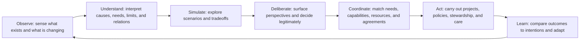

The platform should help communities answer increasingly complex coordination questions:

1. What exists?
2. What is needed?
3. What should we do?
4. Why is this happening?
5. What might happen?
6. How should civilization coordinate itself?

The architecture should be capable of beginning at neighborhood, watershed, cooperative, city, or bioregional scale, then federating across scales without collapsing into centralized command.

## 3. Philosophical Assumptions

### Stewardship Before Ownership

The system assumes that stewardship is more fundamental than ownership. Land, housing, water, forests, energy systems, knowledge, infrastructure, cultural resources, and productive capacity should be representable through multiple rights and responsibilities, including custodianship, usufruct, commons governance, cooperative ownership, public trust, indigenous sovereignty, land trusts, and time-limited use rights.

Ownership records may exist, but the platform should not treat ownership as the only legitimate relation between people and resources.

### Nature Is Not an Externality

Living systems are first-class participants in the architecture. Watersheds, forests, aquifers, species populations, habitats, soils, rivers, estuaries, airsheds, and bioregions should have:

- Health indicators
- Limits and thresholds
- Seasonal rhythms
- Regeneration needs
- Evidence records
- Risk signals
- Guardians or representative institutions
- Relationships to projects, policies, resources, and decisions

Representation of living systems may be performed by scientists, communities, indigenous groups, guardians, land trusts, ecological institutions, sensor systems, and AI-assisted monitoring. The platform must make explicit who or what is speaking for a living system, with what evidence, legitimacy, and accountability.

### Economics As Coordination, Not Accumulation

The platform attempts to solve the fundamental coordination problems that capitalist markets partially solve:

- What should be produced?
- Where should it be produced?
- By whom?
- With which resources?
- For whose benefit?
- At what ecological cost?
- Under which governance authority?
- With which feedback loops?

The difference is that coordination is driven by needs, capabilities, stewardship, ecological constraints, democratic deliberation, and collective intelligence rather than profit, speculation, shareholder returns, and capital accumulation.

### AI As Sensemaking, Not Sovereign

AI is not the governor. AI may summarize, translate, classify, detect patterns, identify tradeoffs, surface risks, match needs and capabilities, and simulate scenarios. AI must not become the ultimate decision-maker. Human communities and legitimate institutions retain authority.

Every AI-mediated recommendation must expose:

- Inputs used
- Uncertainties
- Assumptions
- Excluded data
- Affected parties
- Ecological constraints considered
- Alternative options
- Contestability mechanisms

### Value Pluralism

The system must not optimize a single metric. Some values cannot be fully quantified. Wellbeing, resilience, biodiversity, autonomy, equity, freedom, democratic participation, care, cultural continuity, and capability development must be navigated as plural values, not compressed into one universal score.

## 4. System Principles

### Principle 1: Subsidiarity With Federation

Decisions should be made at the smallest scale capable of handling the relevant consequences. When impacts cross scales, coordination should federate upward or outward without erasing local autonomy.

### Principle 2: Ecological Constraint Before Throughput

Production and coordination must respect ecological thresholds, regeneration rates, planetary boundaries, and local carrying capacities.

### Principle 3: Participatory Legibility

People should be able to see how decisions were made, what evidence mattered, who participated, what alternatives were considered, and how outcomes will be reviewed.

### Principle 4: Polycentric Governance

Multiple overlapping centers of governance should coexist. The platform should support commons, municipalities, cooperatives, watershed councils, indigenous institutions, regional assemblies, public agencies, scientific bodies, and informal mutual aid networks.

### Principle 5: Requisite Variety

Following cybernetic theory, the system must preserve enough internal variety to respond to the complexity of the environment. It should not impose a uniform governance template on every place, commons, or living system.

### Principle 6: Feedback Over Command

The platform should privilege feedback loops, learning, consent, and negotiated coordination over top-down directives.

### Principle 7: Contestability

Every model, indicator, classification, recommendation, and decision should be challengeable through defined processes.

### Principle 8: Memory With Forgiveness

The system should remember decisions, outcomes, evidence, and harms, but avoid turning civic life into permanent reputational punishment. Records should distinguish institutional accountability from personal stigmatization.

### Principle 9: Interoperability And Exit

Communities must be able to export their data, federate with other systems, and leave governance arrangements through legitimate transition processes.

## 5. Lessons Incorporated

### Elinor Ostrom

The architecture should encode conditions that made commons governance durable:

- Clearly defined commons and participant boundaries
- Locally appropriate rules
- Collective rule modification
- Monitoring by accountable participants
- Graduated sanctions
- Conflict-resolution mechanisms
- Recognition by wider authorities
- Nested governance for larger systems

### Stafford Beer, VSM, And Project Cybersyn

The system should learn from cybernetics without reproducing authoritarian control. Cybersyn's most important architectural lesson is that real-time coordination can preserve local autonomy when the central system receives abstracted signals, detects exceptions, and supports rapid response rather than micromanaging every unit.

The platform should use VSM-inspired layers:

- System 1: local operational units such as commons, projects, cooperatives, and stewardship groups
- System 2: coordination and conflict damping across peer units
- System 3: resource allocation, accountability, and internal optimization
- System 3*: audit and ground-truth channels
- System 4: future sensing, simulation, external adaptation
- System 5: identity, principles, constitutional governance

### Donella Meadows

The platform should act at high-leverage points: information flows, rules, self-organization, goals, and paradigms. It should not only optimize existing flows; it should help communities question the goals that shape those flows.

### Karl Polanyi

The architecture should resist disembedding economy from society and nature. Labor, land, care, and ecological systems should not be treated as fictitious commodities whose value is exhausted by price.

### Murray Bookchin

The platform should support confederal, municipal, and ecological forms of democratic coordination. It should enable local assemblies, delegated councils, and nested decision systems without assuming either pure central planning or isolated localism.

### Yanis Varoufakis

The architecture should explore post-capitalist coordination mechanisms that distinguish markets, planning, ownership, and power. It should allow democratic allocation, cooperative productive units, commons-based production, and participatory investment without assuming shareholder control.

### Bioregionalism

The system should privilege ecological boundaries where appropriate: watersheds, foodsheds, energy regions, habitats, and mobility basins. Administrative boundaries remain important but should not be the only planning geometry.

## 6. Operational Kernel

### Purpose

The operational kernel is the minimum civic and ecological substrate required before any domain module can work reliably. It is not an MVP in the startup sense. It is the constitutional object graph that makes later modules coherent.

The kernel defines:

- Identity
- Accounts
- Roles
- Credentials
- Memberships
- Mandates
- Delegations
- Permissions
- Objects and object relationships
- Claims and evidence
- Versioning
- Event log
- Basic governance rules
- Data sensitivity and access rules
- Export and federation format

### Kernel Requirements

- A community can create governed, versioned, contestable objects.
- Every object can declare who created it, who stewards it, who can edit it, who can challenge it, and which governance process applies.
- Every important factual statement can be represented as a claim, not merely as a neutral fact.
- Every decision-relevant object change is recorded in an event log.
- Every permission rule is scoped by role, mandate, object type, sensitivity, and context.
- Every local instance can export its object graph in an interoperable format.
- Minimal federation semantics exist from the beginning, even if full federation comes later.

### Kernel Object Grammar

The core grammar should be simple enough to implement and expressive enough to grow:

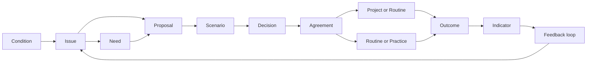

This grammar clarifies the relationship between concepts that were otherwise ontologically flat. A condition produces an issue; an issue may reveal a need or generate a proposal; a proposal may be tested through scenarios; a decision resolves a proposal; an agreement authorizes work; a project or routine acts; outcomes update indicators; indicators feed back into new issues.

## 7. OOUX Object Model

### Object Inventory

The object model begins with the founder brief's candidate objects, with refinements for ecological governance and cybernetic feedback.

| Object | Definition | Primary Questions |
| --- | --- | --- |
| Person | A human participant with roles, affiliations, skills, needs, rights, and responsibilities | Who is affected, capable, authorized, or accountable? |
| Organization | A formal or informal collective entity | What group can act, steward, decide, produce, or represent? |
| Place | A geographic, cultural, administrative, ecological, or lived location; may be typed as neighborhood, parcel, municipality, watershed, foodshed, habitat, or bioregion | Where is this happening and at what scale? |
| Commons | A shared resource system governed by a community | What is shared, by whom, under which rules? |
| Living System | An ecosystem, species, habitat, watershed, forest, river, aquifer, soil system, or climate-related system | What is the health, limit, need, and representation of this system? |
| Resource | A material, energetic, spatial, informational, cultural, or infrastructural capacity | What is available, constrained, depleted, renewable, or contested? |
| Need | A human, institutional, community, or ecological requirement | What must be satisfied, for whom, how urgently, and by what standard? |
| Capability | A skill, tool, institution, facility, knowledge base, labor capacity, or productive ability | What can be done, by whom, where, and under what conditions? |
| Project | A coordinated activity intended to change a state of the world | What action is underway or proposed? |
| Routine / Practice | Recurring care, maintenance, restoration, monitoring, or reproductive labor | What ongoing work keeps a commons, resource, place, or living system viable? |
| Flow | Movement of materials, energy, money, care, labor, knowledge, water, waste, or attention | What is moving from where to where, at what rate, and with what effects? |
| Stock | A quantity of resource, capacity, ecological condition, or reserve at a point in time | What exists as accumulated capacity or depletion? |
| Proposal | A structured suggestion for action, rule change, allocation, or investigation | What option is being considered? |
| Agreement | A ratified commitment among parties | What has been consented to, by whom, under what terms? |
| Policy | A rule or standing decision that shapes future actions | What norms or constraints govern repeated situations? |
| Decision | A discrete choice made through a legitimate process | What was chosen and why? |
| Indicator | A qualitative or quantitative signal about state, trend, health, risk, or value | What should be watched? |
| Scenario | A model of possible future states under assumptions | What might happen? |
| Model | A governable representation of causal, ecological, economic, or social dynamics used to produce scenarios or interpretations | Why do we believe these inputs may lead to these outcomes? |
| Outcome | Observed results of a project, policy, decision, or external event | What actually happened? |
| Issue | A problem, conflict, risk, opportunity, or anomaly requiring attention | What needs interpretation or action? |
| Claim | A contestable statement about an object, condition, cause, need, capability, impact, or outcome | Who is saying what, with what authority and evidence? |
| Counterclaim | A challenge or alternative statement that contests a claim | What disagreement must be resolved or preserved? |
| Perspective | A situated interpretation or value position, usually attached to deliberation | How is this seen by different participants? |
| Evidence | Data, testimony, observation, research, media, sensor readings, or records | What supports or challenges a claim? |
| Guardian | A person, organization, institution, or protocol authorized to represent a living system or vulnerable interest | Who speaks for those who cannot directly participate? |
| Mandate | A delegated authority with scope, duration, and accountability | Who is allowed to decide or act on behalf of others? |
| Use Right | A governed right to access, withdraw, occupy, modify, steward, or benefit from a resource without reducing relation to absolute ownership | Who may use what, under which limits and review? |
| Commitment | A promise to contribute labor, care, resources, capacity, funds, maintenance, or action | What was promised, by whom, for whom, and was it fulfilled? |
| Allocation | An authorized assignment of resource, budget, capacity, attention, or use right | What has been directed toward which need, project, or obligation? |
| Obligation | A duty created by agreement, role, mandate, use right, or stewardship rule | What remains owed or required? |
| Data Stewardship Agreement | A governance object defining access, consent, sensitivity, disclosure, retention, and federation rules for data | Who stewards knowledge about this object or domain? |
| Access Rule | A rule determining who can see, edit, verify, challenge, export, or federate data | How is transparency balanced with safety? |
| Conflict / Grievance | A formalized dispute, harm report, objection, deadlock, or request for remedy | What disagreement or harm needs process? |
| Threshold | A limit, boundary, target, or trigger condition | When does action become necessary or prohibited? |
| Feedback Loop | A defined system pattern, optionally represented as an object when communities explicitly govern the loop | How does the system learn? |

### Object Relationship Map

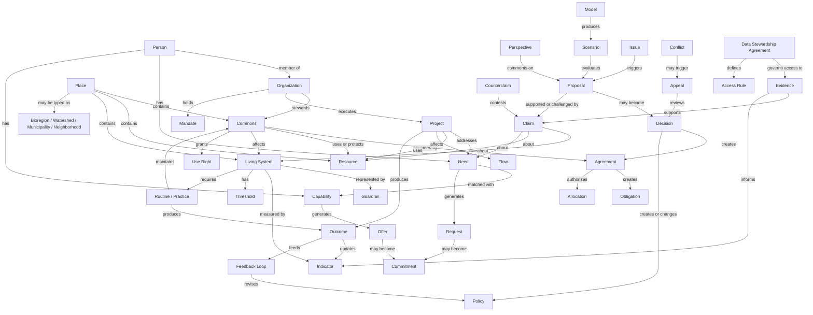

### Object Composition

Every primary object should support:

- Identity: stable ID, name, aliases, object type, provenance
- Scope: geographic, institutional, temporal, ecological, or social boundary
- Relations: links to people, places, resources, decisions, evidence, and outcomes
- State: current condition, status, uncertainty, last verified date
- Rights and responsibilities: who can view, edit, decide, steward, challenge, or archive
- Evidence: claims, sources, confidence, counter-evidence
- Governance: applicable mandates, rules, decision processes, appeal paths
- History: changes over time, versions, decisions, reviews
- Feedback: indicators, outcomes, anomalies, learning notes

## 8. Domain Model

### Domain Boundaries

The platform is organized into ten dependency-aware layers:

1. Civic/Ecological Kernel: identity, roles, mandates, permissions, object graph, claims, evidence, event log
2. Reality Layer: places, commons, living systems, resources, organizations, capabilities, stocks, flows
3. Need and Coordination Layer: needs, offers, requests, commitments, projects, routines, outcomes
4. Governance Layer: issues, proposals, deliberation, decisions, agreements, policies, appeals
5. Ecological Constraint Layer: living systems, indicators, thresholds, guardians, regeneration duties
6. Economic Allocation Layer: use rights, budgets, resource accounting, contribution accounting, procurement, optional credit systems
7. Sensemaking Layer: claims, causal maps, perspectives, evidence synthesis, anomaly detection
8. Simulation Layer: models, scenarios, assumptions, sensitivity analysis, tradeoff surfaces
9. Learning and Accountability Layer: audits, retrospectives, harm reports, rule revision, model review
10. Federation Layer: interoperability, data export, cross-scale mandates, protocols, compacts

### Entity Relationship Diagram

```mermaid
erDiagram
    PERSON ||--o{ ROLE_ASSIGNMENT : holds
    ORGANIZATION ||--o{ ROLE_ASSIGNMENT : grants
    ORGANIZATION ||--o{ MANDATE : holds
    PLACE ||--o{ COMMONS : contains
    PLACE ||--o{ RESOURCE : contains
    PLACE ||--o{ LIVING_SYSTEM : contains
    PLACE ||--o{ PLACE : nests
    COMMONS ||--o{ STEWARDSHIP_RULE : governed_by
    COMMONS ||--o{ AGREEMENT : bound_by
    COMMONS ||--o{ USE_RIGHT : grants
    LIVING_SYSTEM ||--o{ INDICATOR : monitored_by
    LIVING_SYSTEM ||--o{ THRESHOLD : constrained_by
    LIVING_SYSTEM ||--o{ GUARDIANSHIP : represented_by
    LIVING_SYSTEM ||--o{ ROUTINE : maintained_by
    PERSON ||--o{ NEED : expresses
    ORGANIZATION ||--o{ NEED : expresses
    LIVING_SYSTEM ||--o{ NEED : has
    PERSON ||--o{ CAPABILITY : offers
    ORGANIZATION ||--o{ CAPABILITY : offers
    NEED ||--o{ REQUEST : creates
    CAPABILITY ||--o{ OFFER : creates
    NEED ||--o{ MATCH : matched_to
    CAPABILITY ||--o{ MATCH : fulfills
    MATCH ||--o{ COMMITMENT : may_create
    PROJECT ||--o{ MATCH : operationalizes
    ROUTINE ||--o{ COMMITMENT : operationalizes
    PROJECT ||--o{ RESOURCE_USE : uses
    RESOURCE ||--o{ RESOURCE_USE : allocated_to
    RESOURCE ||--o{ STOCK : measured_as
    RESOURCE ||--o{ FLOW : moves_as
    ALLOCATION ||--o{ RESOURCE_USE : authorizes
    COMMITMENT ||--o{ OBLIGATION : creates
    PROJECT ||--o{ OUTCOME : produces
    ROUTINE ||--o{ OUTCOME : produces
    CLAIM ||--o{ EVIDENCE_LINK : supported_by
    CLAIM ||--o{ COUNTERCLAIM : contested_by
    CLAIM ||--o{ OBJECT_REFERENCE : about
    PROPOSAL ||--o{ EVIDENCE_LINK : supported_by
    EVIDENCE ||--o{ EVIDENCE_LINK : cited_in
    PROPOSAL ||--o{ PERSPECTIVE : receives
    PROPOSAL ||--o{ SCENARIO : tested_by
    MODEL ||--o{ SCENARIO : produces
    MODEL ||--o{ ASSUMPTION : contains
    MODEL ||--o{ DATASET : uses
    MODEL ||--o{ MODEL_AUDIT : reviewed_by
    PROPOSAL ||--o{ DECISION : resolved_by
    DECISION ||--o{ AGREEMENT : creates
    DECISION ||--o{ POLICY : creates
    DECISION ||--o{ APPEAL : reviewed_by
    CONFLICT ||--o{ APPEAL : may_create
    ISSUE ||--o{ PROPOSAL : prompts
    OUTCOME ||--o{ INDICATOR_READING : updates
    DATA_STEWARDSHIP_AGREEMENT ||--o{ ACCESS_RULE : defines
    DATA_STEWARDSHIP_AGREEMENT ||--o{ DATASET : governs
```

## 9. Core User Types

### Residents And Community Members

People affected by decisions, with the ability to express needs, contribute knowledge, participate in deliberation, join projects, challenge claims, and evaluate outcomes.

### Stewards

People or organizations responsible for a commons, resource, place, facility, or living system. Stewards maintain records, monitor conditions, coordinate maintenance, and facilitate governance processes.

### Guardians

Authorized representatives for living systems, future generations, vulnerable communities, or non-human interests. Guardians introduce evidence, flag thresholds, request review, and challenge proposals that threaten represented interests.

### Facilitators

People trained to run assemblies, deliberation processes, participatory budgeting, conflict resolution, proposal refinement, and sensemaking sessions.

### Scientists And Domain Experts

People or institutions contributing evidence, models, indicators, thresholds, and uncertainty analysis.

### Civic Institutions

Municipalities, agencies, councils, public utilities, public health departments, watershed districts, schools, and other institutions with formal authority.

### Cooperative And Productive Units

Worker cooperatives, farms, repair shops, clinics, energy cooperatives, fabrication labs, care networks, housing cooperatives, and other units that can satisfy needs or transform resources.

### Mutual Aid And Care Networks

Informal or semi-formal groups that mobilize care, food, transport, shelter, and emergency response.

### Delegates And Councils

Participants with limited, revocable mandates to coordinate across groups, commons, places, or scales.

### Auditors And Ombuds

People or institutions responsible for accountability, appeals, model review, evidence review, anti-corruption checks, and process integrity.

## 10. Core Workflows

### Workflow A: Map What Exists

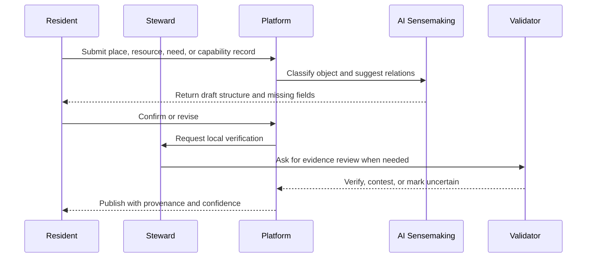

### Workflow B: Express And Aggregate Needs

1. A person, organization, guardian, or living-system steward records a need.
2. The need is scoped by place, urgency, population affected, evidence, and rights implications.
3. AI clusters related needs, detects duplicates, and surfaces unmet patterns.
4. Facilitators convene affected groups to validate interpretation.
5. Needs become visible to capable organizations, projects, or planning assemblies.

### Workflow C: Match Needs And Capabilities

1. A need is identified as unmet or under-met.
2. The system searches relevant capabilities, resources, projects, and organizations.
3. Ecological constraints and stewardship rules filter infeasible matches.
4. AI proposes possible coordination pathways.
5. Affected parties deliberate tradeoffs.
6. An agreement or project is created.
7. Outcomes are measured and compared to the original need.

### Workflow D: Make A Commons Decision

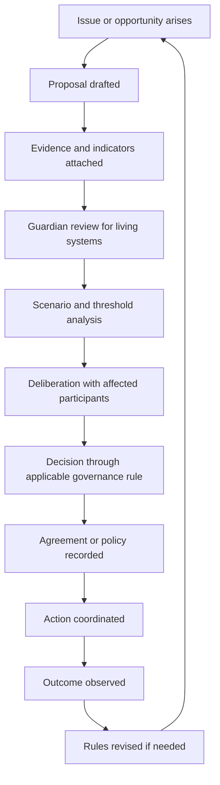

### Workflow E: Detect And Respond To Anomaly

1. Indicator crosses threshold or deviates from expected range.
2. System creates an issue with evidence and uncertainty.
3. Responsible stewards and guardians are notified.
4. AI summarizes likely causes and comparable historical cases.
5. Local units propose corrective action.
6. Higher-scale coordination is triggered only if impacts exceed local scope.
7. Audit channel checks whether local data or official summaries are inaccurate.

### Workflow F: Simulate A Policy Or Project

1. A proposal is selected for simulation.
2. Model inputs are declared and contested.
3. Multiple scenarios are generated across ecological, social, economic, and governance dimensions.
4. Results are displayed as tradeoff surfaces, not a single ranking.
5. Deliberators compare outcomes, uncertainties, and threshold risks.
6. Simulation outputs become evidence, not binding authority.

## 11. User Journeys

### Journey 1: Resident Expresses A Need

1. A resident notices recurring basement flooding after storms.
2. They create a need connected to their household, block, drainage system, watershed, and recent weather events.
3. AI suggests related reports from nearby residents and public works records.
4. A facilitator helps cluster the issue as a neighborhood stormwater need.
5. The watershed guardian attaches ecological indicators and floodplain evidence.
6. The system identifies capabilities: local contractors, city infrastructure teams, rain garden groups, and available public funds.
7. A proposal is created, simulated, deliberated, and converted into a project agreement.
8. Outcomes are measured after future storms and used to revise watershed and infrastructure policy.

### Journey 2: Guardian Challenges A Proposal

1. A housing cooperative proposes development near a wetland.
2. The proposal page automatically identifies affected living systems and notifies the wetland guardian.
3. The guardian adds evidence about habitat thresholds and seasonal breeding cycles.
4. Simulation shows three options: original design, redesign with buffer, and alternative site.
5. Residents, housing advocates, scientists, and indigenous representatives deliberate tradeoffs.
6. The final decision approves a modified project with binding restoration obligations and review dates.
7. Ecological outcomes are monitored and can reopen the agreement if thresholds are breached.

### Journey 3: Cooperative Offers Capability

1. A worker cooperative records available retrofit skills, equipment, training capacity, and geographic range.
2. The system matches the capability with unmet housing, energy, and public health needs.
3. Ecological constraints prioritize retrofits that reduce energy demand and improve heat resilience.
4. A municipal assembly allocates resources through participatory budgeting.
5. The cooperative accepts a mandate to perform work under agreed labor, ecological, and reporting standards.
6. Outcomes update energy indicators, resident wellbeing records, and future capability planning.

### Journey 4: Bioregional Council Coordinates Scarcity

1. Drought indicators cross thresholds across a watershed.
2. Local water commons receive anomaly alerts and submit current conditions.
3. The bioregional council sees exception reports rather than private household-level data.
4. Scenario modeling compares conservation, crop switching, industrial curtailment, emergency transfers, and habitat protection.
5. Affected communities deliberate under pre-agreed drought governance rules.
6. Allocations are made with sunset clauses, guardian review, and post-season audit.
7. The drought plan is revised based on outcomes, harms, and ecological recovery.

## 12. Information Architecture

### Primary Navigation Model

The platform should not begin with feeds or dashboards alone. It should be organized around reality objects and coordination loops.

- Map: places, bioregions, commons, living systems, resources, flows, projects
- Needs: expressed needs, unmet needs, urgency, affected groups, living-system needs
- Capabilities: people, organizations, facilities, skills, productive capacity, care networks
- Commons: shared resources, rules, stewards, access rights, conflicts, indicators
- Deliberation: issues, proposals, evidence, perspectives, decisions, appeals
- Scenarios: simulations, assumptions, model comparisons, threshold risks
- Agreements: policies, compacts, mandates, obligations, review dates
- Learning: outcomes, indicators, audits, anomalies, retrospectives, rule changes

### Object Pages

Every major object page should include:

- Overview and current status
- Location and scale
- Related objects
- Evidence and provenance
- Indicators and thresholds
- Governance rules and mandates
- Active issues and proposals
- Decisions and agreements
- Outcomes and learning history
- Permissions, representation, and appeal paths

### Scale Switching

Users should be able to move between:

- Household or person
- Block or neighborhood
- Commons
- Municipality
- Watershed
- Bioregion
- Federation of regions
- Global commons layer

Scale changes should preserve context and show what becomes visible or hidden at each level.

## 13. Major Platform Modules

### Module 0: Civic/Ecological Kernel

The protocol core for identity, authority, governed objects, claims, evidence, permissions, versioning, events, and export.

Core capabilities:

- Identity, account, role, credential, membership, mandate, and delegation records
- Relation-aware authorization
- Governed object graph
- Claim and evidence model
- Data sensitivity and access rules
- Event log and object versioning
- Basic governance processes for object verification and challenge
- Export and federation envelope

### Module 1: Reality Registry

Canonical object registry for places, commons, resources, living systems, organizations, needs, capabilities, projects, indicators, and flows.

Core capabilities:

- Object creation and verification
- Provenance and versioning
- Relationship graph
- Spatial indexing
- Temporal state history
- Confidence and uncertainty markings

### Module 2: Ecological Twin

A living-systems data layer representing ecological entities, indicators, thresholds, risks, and regeneration needs.

Core capabilities:

- Watershed, habitat, species, soil, forest, air, and climate objects
- Sensor and observational data ingestion
- Ecological threshold modeling
- Guardian representation
- Impact relationship mapping

### Module 3: Needs And Capabilities Exchange

A post-market coordination layer for discovering unmet needs and available capabilities.

Core capabilities:

- Need expression and validation
- Capability inventory
- Matchmaking
- Allocation proposals
- Resource constraints
- Care and production coordination
- Demand reduction and sufficiency options

### Module 4: Commons Governance Engine

Tools for defining, operating, and adapting commons governance systems.

Core capabilities:

- Commons boundaries
- Membership and access rules
- Stewardship obligations
- Rule modification processes
- Monitoring
- Graduated sanctions
- Conflict resolution
- Appeals
- Nested governance

### Module 5: Deliberation And Decision System

Structured processes for moving from issue to proposal to agreement.

Core capabilities:

- Proposal templates
- Evidence rooms
- Perspective mapping
- Consent, vote, sortition, delegation, and assembly processes
- Mandate tracking
- Decision logs
- Appeals and minority reports
- Translation and accessibility

### Module 6: Simulation And Foresight Lab

Scenario modeling for policy, resource allocation, ecological impacts, and future risk.

Core capabilities:

- Scenario builder
- Assumption registry
- Model comparison
- Sensitivity analysis
- Threshold alerts
- Participatory simulation sessions
- Public explanation of uncertainty

### Module 7: Coordination Operations Center

A Cybersyn-inspired operations layer for monitoring anomalies, bottlenecks, unmet needs, and ecological risks across federated units.

Core capabilities:

- Exception dashboards
- Real-time or near-real-time signals
- Local autonomy-preserving escalation
- Coordination requests
- Emergency response modes
- Audit channels
- Feedback loop monitoring

### Module 8: Learning And Accountability Layer

Outcome tracking, retrospectives, audits, model review, and rule adaptation.

Core capabilities:

- Outcome records
- Indicator deltas
- Decision retrospectives
- Harm reporting
- Model audits
- Process audits
- Governance rule revision
- Institutional memory

## 14. Data Architecture Assumptions

### Data Model

The platform should use a hybrid architecture:

- Graph database for object relationships, mandates, evidence links, dependencies, flows, and governance structures
- Geospatial database for places, bioregions, watersheds, infrastructure, land use, hazards, and ecological boundaries
- Time-series database for indicators, sensor readings, resource flows, climate signals, and operational metrics
- Document store for deliberation artifacts, proposals, agreements, policies, testimony, evidence, and model explanations
- Event log for decisions, state changes, audits, appeals, and coordination actions
- Vector index for semantic search over evidence, deliberations, policies, and knowledge artifacts

### Data Principles

- Local-first where possible
- Federated by design
- Interoperable with open standards
- Consent-aware and role-aware
- Provenance-preserving
- Versioned and auditable
- Able to distinguish measurement, testimony, model output, and decision
- Able to represent uncertainty and disagreement

### Data Sensitivity

The system must distinguish between:

- Public civic knowledge
- Community-visible knowledge
- Stewardship-restricted knowledge
- Sensitive ecological data, such as endangered species locations
- Personal data
- Vulnerable-community data
- Security-sensitive infrastructure data
- Deliberation records requiring privacy or delayed disclosure

### Data States

Civic and ecological data will always be incomplete, partial, and contested. The platform must represent "good enough for what purpose" rather than pretending all data is equally true.

Required data states:

- Unverified
- Locally verified
- Expert reviewed
- Contested
- Outdated
- Sensitive
- Archived
- Machine-inferred
- Sensor-derived
- Testimony-derived
- Model-derived
- Institutionally certified

## 15. Identity And Mandate Architecture

### Purpose

Identity is not a profile system. It is the foundation for authority, visibility, participation, accountability, and representation.

The system must distinguish:

- Person
- Account
- Role
- Credential
- Membership
- Mandate
- Delegation
- Authority
- Representation
- Consent

A single person may simultaneously be a resident, commons member, resource steward, assembly delegate, living-system guardian, municipal employee, indigenous nation member, expert contributor, affected party, and platform maintainer. These relations determine what the person can see, edit, verify, challenge, approve, delay, appeal, export, or federate.

### Mandate Requirements

- Every mandate must declare scope, source, duration, revocation path, accountability process, and conflict-of-interest rules.
- Delegated authority must be inspectable by affected participants.
- Mandates must be object-aware and scale-aware.
- Emergency mandates must have sunset clauses and retrospective review.
- Guardianship mandates must specify represented interest, evidence standards, challenge path, and renewal process.

## 16. Claim And Evidence Architecture

### Purpose

The platform should not store contested civic and ecological knowledge as flat "facts." It should store claims supported, challenged, reviewed, and revised through evidence and governance.

Example claims:

- This wetland is degraded.
- This building has 30 vacant units.
- This household needs food support.
- This cooperative has retrofit capacity.
- This policy increased flood risk.
- This species population is below threshold.

### Claim Requirements

Each claim must include:

- Claim text or structured assertion
- Claimant
- Affected objects
- Evidence
- Evidence type
- Confidence
- Counter-evidence
- Verification status
- Review date
- Visibility
- Contestability path
- AI involvement, if any

Evidence types must be distinguishable, including measurement, testimony, sensor reading, local knowledge, scientific study, institutional record, model output, media artifact, and AI interpretation.

## 17. Data Governance Architecture

### Purpose

The knowledge layer is itself a commons. Data governance must protect transparency from becoming surveillance and protect privacy from becoming elite opacity.

### Data Governance Objects

- Data Stewardship Agreement
- Access Rule
- Consent Record
- Disclosure Rule
- Data Sensitivity Classification
- Community Data Protocol
- Data Embargo
- Federation Rule
- Retention Rule

### Data Governance Requirements

- Communities can define data protocols for specific domains, places, commons, and living systems.
- People can revoke or narrow consent where legally and operationally possible.
- Communities can embargo sensitive ecological or vulnerable-community data.
- Crisis data sharing must require pre-defined authority, scope, duration, and review.
- Transparency defaults must be configurable by object class and sensitivity.
- Data export must preserve permissions, provenance, and stewardship agreements.

## 18. Allocation And Accounting Architecture

### Purpose

Post-capitalist coordination still requires accounting. The platform must track promises, capacities, use rights, obligations, budgets, scarcity, surplus, and fulfillment without reducing all value to price.

### Accounting Primitives

- Request
- Offer
- Commitment
- Contribution
- Allocation
- Use Right
- Obligation
- Capacity
- Budget
- Ledger
- Credit, if a community adopts credit
- Reciprocity Record
- Maintenance Burden

### Core Questions

- What was promised?
- By whom?
- Using what?
- For whom?
- At what material, labor, time, energy, and ecological cost?
- Under which constraint or use right?
- Was it fulfilled?
- What remains owed, blocked, surplus, or unresolved?

### Requirements

- Needs can become requests without requiring purchasing power.
- Capabilities can become offers without requiring commodification.
- Offers and requests can become commitments.
- Commitments can produce obligations, allocations, projects, routines, or agreements.
- Communities can choose whether to use budgets, contribution accounting, mutual credit, time accounting, or non-credit reciprocity.
- Maintenance and care burdens must be visible, not hidden inside project budgets.

## 19. Stock And Flow Architecture

### Purpose

Flows are where ecological and economic coordination becomes operationally serious. The platform must distinguish accumulated stocks from movement, capacity from throughput, and regeneration from depletion.

### Flow Requirements

Each flow should include:

- Source
- Destination
- Resource type
- Quantity
- Quality
- Frequency
- Time period
- Transport or transmission mode
- Energy cost
- Labor requirement
- Ecological impact
- Governance rule
- Loss, waste, or leakage
- Dependency risk

### Required Distinctions

- Stock versus flow
- Capacity versus throughput
- Renewable versus nonrenewable
- Regenerating versus depleting
- Local flow versus imported dependency
- Material flow versus care flow versus information flow
- One-time transfer versus recurring cycle

## 20. Model Governance Architecture

### Purpose

Scenario governance is not enough. Models must be governed because models encode political, ecological, and economic assumptions about causality.

### Model Objects

- Model
- Assumption
- Parameter
- Dataset
- Calibration
- Validation
- Sensitivity Test
- Model Steward
- Model Audit
- Model Dispute
- Known Failure Mode
- Community Note
- Expert Review

### Model Requirements

- Every scenario must reference the model or method that produced it.
- Every model must declare assumptions, parameters, datasets, calibration history, validation status, known failure modes, and steward.
- Affected communities and guardians can contest assumptions.
- Expert review and community review must be distinguishable.
- Model confidence should have a history, not a static label.
- Model outputs become evidence, not authority.

## 21. Conflict And Appeals Architecture

### Purpose

Conflict is not an edge case. In commons governance and ecological coordination, conflict is a core operating condition.

### Conflict Objects

- Conflict
- Grievance
- Appeal
- Mediation Process
- Restorative Process
- Sanction
- Remedy
- Minority Report
- Deadlock
- Escalation Trigger

### Conflict Requirements

- Any consequential claim, object classification, proposal, decision, mandate, model, or data disclosure can be challenged through an appropriate process.
- Conflict processes must distinguish factual dispute, value conflict, procedural objection, harm report, and jurisdictional disagreement.
- Graduated sanctions must be available where a commons chooses them.
- Restorative and remedial processes must be available before punitive escalation where appropriate.
- Deadlock rules must declare when to pause, escalate, delegate, arbitrate, or preserve disagreement.
- Appeals must be linked to the original decision, authority source, evidence, affected parties, and remedy.

## 22. Legacy System Interface

### Purpose

Early deployments will exist inside states, property law, insurance, banks, procurement rules, nonprofit law, municipal law, grant funding, and capitalist markets. The platform must represent these constraints without letting them define the whole ontology.

### Legacy Objects

- Legal Entity
- Legal Owner
- Title
- Lease
- Contract
- Permit
- Grant
- Budget
- Invoice
- Procurement Rule
- Bank Account
- Insurance Policy
- Regulatory Constraint
- Public Agency
- Tax Status

### Requirements

- Legal ownership can be represented without making ownership the primary relation.
- Existing contracts, grants, permits, and procurement rules can constrain proposals and projects.
- Transitional funding and compliance obligations can be linked to agreements and allocations.
- Communities can distinguish legal authority from moral, ecological, customary, or democratic authority.

## 23. Platform Governance And Integrity Architecture

### Platform Self-Governance

The platform's own schemas, defaults, moderation, integrations, AI models, data retention rules, federation settings, and upgrade paths must be governed. Otherwise, administrators become the new elite.

The system must define:

- Who can change schemas
- Who can moderate
- Who can approve integrations
- Who can set defaults
- Who can change AI models
- Who can change data retention rules
- Who can fork
- Who can federate
- Who can defederate
- Who can approve protocol changes

### Abuse And Integrity Requirements

The platform must anticipate spam, false needs, fake capabilities, political brigading, bot-generated evidence, strategic misinformation, capture by organized factions, data poisoning, and model gaming.

Integrity features should include:

- Rate limits and friction for high-impact actions
- Provenance requirements for decision-relevant claims
- Bot and coordinated manipulation detection
- Reputation for evidence quality, not generalized social status
- Moderation logs
- Independent audit paths
- Data poisoning checks for AI and simulation inputs
- Transparent defederation and remediation processes

## 24. AI Architecture And Guardrails

### AI Roles

AI may serve as:

- Summarizer
- Translator
- Classifier
- Pattern detector
- Matchmaker
- Scenario assistant
- Evidence assistant
- Risk surfacer
- Facilitation aide
- Accessibility support
- Knowledge retrieval system

AI must not serve as:

- Final decision-maker
- Unchallengeable authority
- Hidden optimizer of social outcomes
- Legitimacy substitute
- Automated enforcer of contested rules

### AI System Architecture

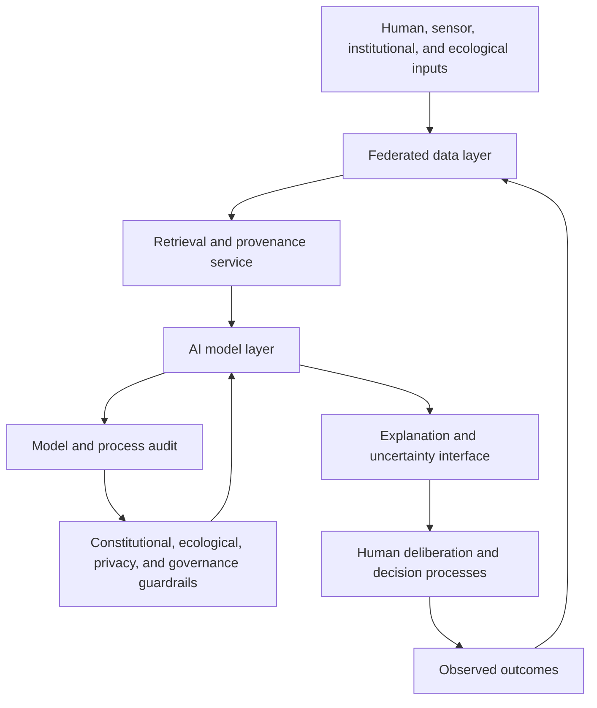

### Guardrails

- Every AI output must be labeled as assistance, not authority.
- Recommendations must show sources, assumptions, and uncertainty.
- AI may not make binding decisions.
- AI must support minority reports and dissenting interpretations.
- AI must not collapse plural values into one hidden optimization score.
- AI systems must be auditable by authorized communities.
- Model performance must be evaluated across language, class, race, disability, geography, and institutional power differences.
- AI must detect when a question requires deliberation rather than prediction.

### Evaluation Strategy

AI quality should be evaluated through:

- Citation accuracy
- Provenance completeness
- Hallucination rate
- Bias and disparate impact testing
- Scenario sensitivity quality
- Match relevance
- Human facilitator review
- Guardian review for ecological claims
- Community contestation outcomes
- Post-decision outcome comparison

## 25. Governance Architecture

### Governance Stack

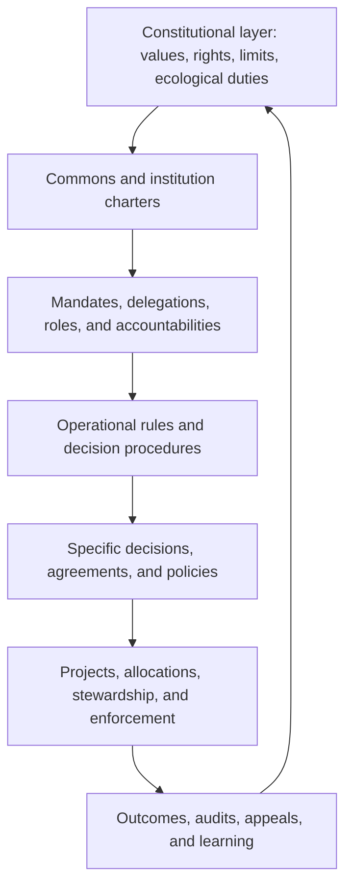

### Supported Decision Modes

The system should support multiple legitimate decision procedures:

- Consensus
- Consent
- Majority vote
- Supermajority
- Sortition
- Participatory budgeting
- Delegated councils
- Liquid delegation
- Expert review
- Guardian veto or delay for ecological thresholds
- Emergency authority with sunset and review
- Treaty or compact negotiation

### Governance Requirements

- Every decision must declare its authority source.
- Every mandate must have scope, duration, revocation process, and accountability.
- Affected-party analysis must be required for consequential decisions.
- Appeals and contestation paths must be visible.
- Minority reports must be preserved.
- Conflicts of interest must be disclosed.
- Decisions must include review dates where appropriate.
- Cross-scale impacts must trigger federation mechanisms.

## 26. Ecological Architecture

### Living System Representation

Living systems should have object pages equivalent in dignity and structure to organizations or places.

Each living system should include:

- Boundary and scale
- Health indicators
- Regeneration cycles
- Thresholds and tipping points
- Human dependencies
- Current pressures
- Guardians
- Evidence sources
- Uncertainty
- Active proposals affecting it
- Decisions and outcomes affecting it

### Ecological Constraint Model

### Ecological Requirements

- Projects must declare expected living-system impacts.
- Policies must identify relevant ecological thresholds.
- Commons must define regeneration responsibilities.
- Guardians must be notified when represented systems are affected.
- Ecological uncertainty must be visible in deliberation.
- Threshold breaches must create issues automatically.
- Restoration and care work must be represented as productive activity.

## 27. Simulation Architecture

### Simulation Philosophy

Simulation is a democratic aid, not technocratic replacement. Scenarios should clarify tradeoffs, uncertainties, and possible consequences. They should not conceal politics behind model outputs.

### Simulation Types

- Resource flow simulation
- Ecological impact simulation
- Climate and hazard scenario modeling
- Housing and land-use scenario modeling
- Food system resilience simulation
- Energy transition planning
- Care capacity and public health simulation
- Participatory budgeting allocation scenarios
- Commons rule stress tests
- Governance legitimacy and participation analysis

### Scenario Object Requirements

Every scenario must include:

- Question being explored
- Relevant objects
- Inputs
- Assumptions
- Model used
- Confidence range
- Excluded factors
- Affected groups
- Ecological thresholds
- Tradeoff surfaces
- Counter-scenarios
- Human interpretation notes

## 28. Economic Coordination Architecture

### Coordination Layers

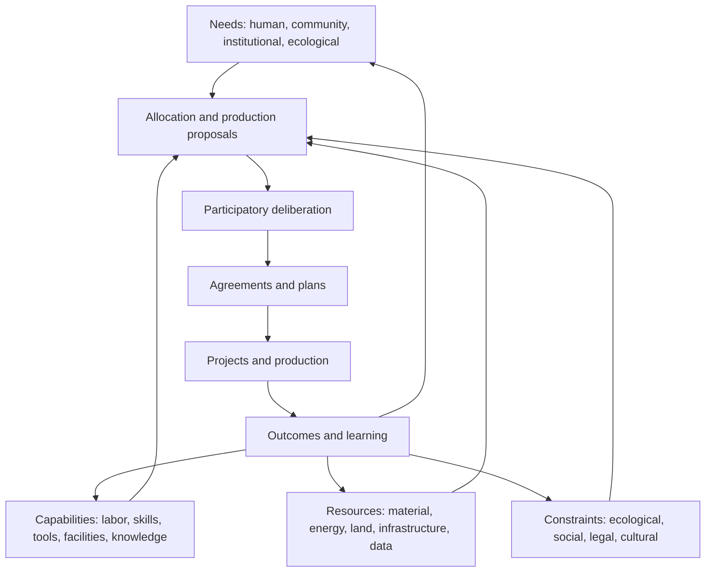

### Coordination Mechanisms

The system should support plural mechanisms:

- Direct need-capability matching
- Participatory planning
- Commons allocation
- Cooperative production planning
- Public procurement
- Mutual aid coordination
- Time banking or contribution accounting where appropriate
- Resource budgeting
- Ecological rationing under thresholds
- Local exchange systems
- Gift and care networks
- Delegated planning councils
- Scenario-informed investment allocation

### Economic Requirements

- Needs must be expressible without purchasing power.
- Capabilities must be visible without being commodified by default.
- Resource allocation must include ecological constraints.
- Productive units must retain operational autonomy within agreed constraints.
- Coordination failures must create observable issues.
- Care, maintenance, restoration, and prevention must be treated as real work.
- The system must distinguish scarcity caused by material limits from scarcity caused by institutional design.

## 29. Commons Architecture

### Commons Lifecycle

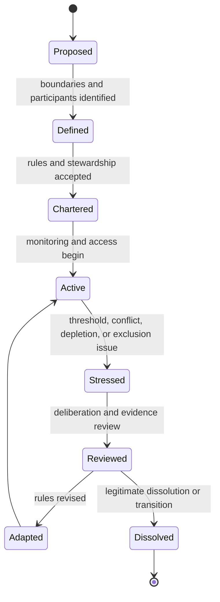

### Commons Requirements

- Define resource boundaries and participant boundaries.
- Record rights, access, withdrawal, contribution, maintenance, and exclusion rules.
- Support monitoring by accountable participants.
- Support conflict resolution before punitive escalation.
- Enable graduated sanctions where communities choose them.
- Recognize nested governance for larger resource systems.
- Link commons to living-system indicators and thresholds.
- Track whether rules are producing intended outcomes.

## 30. System Maps And Comparison With Project Cybersyn

### What To Learn

Project Cybersyn attempted to coordinate a nationalized economy through real-time industrial signals while preserving local autonomy. Its architecture emphasized exception reporting, rapid response, and communication between productive units and a coordination center. The lesson is not to build a central command dashboard for everything. The lesson is to design feedback channels that reveal when local autonomy needs support, when bottlenecks threaten broader systems, and when higher-scale coordination is justified.

### Architectural Similarities

- Real-time or near-real-time operational signals
- Exception detection rather than total surveillance
- Coordination rooms for collective interpretation
- Cybernetic feedback loops
- Local units as active participants rather than passive data sources
- Future-oriented modeling

### Required Differences

- Ecological systems must be first-class, not background constraints.
- Data governance must be democratic, federated, and consent-aware.
- AI must be auditable and subordinate to legitimate human governance.
- The platform must support plural ownership and stewardship forms.
- Coordination must include informal care, commons, indigenous governance, and bioregional institutions, not only factories or state enterprises.
- Legitimacy must come from participatory governance, not merely technical efficiency.
- The system must include anti-authoritarian safeguards, exit rights, appeal paths, and public contestability.

### VSM-Inspired System Map

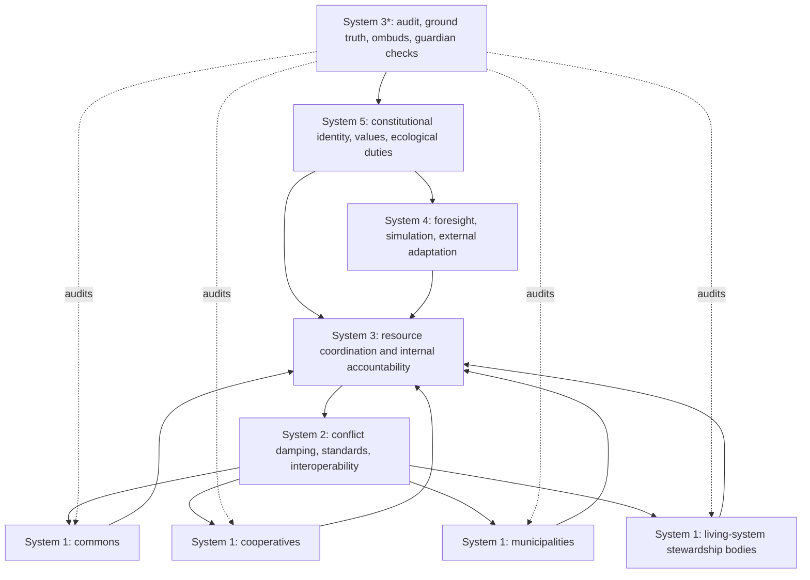

### Cross-Scale Coordination System Map

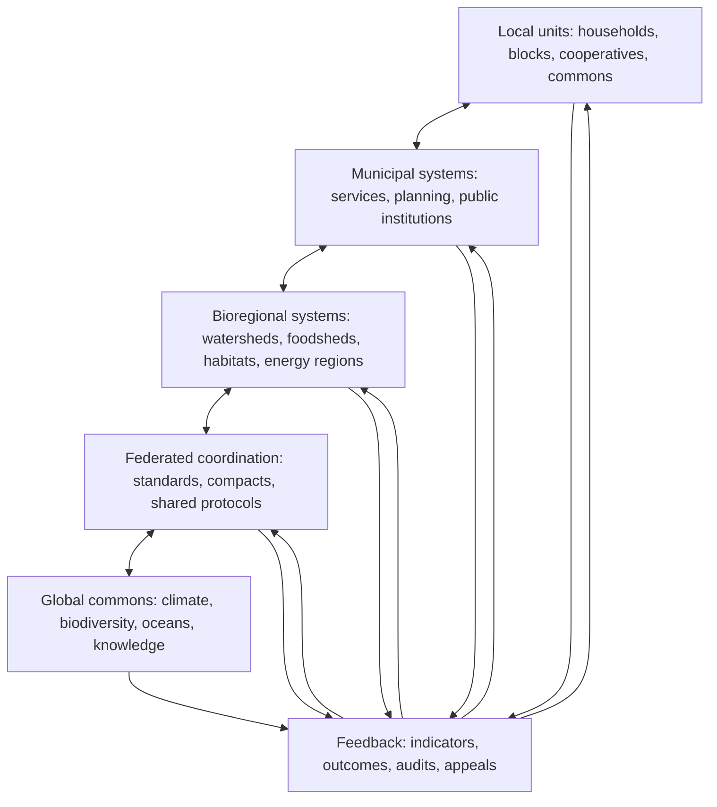

## 31. Architecture-Driven Roadmap

### Phase 0: Civic/Ecological Kernel

Question: How do we represent reality, authority, evidence, permissions, change, and export?

Goal: Build the governed object graph that every later subsystem depends on.

Architecture delivered:

- Object graph
- Identity and accounts
- Roles, credentials, memberships, mandates, and delegations
- Relation-aware permissions
- Claims and evidence
- Versioning
- Event log
- Data states and sensitivity classes
- Basic governance rules for verification and challenge
- Export and federation envelope

Exit criteria:

- A community can create governed, versioned, contestable objects.
- Every object can declare authority, evidence, permissions, history, and challenge paths.
- Data can be exported with provenance and access rules intact.
- Minimal federation assumptions are present before domain scaling begins.

### Phase 1: Shared Reality Map

Question: What exists?

Goal: Build a shared, trusted, federated map of one concrete domain rather than a generic map of everything.

Core questions:

- What places, commons, living systems, resources, organizations, capabilities, projects, policies, stocks, and flows exist in this domain?
- Who maintains knowledge about them?
- How trustworthy, current, and contested is that knowledge?

Architecture delivered:

- Reality Registry
- Place, watershed, foodshed, habitat, municipality, or neighborhood mapping
- Commons and resource inventory
- Living-system object pages
- Simple indicators
- Provenance, verification, and uncertainty
- Public and restricted data permissions

Recommended first domains:

- Watershed resilience: strongest embodiment of living systems, thresholds, municipalities, infrastructure, simulation, and guardianship
- Food commons / food resilience: easiest adoption path because needs, capabilities, surplus, waste, mutual aid, procurement, and flows are visible
- Housing retrofit / climate resilience: clearest project economics, funding pathways, labor capabilities, health indicators, and energy outcomes

Exit criteria:

- A community can maintain a living map of a bounded real-world domain.
- Objects are linked across people, places, resources, commons, and institutions.
- Data can be exported and federated.

### Phase 2: Needs, Capabilities, And Commitments

Question: What is needed, and who or what can respond?

Goal: Represent needs, capabilities, offers, requests, commitments, and basic coordination without reducing them to market demand.

Core questions:

- What human and ecological needs are unmet?
- What capabilities exist locally and regionally?
- Which needs are urgent, chronic, preventable, or structurally produced?
- Which commitments have been made, fulfilled, blocked, or left unresolved?

Architecture delivered:

- Needs registry
- Capability registry
- Offers and requests
- Commitments and obligations
- Need validation workflows
- Guardian-submitted ecological needs
- Project and routine creation
- Basic commitment accounting
- Pattern detection and clustering
- Accessibility and multilingual input

Exit criteria:

- Needs can be expressed independent of purchasing power.
- Capabilities can be discovered without default commodification.
- Unmet needs can be mapped against available capabilities and constraints.
- Communities can see who promised what, for whom, using what, and whether it was fulfilled.

### Phase 3: Governance, Agreements, And Conflict

Question: What should we do, and who has authority to decide?

Goal: Enable legitimate deliberation, proposal generation, conflict resolution, agreements, and coordinated action.

Core questions:

- Which actions are possible?
- Who is affected?
- What rules govern the decision?
- What evidence and perspectives should shape the choice?
- What conflict, appeal, guardian review, or minority report must be preserved?

Architecture delivered:

- Proposal system
- Evidence rooms
- Perspective mapping
- Decision procedures
- Agreement and mandate tracking
- Conflict and appeals workflow
- Guardian review
- Minority reports
- Project coordination
- Commons governance engine

Exit criteria:

- Communities can move from issue to proposal to decision to agreement to action.
- Decisions are traceable, appealable, and linked to outcomes.
- Governance procedures can vary by commons, place, and institution.
- Conflicts are treated as governable processes rather than informal breakdowns.

### Phase 4: Flows And Causal Sensemaking

Question: Why is this happening?

Goal: Build causal sensemaking and structural diagnosis.

Core questions:

- Why are needs unmet?
- Which flows, policies, incentives, ecological pressures, or institutional failures produce the issue?
- What feedback loops reinforce harm or resilience?

Architecture delivered:

- Causal mapping tools
- Stock and flow analysis
- Policy impact history
- Feedback loop explorer
- AI-assisted pattern detection
- Audit and ombuds workflows
- Claim and counterclaim spaces
- Data quality and anomaly review

Exit criteria:

- Communities can distinguish symptoms from causes.
- Repeated failures become visible as structural patterns.
- Corrective action can target rules, stocks, flows, institutions, and assumptions.

### Phase 5: Participatory Simulation

Question: What might happen?

Goal: Support participatory foresight, scenario analysis, and model governance.

Core questions:

- What futures are plausible?
- What thresholds might be crossed?
- Which choices are robust across uncertainty?
- What tradeoffs cannot be avoided?
- Which models, assumptions, datasets, and parameters generated the scenario?

Architecture delivered:

- Simulation and Foresight Lab
- Model registry
- Scenario object model
- Assumption registry
- Dataset and parameter tracking
- Model comparison
- Sensitivity analysis
- Simulation audits
- Ecological threshold alerts
- Participatory scenario sessions

Exit criteria:

- Proposals can be evaluated through multiple scenarios.
- Simulation outputs are transparent, contestable, and linked to deliberation.
- Ecological limits are visible before action is taken.
- Models themselves can be audited, contested, revised, or retired.

### Phase 6: Federation And Bioregional Planning

Question: How do multiple communities coordinate across shared living systems?

Goal: Federate local and bioregional systems into a plural, democratic, ecological coordination infrastructure.

Core questions:

- Which decisions belong at which scale?
- How do local autonomies coordinate around shared constraints?
- How do bioregions, cities, commons, and global systems negotiate shared futures?
- How does the system prevent both central command and fragmented incapacity?
- Which protocols must be shared, and which categories may remain local?

Architecture delivered:

- Federation protocols
- Cross-scale mandates
- Bioregional planning assemblies
- Global commons layer
- Interoperability standards
- Constitutional governance layer
- Coordination operations centers
- Long-term learning and institutional adaptation

Exit criteria:

- Multiple communities can coordinate around shared living systems and resources.
- Higher-scale coordination is triggered by interdependence, not administrative appetite.
- Local units retain autonomy within shared ecological and constitutional constraints.
- Communities can fork, federate, defederate, and reconcile data through legitimate protocols.

## 32. Adoption, Ecosystem, And Maintenance Thesis

### Deployment Thesis

The first deployment should not attempt to map society as a whole. It should activate the kernel inside one domain with enough real pain, existing actors, available data, ecological relevance, and coordination demand to make the system necessary.

Best first-context candidates:

- Watershed resilience, if the goal is strongest philosophical and ecological embodiment
- Food resilience, if the goal is easiest community adoption
- Housing retrofit and climate resilience, if the goal is clearest project economics

Recommendation: start with watershed resilience or food resilience. Watershed best expresses the living-system thesis. Food best expresses needs, capabilities, flows, mutual aid, and procurement pathways.

### Contributor And Extension Ecosystem

The platform should avoid becoming monolithic by supporting a governed extension model.

Possible extensions:

- Simulation models
- Ecological datasets
- Governance templates
- Indicator libraries
- Commons charters
- Visualization modules
- Translation packs
- Local taxonomies
- Sensor integrations
- Procurement adapters
- Legacy-system connectors

Extensions must declare data access, model assumptions, governance impact, maintenance status, and compatibility.

### Taxonomy And Ontology Governance

The platform needs shared object grammar for interoperability, but communities need local language and categories.

Required objects:

- Vocabulary
- Taxonomy
- Translation
- Local Term
- Canonical Mapping
- Fork
- Merge Request
- Ontology Proposal

The system must support semantic interoperability without cultural assimilation. For example, one community may say "resource" while another says "relative"; one may say "guardian" while another says "knowledge keeper"; one may say "commons" while another says "tribal land." Canonical mapping should support translation across systems, not erase local meaning.

### Funding And Maintenance Boundaries

Acceptable funding models may include:

- Public digital infrastructure
- Foundation-supported protocol development
- Municipal or cooperative consortium
- Membership federation
- Commons license with service cooperatives
- Public-benefit utility
- Research institution spinout

Unacceptable funding models:

- Advertising
- Surveillance monetization
- Speculative tokenization
- Proprietary data lock-in
- Growth-at-all-costs venture dependency
- Exclusive ownership of community-generated knowledge

The platform's maintenance model should itself be governed as a commons, with visible budgets, contribution needs, obligations, roadmap decisions, and exit/fork rights.

## 33. Acceptance Criteria By Capability

### Civic/Ecological Kernel

- Users can create governed objects with identity, scope, permissions, provenance, and version history.
- Claims, evidence, counterclaims, and verification states are represented separately.
- Every decision-relevant object change appears in an event log.
- Object data can be exported with provenance, access rules, and federation metadata.
- Minimal governance processes exist for verifying, challenging, archiving, and restoring objects.

### Identity And Mandates

- A person can hold multiple roles, memberships, credentials, delegations, and mandates.
- Permissions are computed from role, mandate, object relationship, sensitivity, and governance context.
- Mandates include scope, duration, source, revocation, accountability, and conflict-of-interest fields.

### Claims And Evidence

- Claims can be supported, contested, reviewed, marked outdated, or archived.
- Evidence type is explicit: testimony, measurement, sensor reading, local knowledge, scientific study, institutional record, media artifact, model output, or AI interpretation.
- Decision packets distinguish claim, evidence, model output, perspective, and final decision.

### Reality Registry

- Users can create, verify, update, contest, and archive core objects.
- Every object includes provenance, relationships, governance scope, and uncertainty.
- Object histories are versioned.
- Map, graph, and list views are available.

### Living System Representation

- Living systems can have guardians, indicators, thresholds, evidence, needs, and affected proposals.
- Ecological thresholds can trigger issues automatically.
- Guardian review is required for proposals affecting represented systems.

### Deliberation And Decisions

- Proposals include evidence, affected parties, governance procedure, ecological impacts, and review schedule.
- Participants can add perspectives, counter-evidence, minority reports, and appeals.
- Decisions are linked to mandates, agreements, projects, and outcomes.

### Needs And Capabilities

- Needs can be submitted by people, organizations, facilitators, guardians, and institutions.
- Capabilities can be described by location, availability, constraints, and governance terms.
- Matching exposes ecological and social tradeoffs, not only logistical feasibility.

### Allocation And Accounting

- Requests and offers can become commitments.
- Commitments can create obligations, allocations, use rights, projects, or routines.
- Communities can track promised, fulfilled, blocked, surplus, and unresolved commitments.
- Care, maintenance, restoration, and preventive work are visible as commitments and routines.

### Data Governance

- Data objects can carry sensitivity, access, consent, disclosure, retention, embargo, and federation rules.
- Sensitive ecological and vulnerable-community data can be protected without erasing accountability.
- Crisis sharing rules include authority, scope, duration, and post-crisis review.

### Conflict And Appeals

- Users can file grievances, appeals, minority reports, and model or claim disputes.
- Conflict records identify dispute type, affected objects, authority source, process, deadline, and remedy.
- Deadlock and escalation triggers are explicit.

### Simulation

- Scenarios expose assumptions, model choice, uncertainty, thresholds, and excluded factors.
- Results are stored as evidence, not decisions.
- Users can compare at least three alternatives for consequential proposals.
- Models include assumptions, parameters, datasets, validation status, steward, known failure modes, and audit history.

### AI

- AI outputs show sources and uncertainty.
- AI recommendations can be challenged, revised, or hidden from decision packets.
- AI does not execute binding decisions.
- AI-assisted workflows include human review checkpoints.

## 34. Open Questions

- Which first domain should anchor deployment: watershed resilience, food resilience, housing retrofit, or another bounded ecology of coordination?
- Which organizations or institutions are legitimate enough to steward the first kernel instance?
- What legal status should ecological guardians have in early versions?
- How should indigenous sovereignty and data governance be represented without assimilation into generic institutional objects?
- Which data should be public by default, private by default, or governed by community protocols?
- How can the system avoid becoming a surveillance infrastructure?
- How should conflicts between scientific indicators and lived experience be handled?
- What is the minimum viable governance process for creating a commons object?
- Which accounting mechanisms should be included first: commitment tracking, participatory budgeting, resource accounting, contribution accounting, public procurement, or mutual credit?
- How should the platform distinguish urgent emergency coordination from ordinary democratic process?
- How should exit rights work when communities share ecological dependencies?
- Which funding and maintenance model avoids capture while providing enough continuity?
- What is the first extension API that should be stabilized: datasets, indicators, governance templates, simulation models, or legacy-system connectors?

## 35. Unresolved Tensions

### Legibility Versus Surveillance

The platform needs shared perception, but perception can become monitoring and control. The architecture must carefully limit who can see what, why, and under which legitimacy.

### Local Autonomy Versus Ecological Interdependence

Communities should govern themselves, but rivers, climate, species, and supply chains cross boundaries. Federation must be strong enough to coordinate shared constraints without becoming centralized domination.

### Expertise Versus Democracy

Scientific expertise is essential for ecological reality, but experts cannot replace democratic judgment. The platform must let expertise inform decisions without monopolizing legitimacy.

### Speed Versus Deliberation

Crises require rapid response, but durable legitimacy requires participation. Emergency powers need sunset clauses, audit trails, and post-action review.

### Quantification Versus Meaning

Indicators are necessary, but they can flatten values. The system must pair metrics with stories, testimony, cultural knowledge, and ethical deliberation.

### AI Capability Versus Human Authority

AI can improve sensemaking, but automated recommendation systems may quietly steer political life. The platform must preserve contestability, transparency, and human decision authority.

### Federation Versus Fragmentation

Plural governance can create resilience, but too much fragmentation can prevent action. The architecture must support coordination protocols without forcing uniformity.

### Shared Ontology Versus Local Meaning

Interoperability requires shared object grammar, but communities must not be forced into categories that erase local, indigenous, cultural, or ecological meanings. The system must support canonical mapping without semantic assimilation.

### Transparency Versus Safety

Anti-capture mechanisms require visibility, auditability, and forkability, but full transparency can endanger vulnerable people, sensitive ecosystems, or critical infrastructure. Data governance must be strong enough to decide when opacity is protective rather than corrupt.

### Platform Governance Versus Administrator Capture

The platform itself has schemas, defaults, moderation rules, AI models, integrations, and federation settings. If those are controlled by administrators without legitimate governance, the software becomes a new center of power.

## 36. Initial Technical Architecture

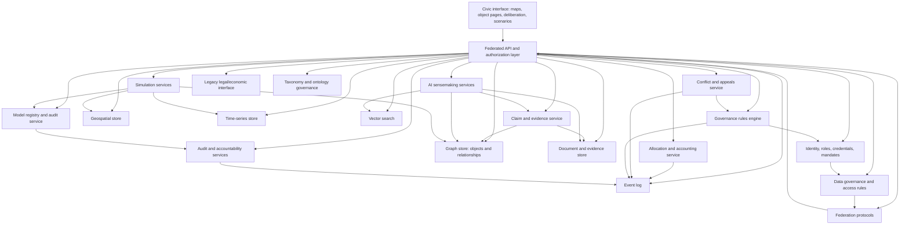

### Architecture Assumptions

- The system should be modular, federated, and capable of local deployment.
- Core data structures should be open and exportable.
- Identity should support people, organizations, guardians, mandates, and institutional roles.
- Authorization must be object-level and relation-aware.
- The system should support offline or degraded local operation where possible.
- Critical decisions should be durable, signed, versioned, and auditable.
- AI services should be replaceable and model-agnostic.
- Models, taxonomies, governance templates, and integrations should be extension points, not hard-coded monopolies.
- Legacy legal and economic records should constrain decisions where necessary without becoming the primary ontology.

## 37. Product Risks

### Political Risk

The platform could be captured by states, funders, parties, NGOs, corporations, or technical administrators. Mitigation requires constitutional governance, transparency, exit rights, and federated ownership.

### Surveillance Risk

Detailed social and ecological mapping could expose vulnerable people or ecosystems. Mitigation requires data minimization, role-aware permissions, community data governance, and sensitive-data protections.

### Technocratic Risk

Models and dashboards could displace democratic judgment. Mitigation requires contestability, participatory interpretation, guardian review, minority reports, and explicit limits on AI authority.

### Complexity Risk

The architecture is vast. Mitigation requires phase discipline, object-first design, modular deployment, and clear local use cases.

### Legitimacy Risk

If governance processes are not trusted, the platform becomes another administrative tool. Mitigation requires community co-design, visible decision rules, appeals, and institutional accountability.

### Epistemic Risk

Bad data, biased models, and false certainty can produce harmful decisions. Mitigation requires provenance, uncertainty, audits, counter-evidence, and ongoing evaluation.

### Manipulation And Instance Capture Risk

Open civic infrastructure can be targeted through spam, false needs, fake capabilities, brigading, bot evidence, factional capture, data poisoning, and administrator control over defaults. Mitigation requires integrity tooling, platform self-governance, transparent moderation, model audits, fork rights, and legitimate federation or defederation processes.

## 38. Foundational Research And Design Tasks

1. Define the kernel schema: identity, roles, mandates, permissions, governed objects, claims, evidence, event log, and export envelope.
2. Define the canonical object grammar and the local taxonomy mapping process.
3. Design the claim, evidence, verification, and contestation workflow.
4. Design the mandate, delegation, guardianship, and authority model.
5. Define data governance primitives: consent, access, sensitivity, disclosure, retention, embargo, and federation rules.
6. Define allocation and accounting primitives: request, offer, commitment, contribution, allocation, use right, obligation, budget, and ledger.
7. Prototype living-system object pages with indicators, guardians, thresholds, claims, routines, and affected proposals.
8. Model three commons governance patterns using Ostrom-inspired design principles.
9. Create a decision packet format linking proposals, claims, evidence, scenarios, models, perspectives, conflicts, decisions, agreements, and outcomes.
10. Select the first deployment domain: watershed resilience, food resilience, or housing retrofit.
11. Build a scoped reality map for that first domain with place, resource, need, capability, living-system, stock, and flow layers.
12. Define AI guardrails, model governance, and evaluation protocols.
13. Create a Cybersyn/VSM-inspired exception reporting model for local autonomy-preserving escalation.
14. Test participatory scenario workflows with a concrete issue such as water allocation, housing retrofit, food resilience, or energy transition.
15. Design federation and data export standards before scaling.

## 39. Summary

This platform is best understood as civic and ecological infrastructure rather than an application category. Its purpose is to help societies see themselves, reason together, coordinate production and care, respect living limits, and adapt through democratic feedback.

The architecture should begin with the civic/ecological kernel: a governed, versioned, contestable object graph capable of representing identity, authority, claims, evidence, permissions, change, and export. It should then be activated inside one real domain before expanding into needs articulation, commitments, deliberation, conflict resolution, causal understanding, model-governed simulation, and federated coordination. The long-term ambition is not a better dashboard for existing institutions. It is a possible coordination substrate for a post-capitalist, ecological civilization.
