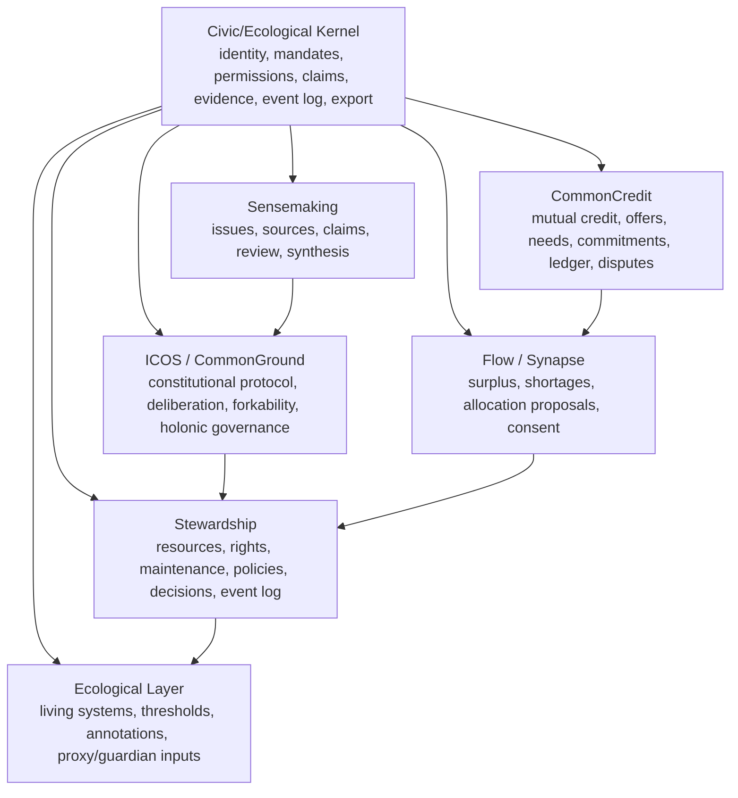

# Integration Analysis: CommonCredit, ICOS, Sensemaking, Stewardship

## Executive Verdict

Yes, substantial parts of these projects can be brought into the new cybernetic commons ecosystem. The strongest path is not to merge the four projects into one monolithic app. The better move is to extract a shared civic/ecological kernel and treat the existing projects as domain modules around it.

Recommended architecture:



The big finding: these projects already anticipate each other. CommonCredit contains a shared `IDENTITY_SPEC.md` for CommonCredit, Stewardship, and Sensemaking. Stewardship has resource governance and rights infrastructure. Sensemaking has a claim/evidence schema. ICOS has the constitutional and protocol layer, plus a more mature CommonGround implementation than the other repos appear to have.

## Project-by-Project Assessment

### CommonCredit

Source project: `CommonCredit`

Best reusable assets:

- Mutual-credit domain model: members, accounts, offers, needs, invoices, transactions, disputes, proposals, votes, treasury, projects.
- Double-entry ledger discipline: immutable ledger entries, paired posting, reversal by offset rather than deletion.
- Cooperative governance framing: credit limits, disputes, sanctions, treasury allocation, participatory budgeting.
- `shared/IDENTITY_SPEC.md`: canonical `Organization`, `Member`, and cross-product domain event envelope.
- `shared/MASTER_PLAN.md`: explicit convergence plan for CommonCredit, Stewardship, and Sensemaking around identity and events.
- Wireframes for deliberation rooms, issue workspaces, scenarios, monitoring, search, proposals, and decision records.

Integration fit:

- Bring in as the **Allocation and Accounting Layer**, not as the whole economic system.
- Map CommonCredit objects into the new PRD's economic primitives:
  - `Offer` -> `Capability` / `Offer`
  - `Need` -> `Need` / `Request`
  - `Transaction` -> one possible `CommitmentFulfillment`
  - `LedgerEntry` -> `LedgerEntry`
  - `Invoice` -> legacy-compatible `PaymentRequest`
  - `CreditLimitRequest` -> governed `UseRight` over mutual-credit capacity
  - `Dispute` -> `Conflict / Grievance`
  - `Proposal` and `Vote` -> governance module or ICOS/CommonGround

What to lift directly:

- Ledger invariants and reversal model.
- Offer/Need matching vocabulary.
- Dispute ladder, with modifications to fit broader conflict architecture.
- Cross-product event envelope from `shared/IDENTITY_SPEC.md`, expanded beyond the current three products.
- The "institution, not app" design principle.

What to adapt:

- The current `Member` and `Organization` concepts are narrower than the new ecosystem. The kernel needs `Person`, `Account`, `Member`, `Organization`, `Role`, `Mandate`, `Delegation`, and `Guardian`.
- The current shared identity spec uses product slugs for `common_credit`, `stewardship`, and `sensemaking`; the new system needs module/capability activation rather than product activation only.
- CommonCredit uses Prisma and NextAuth; Stewardship and ICOS use Drizzle, and Stewardship/Sensemaking use Clerk. Do not let the first integration step become an ORM migration war.

Keep separate for now:

- Full mutual credit network UI.
- Tax/accounting exports.
- Stripe/member dues.
- Reputation scoring. Some of it may conflict with the anti-ranking principles in ICOS/Kindred.

### ICOS

Source project: `ICOS`

Best reusable assets:

- Constitutional principles: revocability, due process, commons protection, forkability, holonic nesting, deliberation, framework accountability.
- Anti-capture architecture: financial, founder, board, state, market, technical, data, platform, expertise, narrative, federation capture.
- CommonGround Protocol: attention, perspecting, integration, decision, memory.
- Holonic governance model: local autonomy with cross-scale pattern surfacing and translation.
- EIL PRD: ecological impact layer, annotation layer, proxy/territory guardian roles, uncertainty, offline pathways.
- Flow Engine PRD: Synapse, Equip, Kindred, surplus/shortage visibility, allocation consent, shared asset lifecycle, non-ranking gift ledger.
- CIP PRD: care infrastructure that deliberately avoids turning relational care into a ledger.
- App implementation: issues, perspectives, delegations, decision records, timeline events, referenda, quorum, export bundles, Synapse declarations, allocation proposals, producers, time credits.

Integration fit:

- Use ICOS as the **constitutional/protocol reference architecture** for the new ecosystem.
- Treat CommonGround as the best existing implementation candidate for the deliberation/governance protocol.
- Treat Synapse and Flow Engine as the most aligned implementation path for food resilience and resource-flow pilots.
- Treat EIL as the direct ancestor of the new `Living System`, `Indicator`, `Threshold`, `Guardian`, `Annotation`, and ecological decision-overlay architecture.

What to lift directly:

- Seven Tier 1 constitutional principles.
- The attention -> perspecting -> integration -> decision -> memory protocol.
- Revocable delegation schema. The ICOS `delegations.ts` file structurally prevents irrevocable delegations.
- Decision record model with `what`, `how`, `rationale`, unresolved objections, review date, supersession, and finalization.
- Append-only civic memory pattern. ICOS enforces append-only timeline events at the database role level, which is stronger than a convention-only event log.
- Export bundle model with content hash.
- Synapse surplus/shortage declarations and consented allocation proposals.
- Producer actor type for food-system pilots.
- Time-credit ledger constraints from Kindred, especially record-not-rank and no gating.

What to adapt:

- ICOS uses `Space`, `Neighborhood`, and `Member`; the new PRD needs these generalized into `Place`, `Commons`, `Organization`, `Person`, and `Mandate`.
- Some ICOS docs use strong constitutional commitments that may be too specific for a protocol intended to support plural communities. Keep them as default constitutional templates, not universal hard-coded law, except where they protect non-capture and exit.
- EIL says ecological data informs but does not constrain; the newer PRD sometimes treats ecological thresholds as hard constraints. The synthesis should distinguish:
  - informational ecological context
  - governance-triggering threshold
  - hard ecological boundary accepted by prior agreement

Keep separate for now:

- Full ICOS site/docs.
- Municipal-scale MCS until the kernel and one domain pilot exist.
- AI layer until claims, evidence, model governance, and audit are stable.

### Sensemaking

Source project: `Sensemaking`

Best reusable assets:

- Prisma schema for Phase 1 issue memory and AI synthesis.
- `Issue` as central hub object.
- `Source` model with source type, raw text, processing state, credibility rating.
- `Claim` model with type, confidence, source quote, contested flag, review status, accepted/rejected timestamps.
- `Theme` model for extracted content clusters.
- `StakeholderGroup` model with power and affectedness levels.
- `Contribution` model for deliberation contributions.

Integration fit:

- Bring in as the **Claim and Evidence / Sensemaking Layer**.
- It is particularly useful for the PRD's `Claim`, `Evidence`, `Issue`, `Perspective`, `Source`, and AI-assisted extraction workflows.

What to lift directly:

- Claim review lifecycle: pending, accepted, rejected.
- Claim types: fact, causal, value, assumption, preference.
- Source ingestion structure.
- Stakeholder group power/affectedness modeling.
- "Nothing is canonical until a human accepts it" as a kernel rule.

What to adapt:

- Sensemaking's UI is still boilerplate, so the value is currently schema and direction, not app experience.
- `Claim` should become more general:
  - claimant can be person, org, guardian, sensor, institution, or AI
  - claim can be about any object, not only an issue
  - counterclaims should be first-class
  - evidence should support claims through a link table, not only direct `sourceId`
  - review should include verification state, sensitivity, visibility, review date, and contestability path
- `Source` should become `EvidenceSource` or `EvidenceArtifact` in the kernel.

Keep separate for now:

- App shell.
- AI extraction implementation until model governance and data sensitivity rules exist.

### Stewardship

Source project: `Stewardship`

Best reusable assets:

- PRD and domain mapping for resource stewardship, maintenance, policies, proposals, decisions, access rights, contribution logging, event log, onboarding, and indicators.
- Drizzle schemas for resources, access rights, governance, policies, maintenance, members, event log, stewardship assignments, and food flows.
- Rights engine API contract centered on `can(memberId, rightType, resourceId)`.
- Row-level-security-oriented API convention: community context comes from authenticated session, not URL/body.
- Food flows schema: field -> harvest -> process -> store -> transport -> distribute -> institution -> table/waste.
- Maintenance and care-work visibility model.
- Policy versioning tied to decisions.

Integration fit:

- Stewardship is the best candidate for the **first concrete domain module** and the most immediately reusable implementation substrate for the kernel.
- It directly maps to the new PRD's `Resource`, `Use Right`, `Routine / Practice`, `Maintenance Cycle`, `Policy`, `Proposal`, `Decision`, `Contribution`, `Event Log`, `Access Rule`, and `Stewardship Assignment`.

What to lift directly:

- Resource registry and condition updates.
- Access-rights schema and rights vocabulary.
- `can()` rights engine shape.
- Maintenance task schema, including recurrence, deferred cost, review requirement, and condition-triggered tasks.
- Policy and policy-version schema.
- Governance proposals, deliberation comments, votes, decision rules, and decision records.
- Event log concept.
- Food-flows schema if the first pilot is food resilience.

What to adapt:

- Replace `Community` naming with the kernel's `Organization` / `Commons` / `Place` distinction.
- Convert `AccessRight` into the more general `UseRight` plus `AccessRule`.
- Convert `MaintenanceTask` into both `ProjectTask` and `Routine / Practice`, because ongoing care is not always a project.
- Make event log append-only at the database role level, borrowing the ICOS implementation.
- Extend resources into living systems and ecological thresholds rather than only human-stewarded assets.

Keep separate for now:

- MVP success metrics and SaaS-style active-org targets. They are useful operationally, but the new ecosystem should not be driven by them.
- Contribution dashboards if they risk ranking members; adapt with ICOS/Kindred's anti-ranking constraints.

## Cross-Project Convergences

### 1. Shared Identity Already Exists

CommonCredit's `shared/IDENTITY_SPEC.md` is the existing seed for Phase 0. It defines canonical `Organization`, `Member`, product activation, auth, and domain event envelope across CommonCredit, Stewardship, and Sensemaking.

Upgrade path:

- Rename it from "Shared Identity Specification" to "Kernel Identity and Event Contract."
- Expand `Member` into `Person`, `Account`, `Membership`, and `RoleAssignment`.
- Add `Mandate`, `Delegation`, `Guardian`, and `Credential`.
- Replace `ProductSlug[]` with `ModuleCapability[]` or `ActivatedModule[]`.
- Preserve `org_id` as partition key, but introduce `place_id`, `commons_id`, and `living_system_id` where needed.

### 2. Claims/Evidence Is Split Across Sensemaking And Stewardship

Sensemaking has a good `Claim` model. Stewardship has proposal evidence as JSON. ICOS has perspective and civic-memory protocols.

Recommended synthesis:

- Use Sensemaking's `Claim` lifecycle as the base.
- Use ICOS's `Perspective` as first-class deliberative input.
- Replace Stewardship's proposal `evidence: jsonb` with evidence links to kernel claims/evidence.
- Add `Counterclaim`, `EvidenceArtifact`, `EvidenceLink`, and `VerificationProcess`.

### 3. Event Logs Exist In Multiple Forms

- CommonCredit: domain events in shared spec.
- Stewardship: generic `event_log`.
- ICOS: `timeline_events` with database-level append-only enforcement.

Recommended synthesis:

- Use CommonCredit's event envelope.
- Use ICOS's append-only enforcement model.
- Use Stewardship's domain breadth and event naming.
- Split event types into:
  - kernel events
  - governance events
  - stewardship events
  - claim/evidence events
  - allocation/accounting events
  - federation events

### 4. Governance Has Two Strong Candidates

Stewardship has practical proposal/vote/decision schemas. ICOS has a deeper deliberative protocol and constitutional accountability.

Recommended synthesis:

- Use ICOS/CommonGround for protocol semantics: attention, perspecting, integration, decision, memory.
- Use Stewardship for resource-policy-specific governance objects and API contracts.
- Use ICOS decision records as the durable record shape.
- Retain multiple decision methods from Stewardship.

### 5. Resource Flow Exists In Two Forms

- Stewardship has food-flow records and policy interventions.
- ICOS has Flow Engine/Synapse docs and app schemas for surplus/shortage declarations and allocation consent.

Recommended synthesis:

- If the first pilot is food resilience, combine ICOS Synapse with Stewardship food flows.
- ICOS handles declarations and consented allocation proposals.
- Stewardship handles traceable flow records and policy interventions.
- CommonCredit can later add mutual-credit settlement where communities explicitly choose it.

## Key Conflicts To Resolve

### ORM And App Stack Fragmentation

- CommonCredit and Sensemaking use Prisma.
- Stewardship and ICOS use Drizzle.
- ICOS has the most mature implementation in terms of protocol, jobs, exports, and constitutional checks.

Recommendation: do not force an immediate migration. Define the kernel contract first as schema docs and TypeScript/Zod contracts. Migrate implementation later.

### Auth Fragmentation

- Shared identity spec recommends Clerk.
- CommonCredit currently uses NextAuth.
- Stewardship and Sensemaking are Clerk-oriented.
- ICOS uses custom magic-link/session flows.

Recommendation: treat auth provider as replaceable. The kernel should care about `Account`, `Person`, `Membership`, `Credential`, and `SessionClaims`, not Clerk itself. Clerk can be the near-term adapter.

### Constitutional Defaults Versus Community Pluralism

ICOS contains strong constitutional principles. They are excellent, but hard-coding all of them universally may conflict with plural community governance.

Recommendation: make them the default "Commons Constitutional Profile." Mark some as kernel invariants only when they protect exit, data portability, due process, and anti-capture.

### Quantification Risk

CommonCredit and Stewardship track contribution, reputation, credits, hours, and tasks. ICOS/Kindred/CIP correctly warns against turning care and contribution into scores.

Recommendation: allow ledgers for commitments and accounting, but prohibit ranking, gating, and portable social scores by default.

### Ecological Constraint Semantics

EIL sometimes says ecological data informs but does not constrain. Flow Engine treats EIL constraints as hard boundaries. The new PRD also wants thresholds to trigger governance.

Recommendation: define three threshold classes:

- Advisory indicator: visible in deliberation
- Governance trigger: creates issue/review/escalation
- Binding threshold: hard constraint because a legitimate agreement made it binding

## What To Bring Into The New Ecosystem

### Bring Now

- CommonCredit `shared/IDENTITY_SPEC.md` as the seed for kernel identity/events.
- ICOS constitutional principles, anti-capture architecture, CommonGround protocol, delegation model, decision record model, export bundle pattern, and append-only civic memory enforcement.
- Sensemaking claim/source/review schema.
- Stewardship resource, access-rights, maintenance, policies, proposals, decisions, event log, and food-flow schemas.

### Bring After Kernel

- CommonCredit ledger and mutual-credit accounting.
- ICOS Synapse allocation proposals and producer declarations.
- Stewardship maintenance and policy UI.
- Sensemaking AI extraction pipeline.

### Keep As Separate Domain Modules

- Mutual credit network
- Stewardship/resource governance
- Sensemaking/claims workspace
- CommonGround deliberation
- EIL ecological data service
- CIP relational care
- Flow/Synapse resource planning

## Recommended Next Architecture

Create a new shared package or spec folder, not a new app first:

```text
kernel/
  identity/
    person.ts
    account.ts
    organization.ts
    membership.ts
    role.ts
    mandate.ts
    delegation.ts
    guardian.ts
  objects/
    object-reference.ts
    claim.ts
    evidence.ts
    counterclaim.ts
    event.ts
    access-rule.ts
    data-stewardship-agreement.ts
  governance/
    issue.ts
    perspective.ts
    proposal.ts
    decision-record.ts
    appeal.ts
  accounting/
    request.ts
    offer.ts
    commitment.ts
    obligation.ts
    allocation.ts
    ledger-entry.ts
  ecology/
    living-system.ts
    indicator.ts
    threshold.ts
    annotation.ts
  federation/
    export-envelope.ts
    domain-event.ts
    schema-version.ts
```

This kernel should be implementation-neutral at first: TypeScript types, Zod schemas, SQL notes, lifecycle diagrams, invariants, and event names. Once stable, choose one implementation path.

## Best First Pilot Choice

Given these projects, the best first pilot is probably **food resilience**, not watershed.

Why:

- ICOS Flow Engine already specifies food producer surplus/shortage visibility.
- ICOS app already has `producers`, `surplus_shortage_declarations`, `allocation_proposals`, and `allocation_consents`.
- Stewardship already has `food_flows`, `food_items`, `food_actors`, `procurement_needs`, and `production_capacities`.
- CommonCredit can later support non-cash settlement or mutual-credit purchasing.
- Sensemaking can ingest sources, extract claims, and support policy/procurement deliberation.

Watershed remains philosophically stronger, but food has more existing code and clearer adoption hooks.

## Recommended 30-Day Plan

### Week 1: Kernel Extraction

- Copy CommonCredit `shared/IDENTITY_SPEC.md` into a new kernel spec.
- Add missing kernel objects: `Person`, `Account`, `Membership`, `Mandate`, `Delegation`, `Guardian`, `Claim`, `Evidence`, `Counterclaim`, `AccessRule`, `DataStewardshipAgreement`.
- Decide event envelope and object reference format.

### Week 2: Governance And Memory Synthesis

- Merge ICOS decision record shape with Stewardship proposal/decision rules.
- Adopt ICOS append-only civic-memory enforcement as the target implementation pattern.
- Define claim/evidence links so proposals no longer store evidence as loose JSON.

### Week 3: Food Resilience Pilot Schema

- Combine ICOS producers/declarations/allocation proposals with Stewardship food-flows.
- Define how a food surplus claim becomes an allocation proposal, then a commitment, then a flow record, then an outcome.
- Define privacy states for producers, households, food coops, and municipalities.

### Week 4: Thin Prototype Path

Build one vertical path:

```text
Producer declares surplus
-> Food coop declares need
-> System proposes allocation
-> Required parties consent
-> Governance decision records public procurement or routing
-> Commitment is created
-> Food flow is recorded
-> Outcome updates indicator / claim
```

This validates the kernel, governance, flow, accounting, and sensemaking loops without trying to build the whole civilization system.

## Bottom Line

These projects are not random side projects. They are earlier organs of the same system.

- **ICOS** should become the constitutional and protocol source.
- **Stewardship** should become the concrete resource/governance implementation base.
- **Sensemaking** should become the claim/evidence and AI-assisted interpretation layer.
- **CommonCredit** should become the mutual-credit/accounting and commitment-settlement module.

The next move should be extraction and synthesis, not feature-building. Build the kernel contract first, then activate a food-resilience pilot using the pieces that already exist.
